# Балансировка нагрузки

## ***Вступление***

В роутерах **KROKS** с двумя модемами реализована возможность балансировки используемого трафика как входящего, так и исходящего. Эта функция позволяет вам разделить нагрузку на несколько подключений, что увеличивает поток обрабатываемой информации и соответственно производительность устройства.

Необходимость в балансировке трафика может быть вызвана не только в случае больших нагрузок на устройство. Если в вашем роутере установлено несколько модемов, то в процессе работы они могут создавать помехи друг для друга. В таких ситуациях рекомендуется произвести разделение модемов по используемым частотам.

:::tip
Подобные ситуации не столько распространены, поэтому в данной статье мы не будем их затрагивать. С подробностями вы можете ознакомиться на нашем YouTube канале.
[Youtube](https://www.youtube.com/watch?v=dALbZOu7f2s&t=4s)

:::

Кроме того в этой статье вы познакомитесь с такими понятиями, как **вес** и ***метрика***, которые помогут вам более рационально распределять нагрузку, а также с несколькими другими важными деталями балансировки трафика.

## ***СБРОС УСТРОЙСТВА НА ЗАВОДСКИЕ НАСТРОЙКИ***

:::info
Данный пункт является не обязательным и рекомендуется только для того чтобы избежать случайных осложнений и конфликтов с уже существующими настройками устройства.

С инструкцией о том как откатить устройство к заводским настройкам вы можете ознакомиться в отдельной [статье](/docs/routery/chasto-zadavaemye-voprosy/sbros-ustroystva-na-zavodskie-nastroyki.md).

:::

## ***НАСТРОЙКА СЕТИ***

Первым шагом вам необходимо настроить [простое подключение](/docs/routery/prodvinutaya-nastroyka/rezhimy-podklyucheniya-routerov-KROKS.md) к сети, будь то ***WAN***, ***МОДЕМ*** или ***Wi-Fi*** подключение. В нашем примере будут рассматриваться все три варианта.

:::warning
Обратите внимание, во всех настраиваемых интерфейсах должна быть выключена галочка на против пункта ***netchek***.  
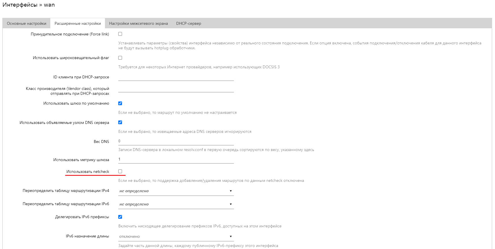

:::

## ***УСТАНОВКА ПАКЕТА MWAN3***

:::tip
Пропустите этот пункт, если на вашем роутере уже есть ***Менеджер MiltiWan.***

:::

Для того чтобы вам стали доступны настройки балансировки, необходимо установить на ваш роутер пакет ***luci-app-mwan3***.

Для этого перейдите во вкладку "***Система***" → "***Менеджер пакетов***". Нажмите кнопку "***ОБНОВИТЬ СПИСКИ***" и дождитесь окончания операции. В появившемся окне нажмите кнопку "***ЗАКРЫТЬ***".  
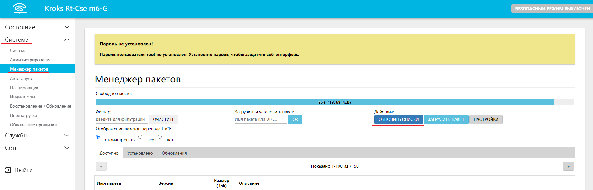  
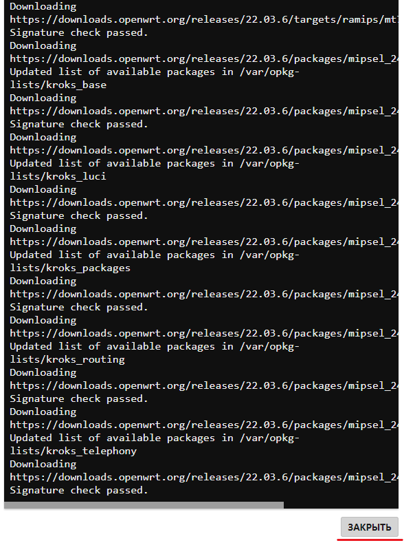

В строке "***Фильтр"*** введите ***luci-app-mwan3***, найдите нужный пакт и нажмите "***УСТАНОВИТЬ***".  
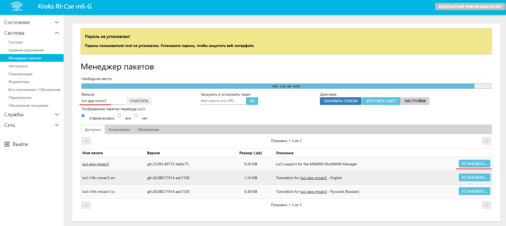

В появившемся окне нажмите кнопку "***УСТАНОВИТЬ***". Также рекомендуем вам установить дополнительные пакеты перевода. Для этого будет автоматически установлена галочка напротив строки "**Также установить рекомендуемые пакеты перевода**" в нижней части открывшегося окна, достаточно будет просто не убирать её.  
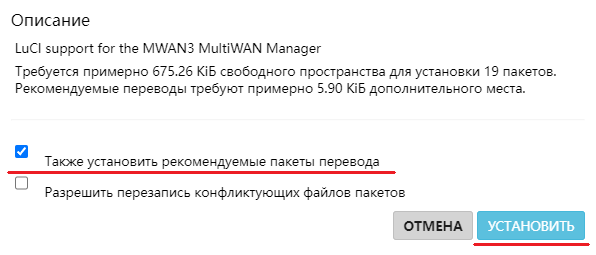

Дождитесь окончания установки и в появившемся окне нажмите кнопку "***ЗАКРЫТЬ***".

## ***Перезагрузка устройства***

После установки пакета рекомендуется перезагрузить роутер, что можно сделать, также как и сброс, двумя способами.

### ***Через WEB-интерфейс***

* В случае выбора этого варианта вам будет необходимо всего лишь зайти во вкладку "*Система*" → "*Перезагрузка*", нажать на кнопку "***ВЫПОЛНИТЬ ПЕРЕЗАГРУЗКУ***" и дождаться пока web-интерфейс вновь станет доступным.  
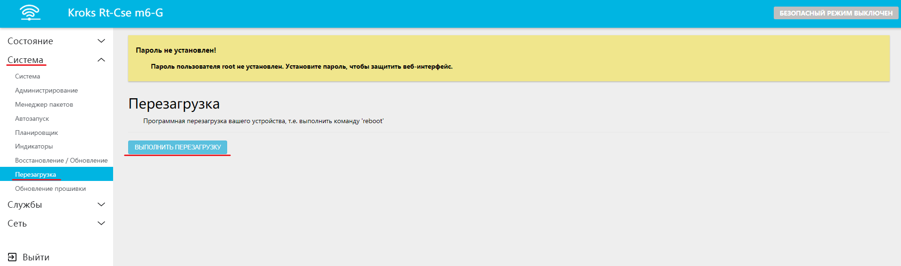

### ***Физической кнопкой***

* Чтобы перезагрузить роутер, ***без использования web-интерфейса,*** вам необходимо просто нажать на кнопку ***RST*** (стрелка сверху вниз) и дождаться загрузки роутера.  
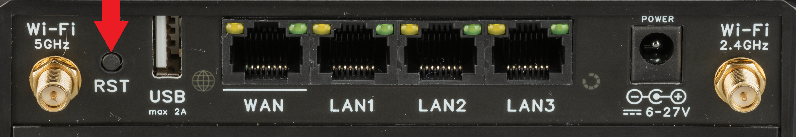

## ***НАСТРОЙКА MWAN3***

Теперь можно заняться непосредственно настройкой балансировки сети. И первым шагом нам нужно будет  настроить метрику шлюза.

### ***Метрика шлюза***

Перейдите на вкладку "***Сеть***" → "***Интерфейсы***".  
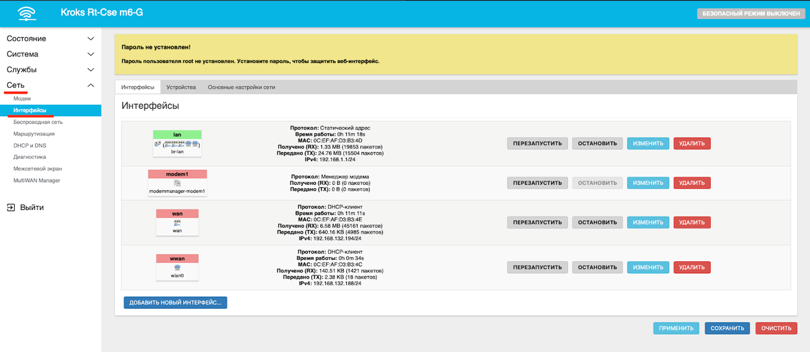

Как можете видеть в нашем примере настроено подключение по проводу, по Wi-Fi и через модем.

Нажмите кнопку "***ИЗМЕНИТЬ***" рядом с каждым интерфейсом и во вкладке "***Расширенные настройки***" заполните строку "***Использовать метрику шлюза***", опираясь на следующее правило:  
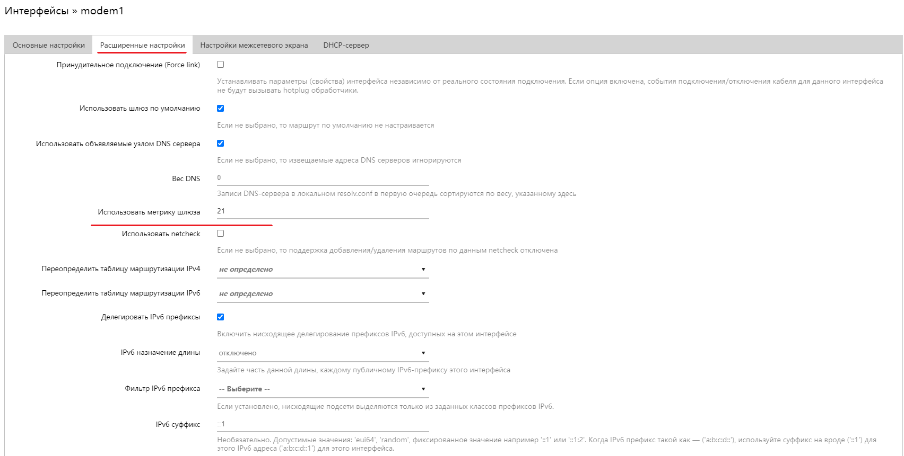

* проводное подключение - 1;
* подключение по Wi-Fi - 11;
* подключение через модем - 21 (в зависимости от используемого модема, если их несколько, для **modem1** будет 21, для **modem2** будет 22 и так далее).

Нажмите кнопку "***СОХРАНИТЬ***".

После того как вы настроите все необходимые вам интерфейсы, нажмите кнопку "***ПРИМЕНИТЬ***" во вкладке со всеми интерфейсами.

Далее мы можем приступить к созданию новых интерфейсов.

### ***Создание интерфейсов в MWAN***

Перейдите на вкладку "Сеть" → "MultiWAN Manager" и  откройте раздел "Интерфейс".  
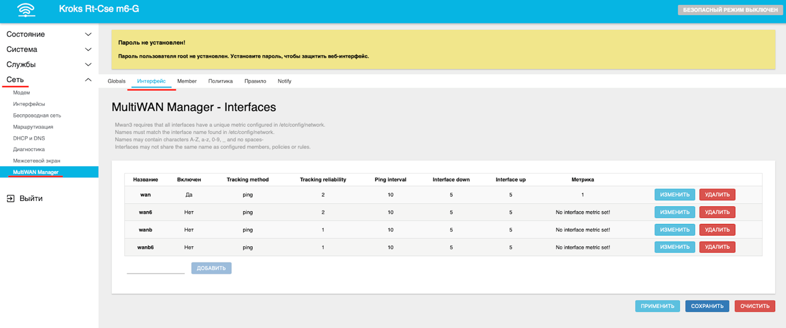

Здесь вы увидите настройки по умолчанию. Удалите каждый пункт при помощи кнопки "УДАЛИТЬ".

Теперь, когда на этой странице пусто, давайте создадим первый интерфейс. Пусть это будет **WAN**.

Создание интерфейса происходит с помощью кнопки "ДОБАВИТЬ".

:::info
Обратите внимание, имя интерфейса, которое мы будем указывать здесь, должно совпадать с именем интерфейса во вкладке "Сеть" → "Интерфейсы".  
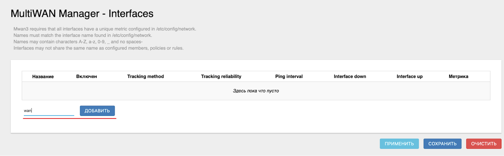

:::

После добавления нового интерфейса автоматически откроется окно, в котором нужно ввести следующие параметры:  
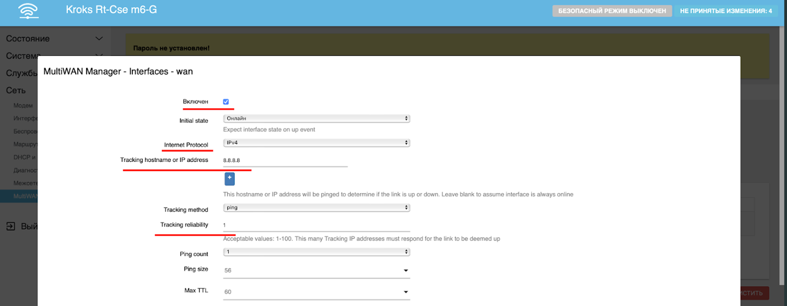

* **Включен** - поставить галочку;
* **Интернет протокол** - в нашем случае **IPv4**;
* **Tracking hostname or IP address** - Список адресов, на которые будут периодически отправляться пакеты Ping, чтобы убедиться в работоспособности интерфейса. Например, добавим IP-адрес DNS сервера Google (8.8.8.8). По желанию можете добавить несколько IP-адресов или имен сайтов;
* **Tracking reliability** - сколько адресов должны ответить, чтобы интерфейс считался рабочим. Рекомендуем оставить **1**.

Аналогичным образом добавьте остальные интерфейсы.

### ***Особенности работы с роутерами в которых встроено несколько модемов***

На роутере с 2-4 модемами по умолчанию идёт видоизмененный менеджер **mwan3**. Для настройки IP-адресов и проверки в этом случае необходимо использовать сервис проверки сети, расположенный во вкладке "Службы" → "Проверка сети".  
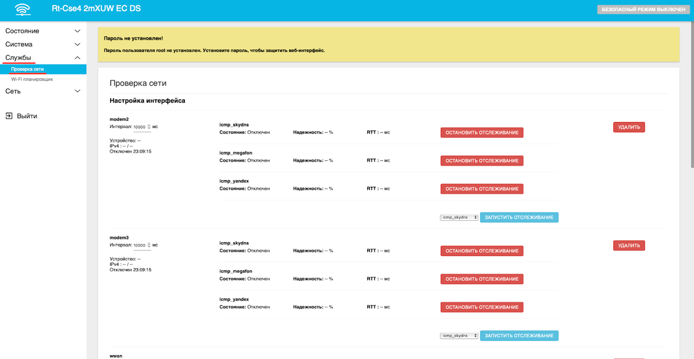

Здесь нам необходимо удалить всё из блока **Настройка интерфейса**.  
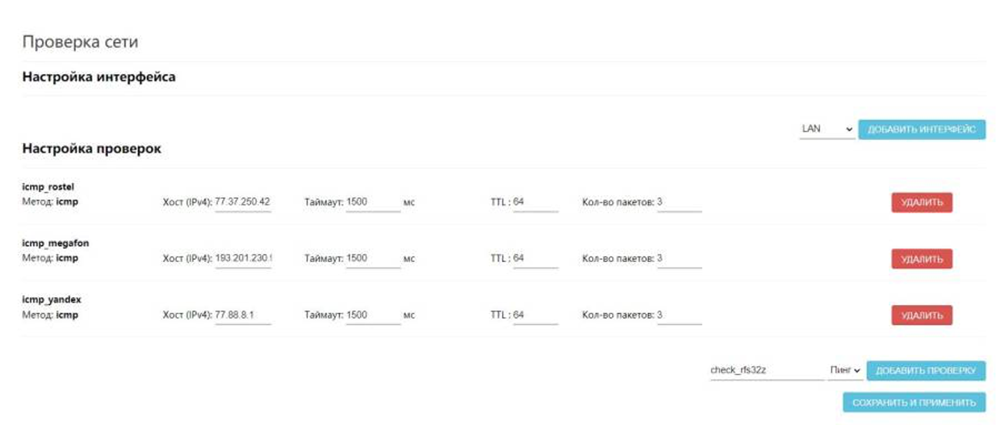

Далее, в настройке проверок добавляем новую проверку. Например, **check_google_1**. После нажатия на кнопку "Добавить проверку" в списке появится **check_google_1**. Введем в поле Хост(IPv4) IP-адрес сервера DNS Google.  
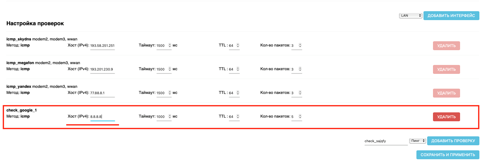

Далее выбираем в блоке **Настройка интерфейса** наш модем modem1 и нажимаем "Добавить интерфейс".  
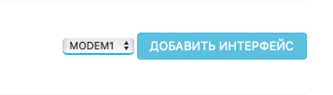

Интервал поставим 10000мс и выберем отслеживание check_google_1. Нажмем кнопку "Запустить отслеживание".  
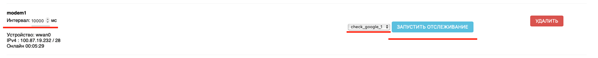  
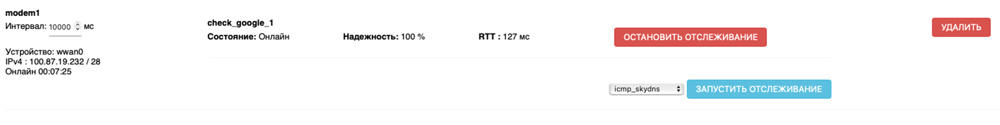

Теперь перейдём на вкладку "Member".

Здесь необходимо также удалить каждый пункт с помощью кнопки "УДАЛИТЬ".  
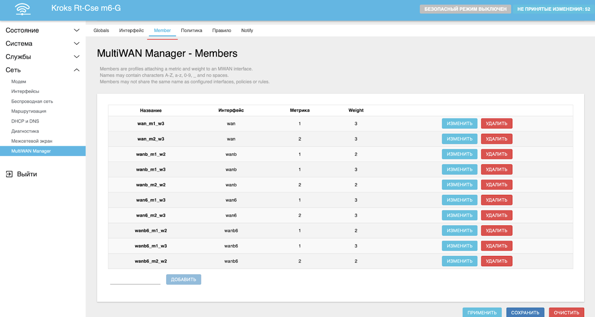

## ***Пример настройки***

В качестве примера разберем такой случай:

> ***Нагрузка разделяется поровну между проводным и Wi-Fi подключениями. И в качестве резервного соединения, если оба основных интерфейса недоступны, будет использоваться соединение через модем.***

Для этого нам нужно создать "Member" согласно следующему правилу:

* Сначала в названии идёт имя интерфейса, например **wan**;
* За ним, через нижнее подчеркивание «*» следует его **метрика**, на этот раз не та, что мы указывали в "Сеть"* → "Интерфейсы", а относительная. Например, **m1** (где **m** - metric (метрика), а **1** - значение метрики).

:::info
метрика - число, определяющее приоритет интерфейса. Чем меньше метрика, тем более приоритетным становится интерфейс

:::

* Далее идёт **вес** метрики. Задаётся числом от 0 до 1000. Мы рекомендуем для повышения читаемости задавать вес в процентах. Так, например, распределение нагрузки равномерно по 4 интерфейсам будет иметь вес 25.

  В нашем же случае для wan укажем вес 50, так как он делит нагрузку с Wi-Fi в равной степени - **w50** (где **w** - weight (вес), а **50** - значение веса).

:::info
вес - число, определяющее приоритет интерфейса, **если их метрики одинаковы**. Чем выше вес, тем больше нагрузка на интерфейс при одинаковых метриках.

:::

Получаем итоговое название в виде - **wan_m1_w50**.  
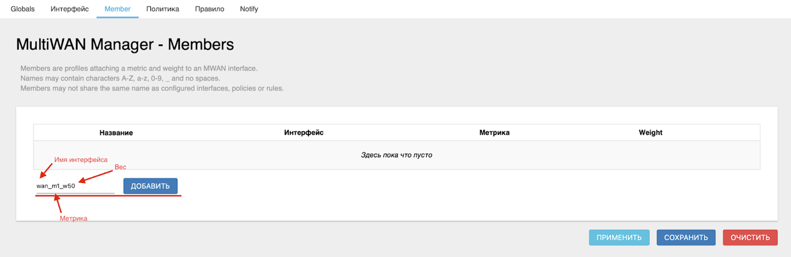

Нажмите кнопку "ДОБАВИТЬ", выберите настраиваемый интерфейс и введите его метрику и вес.  
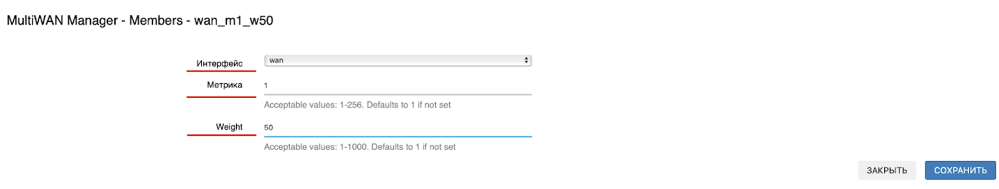

Добавьте остальные интерфейсы аналогичным образом.
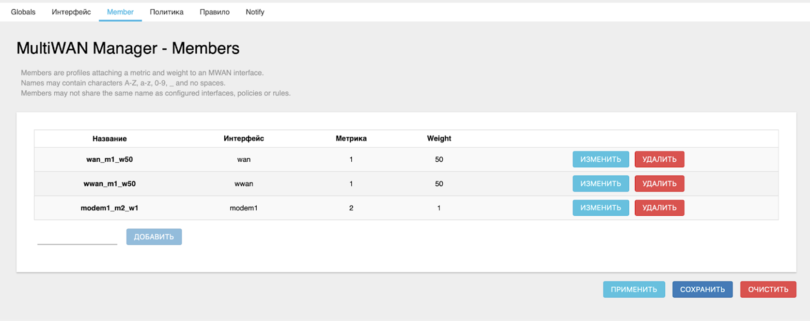

:::warning
Не забывайте изменять интерфейс на настраиваемый, в одноименном селекторе.

:::

Теперь перейдём на вкладку "Политика". Удаляем каждую политику нажатием кнопки "Удалить" и создаём новую. Назовём её **balanced**. Нажмите кнопку "ДОБАВИТЬ".  
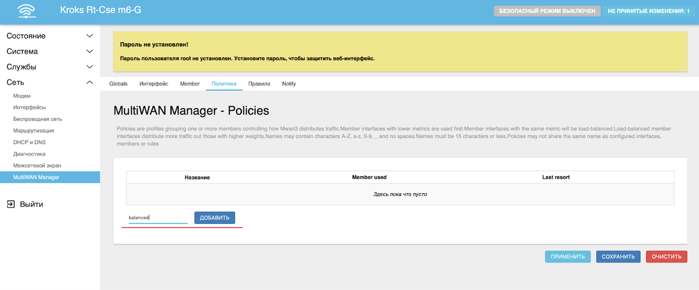

В открывшемся окне выберете ранее созданные интерфейсы в селекторе **Member used**.

Поле **Last resort** можно оставить без изменений.

Нажмите кнопку "СОХРАНИТЬ".  
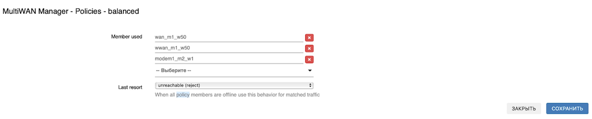

Теперь перейдём на вкладку "Правило".

Удаляем все правила.

Создаём новое правило. Для примера назовём его **default**.

Нажмите кнопку "ДОБАВИТЬ".  
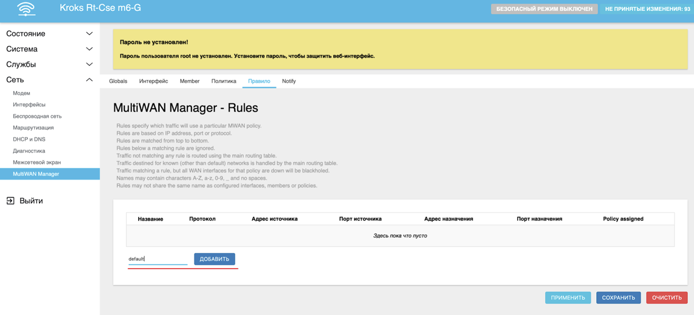

Теперь необходимо заполнить открывшееся окно:

* В поле **Internet Protocol** выбираем **Только IPv4**;
* В поле **Протокол** оставляем **all**.
* В поле **Sticky** выберите **Нет**.
* В поле **Policy assigned** выберите созданную нами политику **balanced**.

Нажмите "СОХРАНИТЬ".

Нажмите кнопку "ПРИМЕНИТЬ".  
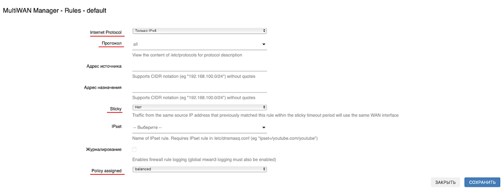

## ***Тест***

На этом настройка балансировки закончена. Чтобы убедиться, что всё работает, перейдём на вкладку "Состояние" → "MultiWAN Manager".

На вкладке "Обзор" видим что все 3 интерфейса активны.  
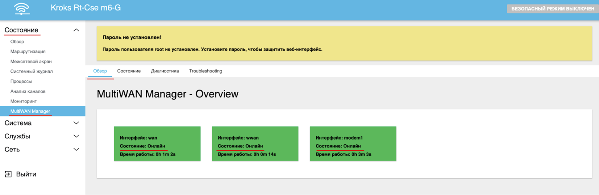

Перейдём на вкладку "Состояние". Здесь увидим, что нагрузка распределяется на интерфейсы в равных долях (50%), как мы и указали.  
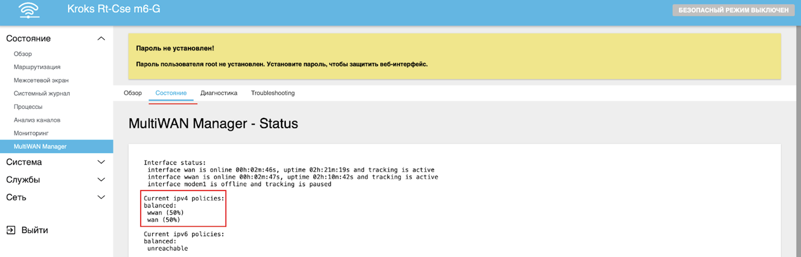

Теперь попробуем отключить провод wan и беспроводную точку доступа.  
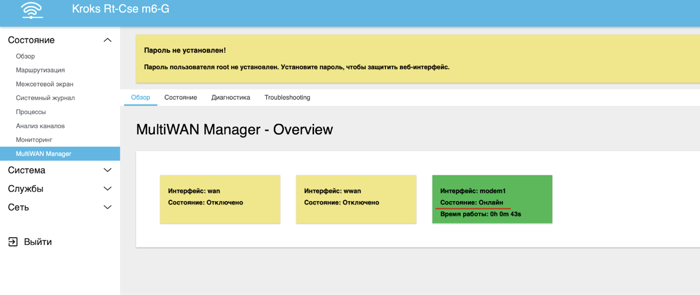

Как видим, весь трафик теперь идёт через modem1.  
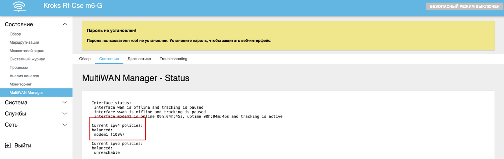

Восстановим подключение по проводу.  
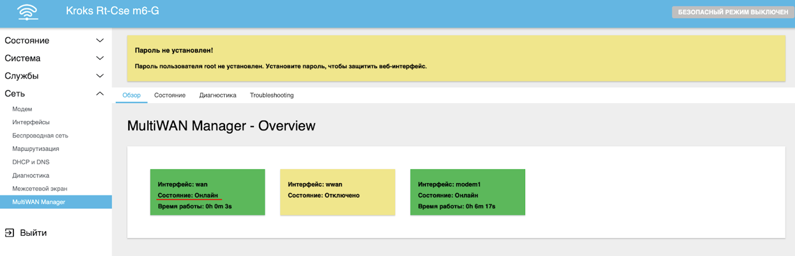

На вкладке "Состояние" увидим, что в этом случае вся нагрузка идёт только по проводному подключению, согласно установленной нами метрике.  
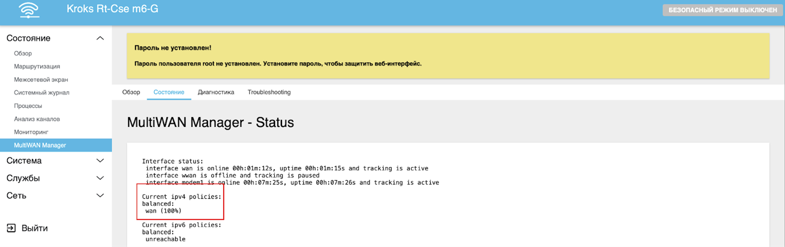

## ***Итог***

Как вы видите тесты прошли успешно, а значит у нас получилось настроить балансировку трафика нужным нам образом.

В таком случае следуя этой простой статье и опираясь на используемый в ней пример. Вы без проблем сможете повторить данную балансировку или настроить собственную, уже исходя из ваших целей, задач и необходимостей.
