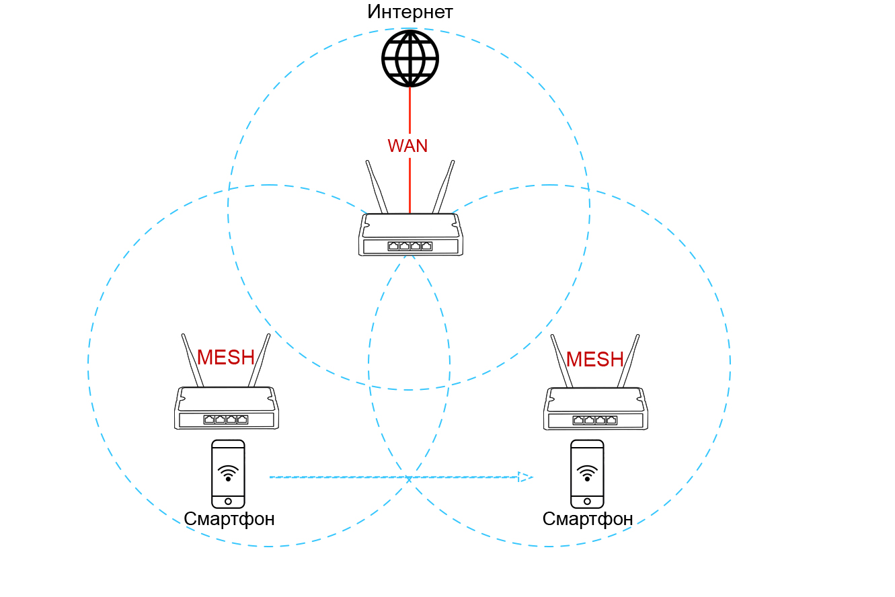
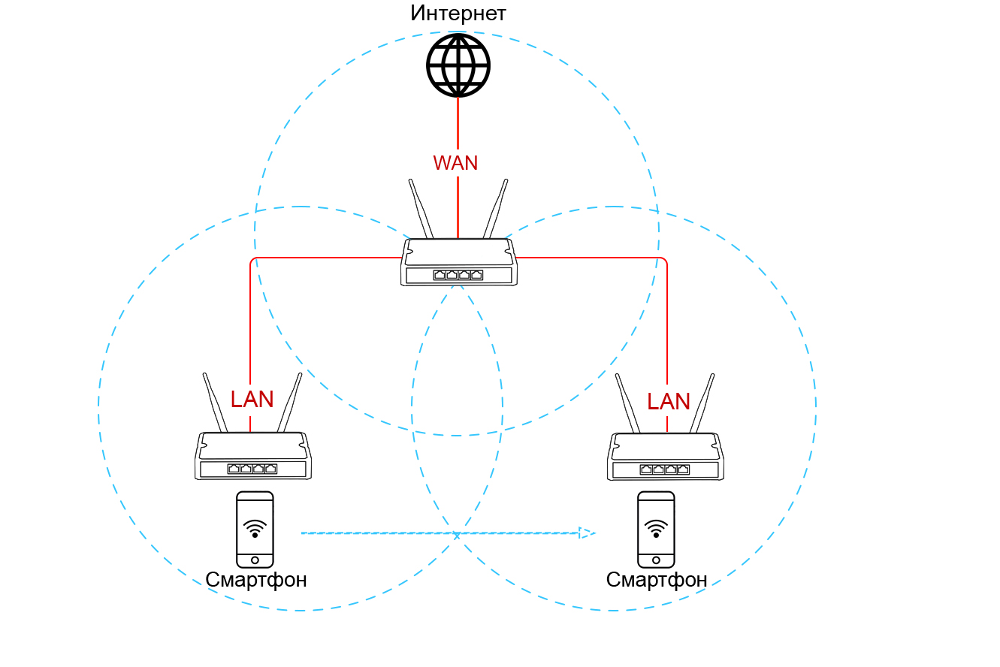
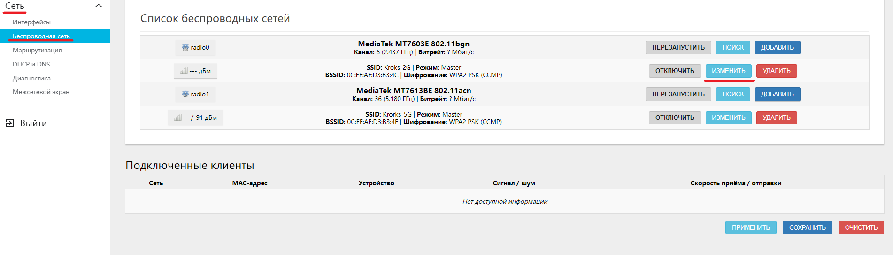
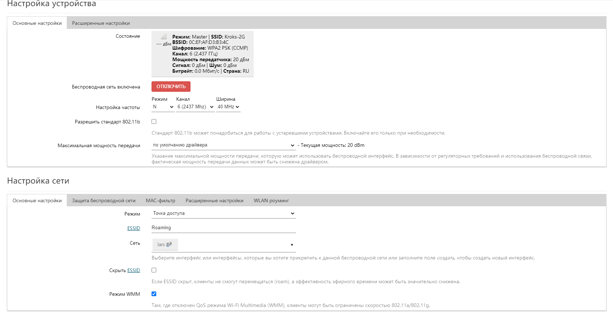
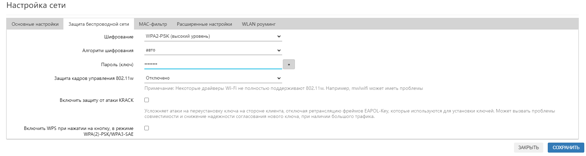
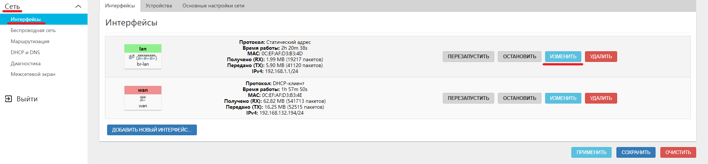
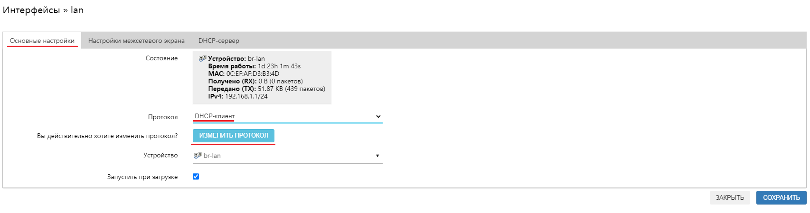
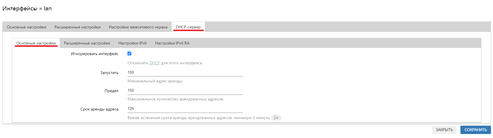
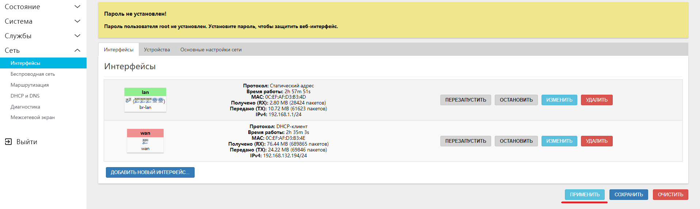

# Бесшовный роуминг

Механизм, описаный ниже, называется "Бесшовный роуминг Wi-Fi" и предназначен для ускоренного переключения беспроводных клиентов между точками доступа. При перемещении внутри зоны покрытия, устройство (смартфон, ноутбук) самостоятельно выбирает наиболее подходящую точку доступа в зависимости от уровня сигнала. Обычно переключение сигнала Wi-Fi в телефоне от одной точки доступа к другой занимает несколько секунд. Бесшовный роуминг значительно ускоряет этот процесс, как следствие голосовые или видеозвонки в мессенджерах не будут прерываться.

::: warning
Обратите внимание - бесшовный роуминг работает только для устройств, находящихся в одной сети. В такой топологии сети только один роутер считается главным и раздаёт IP-адреса всем клиентам сети, остальные роутеры должны выступать лишь в роли расширителей главной сети.
:::

## ***Тип подключения***

В схеме бесшовного роуминга, роутеры могут быть соединены между собой двумя способами - **Беспроводное подключение (MESH)**, **Проводное подключение (LAN)**.

### ***Беспроводное подключение (MESH)***

Каждый из настраиваемых роутеров подключен к главному роутеру, через который осуществляется выход в интернет. Подключение роутеров между собой осуществляется через технологию MESH.  

Настройка роутеров в такой схеме сводится к четырём пунктам:

* [Создание Mesh-сети](/docs/routery/prodvinutaya-nastroyka/Mesh-set.md)
* [Настройка Wi-Fi сети](#настройка-wi-fi-сети)
* [Настройка безопасности](#настройка-безопасности)
* [Добавление MAC-адресов](#добавление-mac-адресов)

### ***Проводное подключение (LAN)***

**Главный роутер** подключен к провайдеру и через него осуществляется выход в интернет. Все остальные роутеры в роуминге подключаются LAN в LAN.  

Настройка роутеров в такой схеме сводится к четырём пунктам:

* [Настройка Wi-Fi сети](#настройка-wi-fi-сети)
* [Настройка безопасности](#настройка-безопасности)
* [Отключение DHCP-сервера](#отключение-dhcp-сервера)

## ***Порядок настройки***

### ***Настройка Wi-Fi сети***

Базовая настройка одинакова на всех роутерах в бесшовном роуминге.

* Сеть - Беспроводная сеть - Изменить.  
    

* Настройка частоты: Режим:

    ::: info
    **N** - подходит для большинства устройств.  
    **Legacy** - для работы с устаревшими устройствами, не поддерживающих стандарт 802.11n. Для большинства случаев рекомендуем оставить N.
    :::

* Канал на разных роутерах рекомендуется менять в зависимости от загруженности эфира. Загруженность эфира можно узнать во вкладке Состояние - Анализ каналов.

* Ширина канала выбирается в зависимости от расположения точек доступа. Чем больше ширина канала, тем выше скорость передачи данных, но меньше зона покрытия сети. Для большинства ситуаций подходит 20 МГц.

* ESSID - это имя вашей сети Wi-Fi. Оно должно быть одинаковым для всех точек доступа.

### ***Настройка безопасности***

Во вкладке Защита беспроводной сети необходимо выбрать Шифрование, рекомендуется WPA2-PSK. Внимание, тип шифрования должен быть одинаковым для всех точек доступа.  

После выбора шифрования появится возможность ввести ключ доступа к сети (минимальная длина пароля 8 символов). Остальные настройки рекомендуется оставить по умолчанию.  

### ***Настройка бесшовного роуминга***

Для того чтобы включить механизм бесшовного роуминга на вашем устройстве необходимо выполнить несколько простых шагов:

* На станице Сеть - беспроводная сеть находим точку доступа, которую необходимо сделать бесшовной. Нажимаем ИЗМЕНИТЬ
* На вкладке Расширеные настройки есть параметр "Максимально допустимое время бездействия клиента". Он отвечает за то, сколько секунд точка доступа будет считать устройство подключенным, если то не передаёт никаких данных, после чего начнёт проверять находится ли устройство в пределах досягаемости точки доступа и, если это не так, отключает его от сети. Слишком большое время (5 минут по умолчанию) может помешать работе роуминга, а слишком малое создаст дополнительную нагрузку на сеть. Устанавливаем оптимальное значение **15** секунд.
* На вкладке WLAN роуминг находятся несколько параметров, котрые необходимо включить.

    1. 802.11r Быстрый Роуминг - включает механизм быстрого роуминга для точки доступа
    2. 802.11k RRM [при этом параметры **Отчет о соседях** и **Отчет о маяках** должны быть включены по умолчанию] - включает механизм информирования клиентов о соседних точках доступа, доступных для подключения
    3. Объявление о времени - ВКЛЮЧЕН - позволяет более корректно работать бесшовному роумингу
    4. Временная зона - ваша временная зона - необходимо для корректной работы объявления о времени
    5. Режим сна WNM - позволяет устройствам с Wi-Fi 6 поколения засыпать для энергосбережения
    6. Исправление режима сна WNM - позволяет более корректно работать WNM
    7. BSS переход - необходим для корректной работы роуминга и отвечает за способ взаимодействия узлов общей сети

* после этого сохраняем и применяем настройки. Ровно то же самое необходимо сделать и на всех устройствах, учавсвующих в роуминге, а так же на всех точках доступа.

::: info
Также для повышения качества работы бесшовного роуминга реккомендуется установить пакет luci-app-usteer на все роутеры, участвующие в работе бесшовного роуминга. Подробнее об установке пакетов рассказано в этой [статье](/docs/routery/prodvinutaya-nastroyka/ustanovka-storonnih-paketov.md)
:::

### ***Отключение DHCP-сервера***

Этот пункт необходим только в случае использования [проводного подключения](#проводное-подключение-lan), так как в случае использования MESH сети DHCP-сервера уже были отключены на этапе её настройки.

Для работы бесшовного роуминга необходимо на всех устройствах, кроме главного, изменить протокол на DHCP-клиент и отключить DHCP-сервера.

Во вкладке Сеть - Интерфейсы - lan нажимаем кнопку ИЗМЕНИТЬ.  

Во вкладке Основные настройки измените протокол подключения на DHCP-клиент и нажмите кнопку ИЗМЕНИТЬ ПРОТОКОЛ.  

Во вкладке DHCP-сервер - Основные настройки поставьте галочку Игнорировать интерфейс и нажмите СОХРАНИТЬ.  

Для того чтобы активировать настройки нажмите кнопку ПРИМЕНИТЬ.  

**На этом настройка бесшовного роуминга окончена.**
