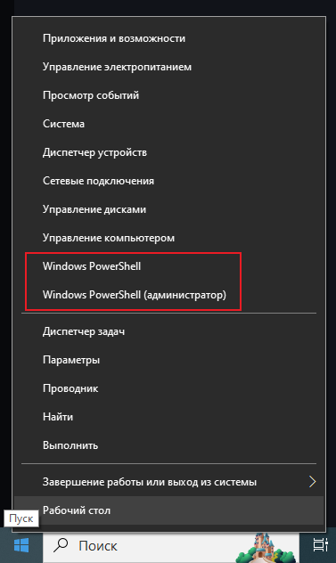
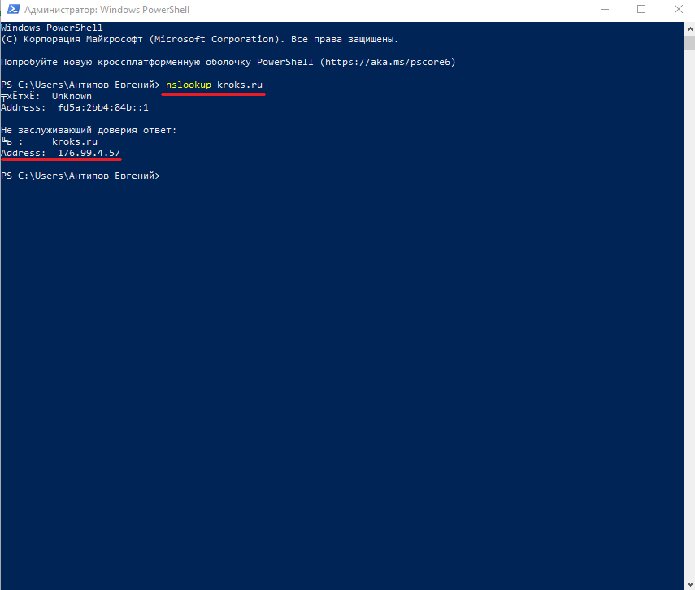
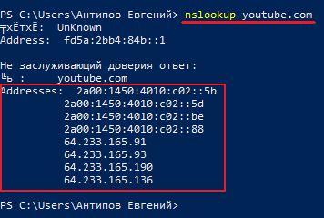
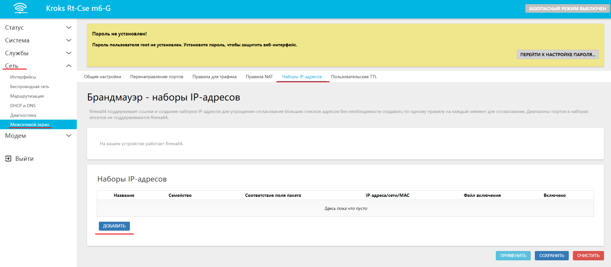
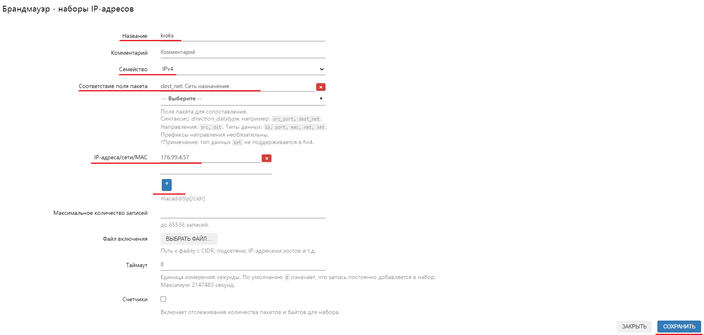
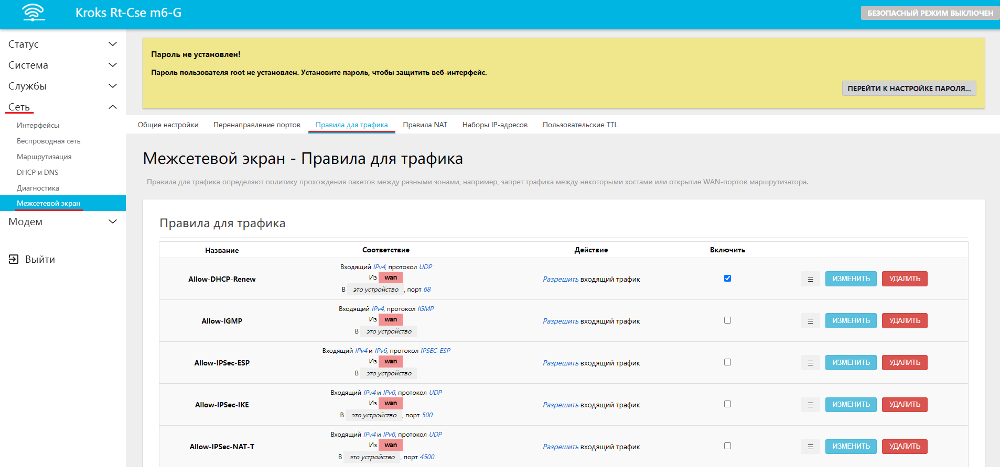
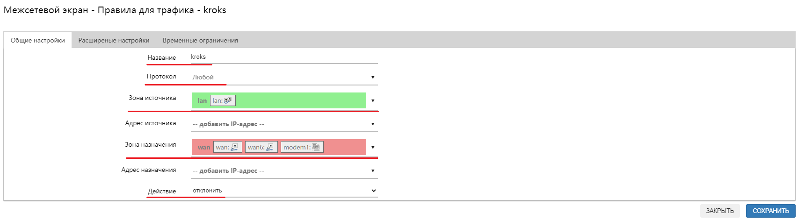
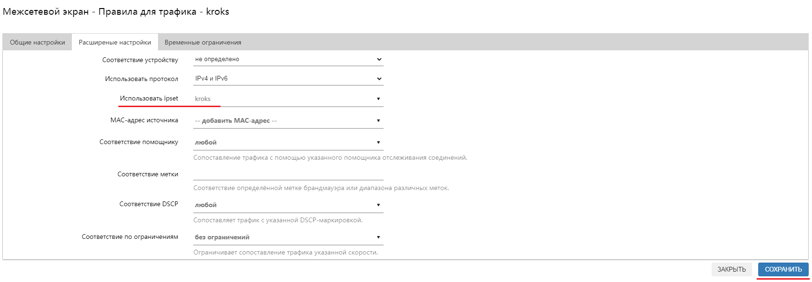
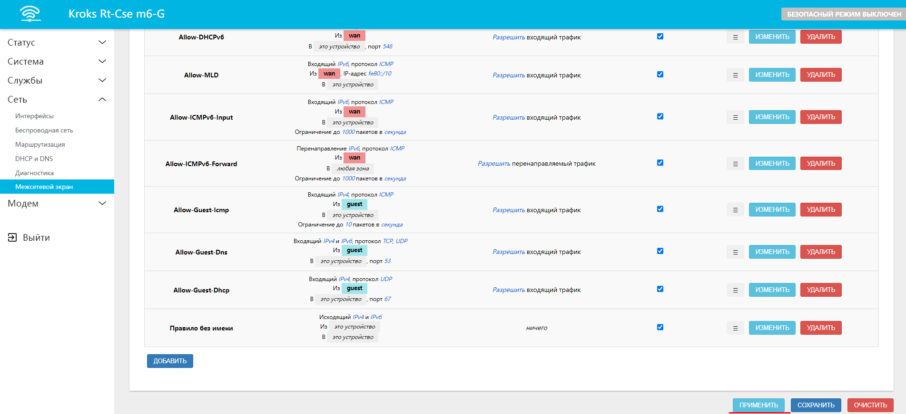

# Блокирование сайтов через веб-интерфейс роутера

В данной статье мы разберём способ блокирования доступа к каким-либо определенным ресурсам, через веб-интерфейс роутера Kroks. Для этого понадобится несколько простых действий.

## ***Получение IP адреса необходимого ресурса***

Для начала нам понадобится выяснить какие IP-адреса использует нужный вам ресурс. Проверить это можно с помощью **Windows PowerShell**.

Нажмите правой кнопкой мыши на меню **Пуск** и в открывшемся контекстном окне выберите пункт **Windows PowerShell** или **Windows PowerShell (администратор)**.  

В открывшемся окне введите команду **nslookup** и адрес нужного вам ресурса (в примере мы используем сайт **kroks.ru**), после чего нажать клавишу **Enter**. После выполнения команды, вы увидите в строке **Address** нужный вам IP-адрес.  

:::tip
Обратите внимание, что ресурс может использовать несколько IP-адресов, как формата IPv4, так и IPv6. В таком случае вам нужно скопировать их все.  

:::

## ***Набор IP-адресов***

Следующим шагом вам необходимо открыть веб-интерфейс роутера и перейти на вкладку "Сеть" → "Межсетевой экран" → "Наборы IP-адресов". Здесь нажмите кнопку "ДОБАВИТЬ".  

В открывшемся окне вводим следующие настройки:

**Название** - **любое (в примере kroks)**;

**Семейство** - зависит от типа IP-адресов, используемых ресурсом (в примере **IPv4**);

**Соответствие поля пакета** - **dest_net: Сеть назначения;**

**IP-адреса/сети/MAC** - сюда нужно ввести найденные ранее IP-адреса (в пример **176.99.4.57**), если адресов несколько, то нажмите на символ "**+"** для появления дополнительной строки.

Остальные строки рекомендуется оставить без изменений. По окончании настройки нажмите кнопку "СОХРАНИТЬ".  

## ***Правила для трафика***

Далее перейдите на вкладку "Сеть" → "Межсетевой экран" → "Правила для трафика", в нижней части страницы нажмите кнопку "ДОБАВИТЬ".  
  

В открывшемся окне введите следующие настройки:

**Название** - **любое (в примере kroks)**;

**Протокол** - **любой**;

**Зона источника** - **lan**;

**Зона назначения** - **wan**;

**Действие** - **отклонить.**  

После чего перейдите на вкладку "Расширенные настройки" и укажите здесь созданный вами набор IP-адресов в графе **Использовать ipset**, после чего нажмите кнопку "СОХРАНИТЬ".  

Теперь нужно нажать кнопку "ПРИМЕНИТЬ" внизу страницы.  

:::tip
После того как веб-интерфейс снова станет доступен, необходимо перезагрузить роутер.
:::

:::info
Если необходимый вам ресурс использует сразу и IPv4 и IPv6 адреса, то необходимо аналогичным образом создать для них **набор IP-адресов** и **Правила для трафика**.
:::
