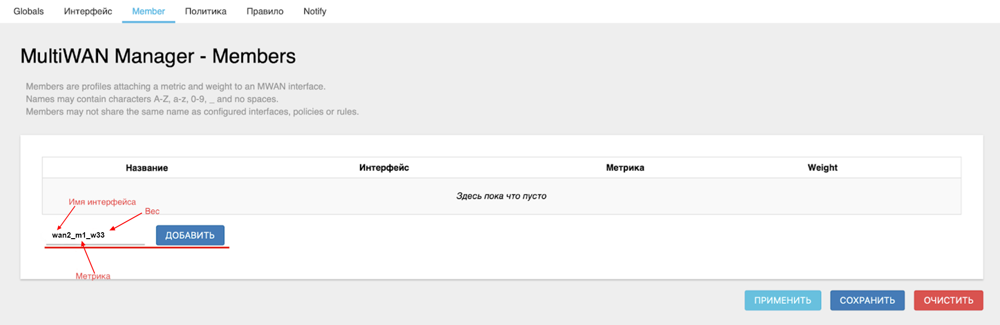
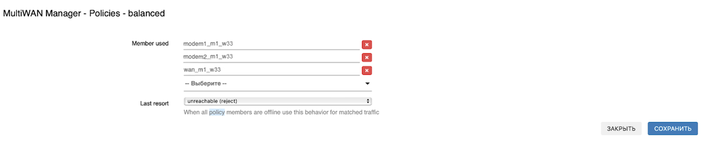

# Дополнительные случаи резервирования и балансировки

В этой статье собраны не самые распространенные варианты настройки вашего роутера, например, тут будут рассмотрены следующие случаи:

* Суммирование **modem1** - 33%, **modem2** - 33% и **wan** - 33%
* Суммирование **wan1** и **wan2**
* Одновременное использование  и суммирования и резервирования

## ***Суммирование modem1, modem2 и wan***

Подобный случай, как и любой другой где используется больше двух интерфейсов, отличается от уже [рассмотренных нами вариантов](/docs/routery/prodvinutaya-nastroyka/primery-summirovaniya-trafika.md) только большим количеством **Member**, создаваемых в процессе настройки.

Например, возьмём случай, разобранный в другой статье, [суммирование modem1 и modem2](/docs/routery/prodvinutaya-nastroyka/primery-summirovaniya-trafika.md#суммирование-modem1-и-modem2).

Следуя описанному пути, вам нужно лишь указать **вес** метрики не **50**, а **33** (если вы хотите, как в нашем примере, разделить нагрузку поровну, либо же любое другое нужное вам процентное соотношение).  
  
  

А также соответственно у вас будет отличаться количество **Member** в создаваемом правиле.  

В остальном процесс настройки суммирования абсолютно идентичен другим разобранным случаям.

## ***Суммирование wan1 и wan2***

Также в роутерах ***KROKS*** существует возможность использования в балансировке дополнительных интерфейсов **WAN.** Особенность данного варианта заключается в необходимости предварительной [настройки коммутатора](/docs/routery/prodvinutaya-nastroyka/nastroyka-kommutatora-na-routerah-KROKS.md).

После чего созданный интерфейс, например, **wan2** можно использовать удобным вам образом при [суммировании](/docs/routery/prodvinutaya-nastroyka/primery-summirovaniya-trafika.md) и/или [резервировании](/docs/routery/prodvinutaya-nastroyka/primery-rezervirovaniya-podklyucheniya.md). Процесс настройки не будет отличаться от уже разобранных случаев.

## ***Одновременное использование суммирования и резервирования***

Такая задача тоже не является чем-то сложным при настройке роутера ***KROKS***.

Единственное что будет отличать процесс настройки от приведенных ранее примеров - необходимость указать разную метрику для создаваемых **Member**. Например разберем такой случай:

***Нагрузка разделяется поровну между проводным и Wi-Fi подключениями. И в качестве резервного соединения, если оба основных интерфейса недоступны, будет использоваться соединение через модем.***

Для этого нам нужно создать "Member" согласно следующему правилу:

* Сначала в названии идёт имя интерфейса, например **wan**;
* За ним, через нижнее подчеркивание «*» следует его **метрика**, на этот раз не та, что мы указывали в "Сеть"* → "Интерфейсы", а относительная. Например, **m1** (где **m** - metric (метрика), а **1** - значение метрики).

:::tip
Метрика - число, определяющее приоритет интерфейса. Чем меньше метрика, тем более приоритетным становится интерфейс
:::

* Далее идёт **вес** метрики. Задаётся числом от 0 до 1000. Мы рекомендуем для повышения читаемости задавать вес в процентах. Так, например, распределение нагрузки равномерно по 4 интерфейсам будет иметь вес 25.

  В нашем же случае для wan укажем вес 50, так как он делит нагрузку с Wi-Fi в равной степени - **w50** (где **w** - weight (вес), а **50** - значение веса).

:::tip
Вес - число, определяющее приоритет интерфейса, **если их метрики одинаковы**. Чем выше вес, тем больше нагрузка на интерфейс при одинаковых метриках.

:::

Получаем итоговое название в виде - **wan_m1_w50**.  

Нажмите кнопку "ДОБАВИТЬ", выберите настраиваемый интерфейс и введите его метрику и вес.  

Добавьте остальные интерфейсы аналогичным образом.

:::tip
Не забывайте менять **Интерфейс** в соответствующем селекторе на настраиваемый.

:::

Теперь перейдём на вкладку "Политика". Удаляем каждую политику нажатием кнопки "Удалить" и создаём новую. Назовём её **balanced**. Нажмите кнопку "ДОБАВИТЬ".  

В открывшемся окне выберете ранее созданные интерфейсы в селекторе **Member used**.

Поле **Last resort** можно оставить без изменений.

Нажмите кнопку "СОХРАНИТЬ".  

Теперь перейдём на вкладку "Правило".

Создаём новое правило. Для примера назовём его **default**.

Нажмите кнопку "ДОБАВИТЬ".  

Теперь необходимо заполнить открывшееся окно:

* В поле **Internet Protocol** выбираем **Только IPv4**;
* В поле **Протокол** оставляем **all**;
* В поле **Sticky** выберите **Нет**;
* В поле **Policy assigned** выберите созданную нами политику **balanced**.

Нажмите "СОХРАНИТЬ".

Нажмите кнопку "ПРИМЕНИТЬ".  

