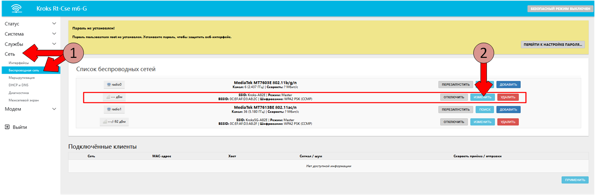
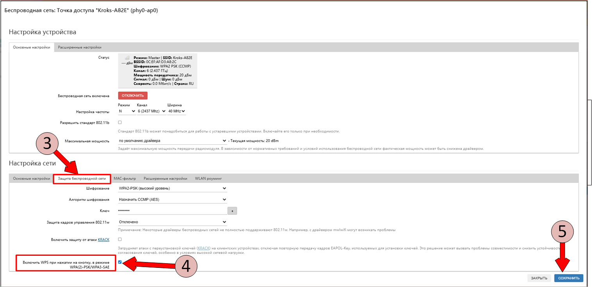
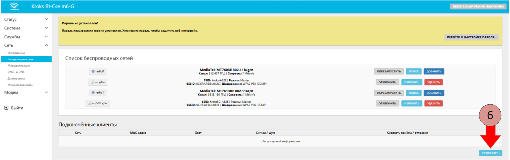
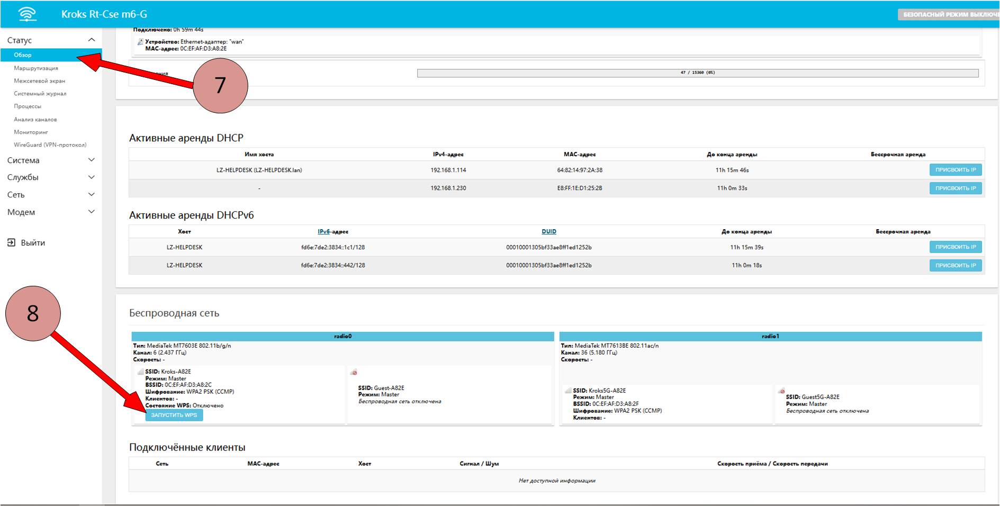
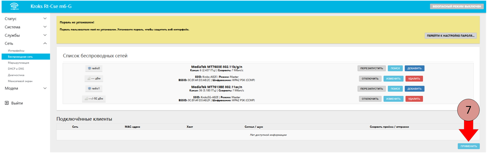

# Эмуляция WPS в роутере Крокс

##  1. "Нажатие" кнопки WPS

:::info
Данный способ может быть недоступен на устройствах со старой версией прошивки. Рекомендуем [обновить](/docs/routery/obnovlenie-proshivki/obnovlenie-proshivki-vstroennim-apdeiterom "Обновление прошивки") её до актуальной версии.
:::

#### 1.1. Подключитесь к [веб-интерфейсу роутера](/docs/routery/chasto-zadavaemye-voprosy/vhod-v-web-interface "Подключение к веб-интерфейсу"). Выберите пункт меню _Сеть_, затем подпункт _Беспроводная сеть_.

#### 1.2. Выберите сеть для работы с WPS и нажмите кнопку __"ИЗМЕНИТЬ"__.  
  
  

#### 1.3. Откроется окно представленное на изображении ниже. В разделе _Настройка сети_ выберите вкладку _Защита беспроводной сети_.  
#### 1.4. Сделайте активным пункт _"Включить WPS при нажатии на кнопку, в режиме WPA(2)-PSK/WPA3-SAE"._  
#### 1.5. Нажмите кнопку __"СОХРАНИТЬ"__.



#### 1.6. Нажмите кнопку __"ПРИМЕНИТЬ"__ во вновь открывшемся разделе ___Беспроводные сети___.  


#### 1.7. Слева в главном меню выберите _Статус_, а затем пункт _Обзор_.  
#### 1.8. Пролистайте страницу вниз и в разделе _Беспроводные сети_ нажмите на кнопку __"ЗАПУСТИТЬ WPS"__.  



:::warning
WPS будет автоматически отключен после подключения устройства или по истечении двух минут с момента нажатия на кнопку.  
:::

---        -----         ---- -- ------

## 2. Альтернативный способ "нажатия" кнопки WPS

#### 2.1. Подключитесь к [веб-интерфейсу роутера](/docs/routery/chasto-zadavaemye-voprosy/vhod-v-web-interface "Подключение к веб-интерфейсу").  
Выберите пункт меню ___Сеть___, затем подпункт ___Беспроводная сеть___. 

#### 2.2. Выберите сеть для работы с WPS и нажмите кнопку __"ИЗМЕНИТЬ"__.  
  
  

Откроется окно представленное на изображении ниже.  
#### 2.3. В разделе _Настройка сети_ выберите вкладку _Защита беспроводной сети_.  
Убедитесь, что установлены следущие настройки: 

   * __Шифрование__ - _WPA2-PSK_  
   * __Алгоритм шифрования__ - _авто_  

#### 2.4. Сделайте активным пункт _"Включить WPS при нажатии на кнопку, в режиме WPA(2)-PSK/WPA3-SAE"._  

#### 2.5. Необходимо так же запомнить наименование в круглых скобках, которое находится в верхней части окна. В нашем случае это __"phy0-ap0"__. Эта информация понадобится нам при дальнейшей настройке (в пункте 4 данной статьи).  

  
#### 2.6. Нажмите кнопку __"СОХРАНИТЬ"__.     
  


#### 2.7. Нажмите кнопку __"ПРИМЕНИТЬ"__ во вновь открывшемся разделе _Беспроводные сети_.  



### 3. Подключение к роутеру по SSH

Сделать это можно с помощью способа описанного в статье ["Подключение по SSH"](/docs/routery/chasto-zadavaemye-voprosy/podklyuchenie-po-ssh "Подключение по SSH").

### 4. Команды для управления кнопкой WPS

 #### 4.1. "Нажатие" кнопки WPS.

```bash
    ubus call hostapd.phy0-ap0 wps_start
```  

Следует обратить внимание на данную часть строки: `phy0-ap0`.  
Замените её на содержимое скобок из пункта 2.5 данной статьи.   


 #### 4.2. Проверка статуса "нажатия" кнопки WPS.  
 
Для проверки текущего состояния кнопки WPS нужно воспользоваться командой ниже.

```bash
    ubus call hostapd.phy0-ap0 wps_status
```  
В результате выполнения команды будет выведено примерно следущее: 

```bash
    "pbc_status": "Active",
    "last_wps_result": "Success",
    "peer_address": "63:81:12:97:2a:35"
```

Разберем, значение строк на этом примере:  
     
   + __pbc_status__ - текущий статус кнопки. Если кнопка "нажата", то значение _Active_. Если нет, то _Disabled_.  
   + __last_wps_result__ - результат последнего подключения. Если подключение произошло, то значение _Success_, в противном случае значение _None_.  
   + __peer_address__ - адрес подключенного устройства.   


 #### 4.3. Отключение кнопки WPS. 

WPS будет автоматически отключен после подключения устройства или по истечении двух минут с момента нажатия на кнопку.  
В ручном режиме это можно сделать командой ниже.
    
```bash
    ubus call hostapd.phy0-ap0 wps_cancel
```

    