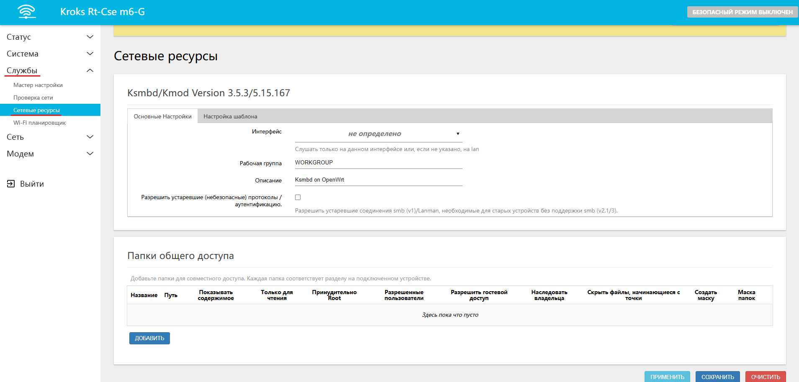
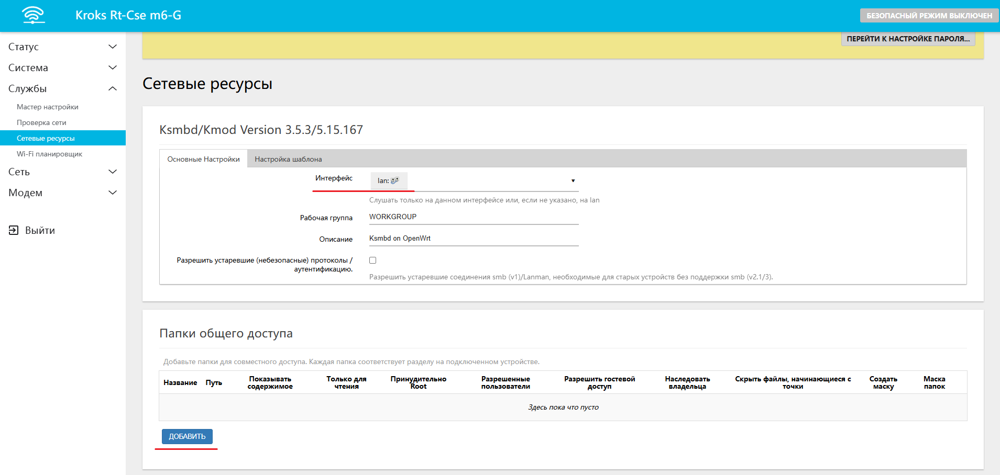
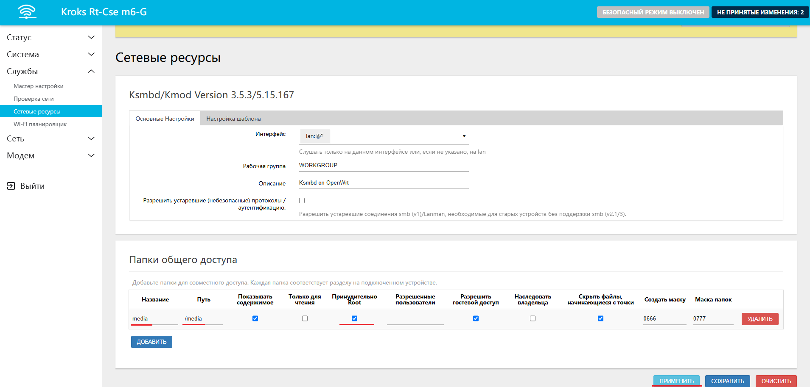
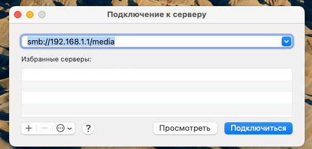
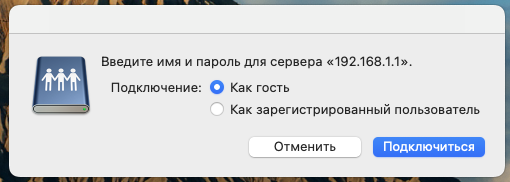
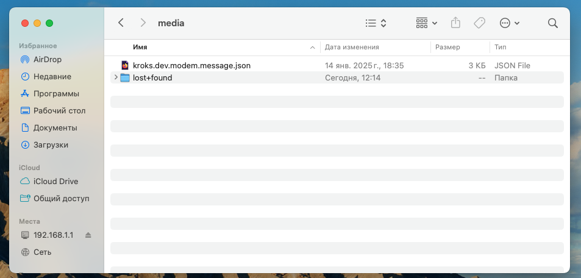

# Настройка SAMBA сервера

Для совместного доступа к файлам внутри локальной сети роутеры фирмы Крокс поддерживают SAMBA-сервер. Главное условие - наличие у роутера USB-порта. В этом случае можно вставить в него USB-накопитель, разметить его согласно [статье о работае с USB-накопителями](/docs/routery/prodvinutaya-nastroyka/rabota-s-USB.md) и настроить SAMBA. После этого всем устройствам в вашей сети будут доступны файлы из USB-накопителя. Фильмы, музыка, фотографии и другие файлы можно легко загрузить с одного устройства и открыть на другом.

## ***Установка пакетов***

Для работы нам потребуется пакеты *shadow-useradd*, *shadow-userdel* и *luci-app-ksmbd*. Установите их согласно [инструкции по установке пакетов](/docs/routery/prodvinutaya-nastroyka/ustanovka-storonnih-paketov.md). После установки выйдите из веб интерфейса кнопкой Выход и войдите вновь.

## ***Настройка SAMBA***

После установки пакета мы можем перейти в интерфейс настройки SAMBA-сервера на вкладке "Службы" -> "Сетевые ресурсы".

Порядок настройки довольно прост. На вкладке **Основные настройки**:

* **Интерфейс** - выберите LAN

Во вкладке **Папки общего доступа** нажмите "ДОБАВИТЬ" и введите следующие параметры:

* **Название** - название вашего SAMBA-сервера (в нашем примере это media)
* **Путь** - путь к накопителю (в нашем примере это /media)
* **Принудительно ROOT** - отметьте галочкой, чтобы накопитель был доступен всем пользователям

Примените настройки. После этого настройка SAMBA-сервера окончена.

## ***Подключение к SAMBA-серверу***

Мы рассмотрим общий принцип подключения к SAMBA-серверу. Инструкции для вашей операционной системы необходимо будет найти отдельно.

Мы же откроем Проводник и найдём пункт Подключение к серверу. В появившемся диалоговом окне выберем опцию Войти как гость, так как мы не настраивали авторизацию. После Подключения мы можем обнаружить файлы, записанные на накопителе. Здесь мы обнаружили файл с информацией из сервиса модема, который копировали в [инструкции о работе с USB-накопителем](/docs/routery/prodvinutaya-nastroyka/rabota-s-USB.md).

