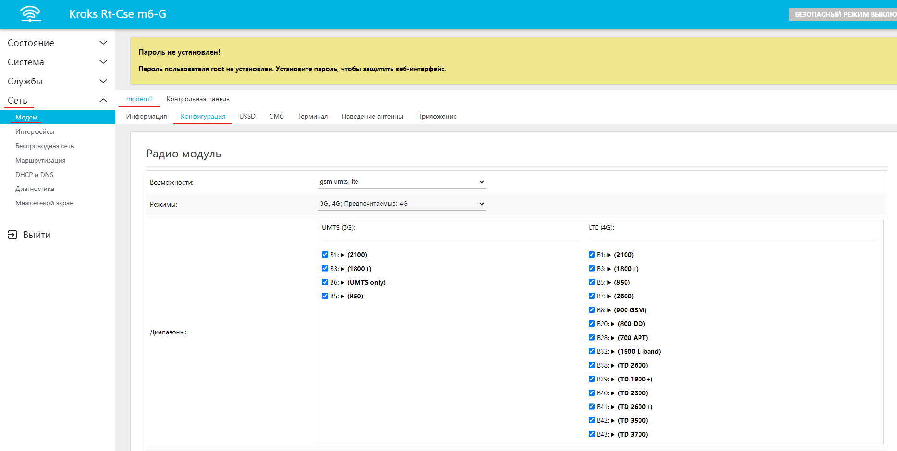
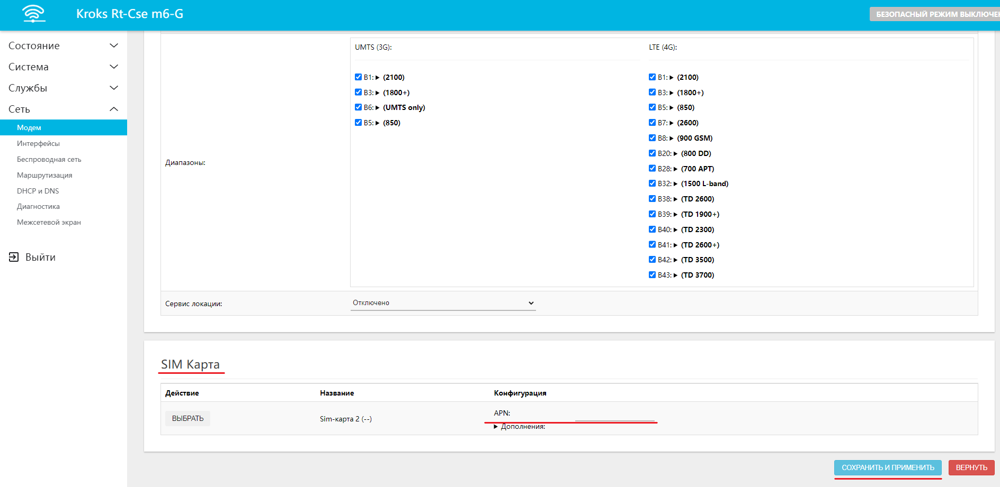
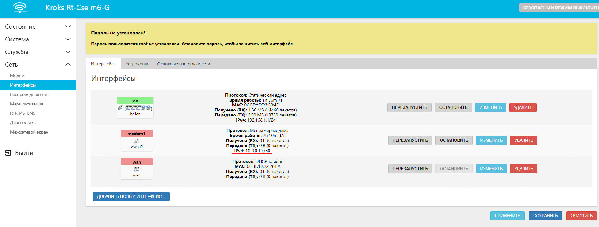
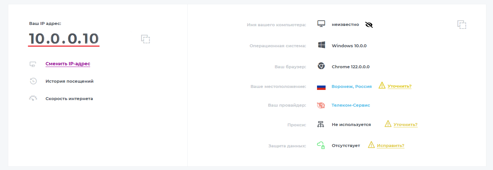
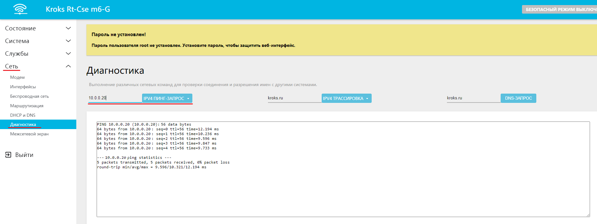
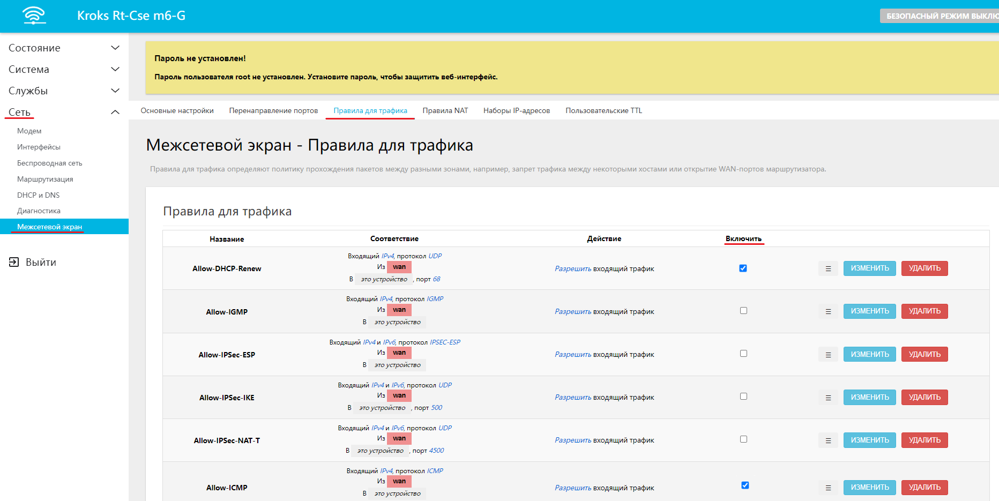
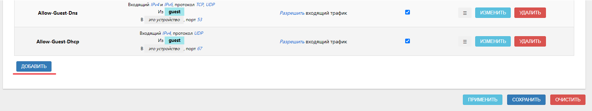
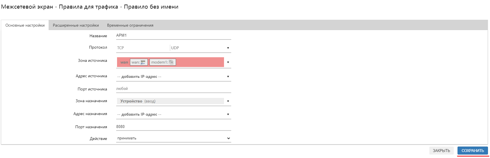
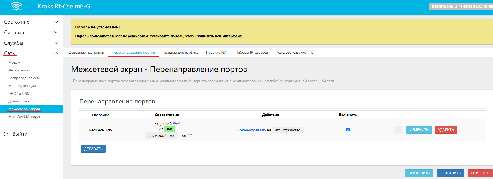
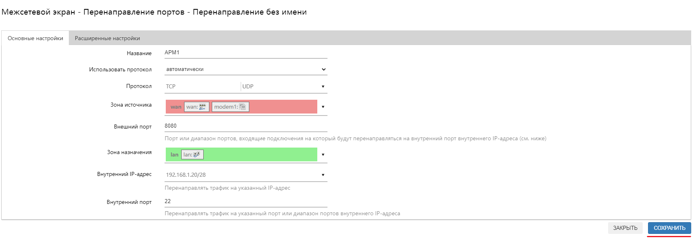

# Настройка коммуникации по выделенному APN с помощью роутеров KROKS

## ***Сброс устройства на заводские настройки***

:::info
Данный пункт является не обязательным и рекомендуется только для того чтобы избежать случайных осложнений и конфликтов с уже существующими настройками устройства.

С инструкцией о том как откатить устройство к заводским настройкам вы можете ознакомиться в отдельной [статье](/docs/routery/chasto-zadavaemye-voprosy/sbros-ustroystva-na-zavodskie-nastroyki.md).
:::

## ***Настройки модема***

Первым шагом в этой статье мы возьмем настройку модема. Для этого перейдите во вкладку "Сеть" → "Модем" → "Конфигурация".  

Теперь вам необходимо перейти к пункту **SIM Карта** и найти строку **APN**. Под стройкой **APN** откройте вкладку **Дополнение**, здесь вы можете ввести данные, предоставленные вам оператором. Не забудьте нажать на кнопку "СОХРАНИТЬ И ПРИМЕНИТЬ".  

Далее необходимо проверить, что IP адрес, указанный во вкладке "Сеть" → "Интерфейсы" → **modem1** и фактический IP адрес совпадают. Для этого можно воспользоваться, например сайтами [2ip](https://2ip.ru/)  или [Яндекс](https://yandex.ru/internet). В примере мы использовали второй вариант.  
  

:::tip
Если IP адреса не совпадают обратитесь к провайдеру за помощью.
:::

Если всё успешно, то далее вам необходимо таким же образом настроить второй роутер.

## ***Проверка настройки***

Для того чтобы проверить правильность произведенной настройки можно запустить **Пинг** от одного роутера к другому.

Перейдите во вкладку "Сеть" → "Межсетевой экран" → "Правила для трафика". Найдите пункт **Allow-ICMP** и поставьте галочку в столбце **Включить** и нажмите кнопку "ПРИМЕНИТЬ".  

Далее необходимо провести аналогичные действия с обоими роутерами:

* На одном из роутеров откройте вкладку "Сеть" → "Диагностика";
* Выполните **IPV4 ПИНГ-ЗАПРОС**, заменив адрес [kroks.ru](http://kroks.ru/) (по умолчанию) на IP адрес другого роутера (например, 10.0.0.20).

Если всё настроено правильно, **Пинг** должен пройти успешно.  

## ***Открыть порт***

Для того чтобы открыть необходимый порт, перейдите во вкладку "Сеть" → "Межсетевой экран" → "Правила для трафика" и нажмите кнопку "ДОБАВИТЬ" внизу страницы.  
  

В открывшемся окне необходимо ввести следующие данные:

* **Название** - любое название на латинице, например, **APM1**;
* **Протокол - TCP**, **UDP** (дополнительные по необходимости);
* **Зона источника** - **WAN**;
* **Адрес источника** - оставьте пустым;
* **Порт источника** - **любой**;
* **Зона назначения** - **Устройство**;
* **Адрес назначения** - оставьте пустым;
* **Порт назначения** - целевой порт, например, **8080**. Это порт, на который будет идти запрос из внешней сети. Например: 10.0.0.20:8080;

После чего нажмите кнопку "СОХРАНИТЬ".  

## ***Проброс порта***

Откройте вкладку "Сеть" → "Межсетевой экран" → "Перенаправление портов".

Нажмите кнопку "ДОБАВИТЬ".  

Далее заполним появившееся окно следующим образом:

* **Название** - любое на латинице, например, **APM1**;
* **Зона источника** - **WAN**;
* **Внешний порт** - целевой внешний порт (в примере это 8080);
* **Зона назначения** - **LAN**;
* **Внутренний IP** - IP адрес целевого устройства, например, **192.168.1.20**;
* **Внутренний порт** - порт на целевом устройстве, например, **22**.

В этом примере получится, что при запросе 10.0.0.20:8080 роутер отправит его в локальную сеть по адресу 192.168.1.20:22.  

Примените настройки и проделайте аналогичные манипуляции на втором роутере.
