# Настройка коммутатора на роутерах KROKS

## ***Перевод LAN в WAN***
В данной статье мы разберем инструкцию о том как происходит настройка коммутатора на роутерах ***KROKS***. В качестве примера мы переведем один из портов **lan** в режим **wan**.

:::tip
Обратите внимание, что данная статья разделена на две части, каждая из них является инструкцией к конкретной линейке роутеров ***KROKS***. Поэтому выполнять нужно только одну из двух частей, предварительно определив подходящую к вашему устройству.
:::

## ***На роутерах kndrt41rX***

:::info
**kndrt41rX** - платформа на которой базируются **гигабитные** роутеры **KROKS**, где **X** - это обозначение конкретной модели роутера, например, kndrt41r**1** или kndrt41r**7**.
:::

### ***Настройка коммутатора kndrt41rX***

* Заходим на вкладку "Сеть" → "Интерфейсы" → "Устройства".
* Находим устройство **br-lan** и нажимаем кнопку "НАСТРОИТЬ…"  
   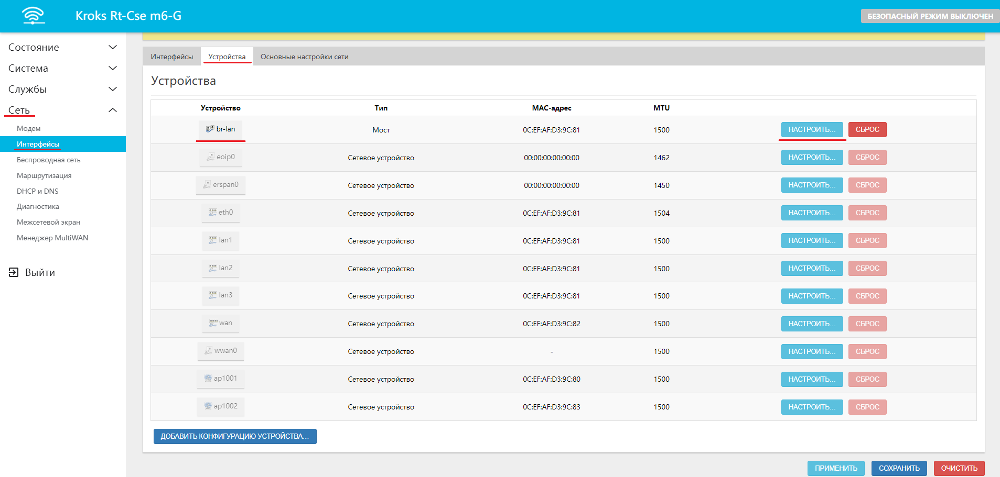
* В пункте **Порты моста** убираем галочку с необходимого нам порта, например, **lan2**.  
   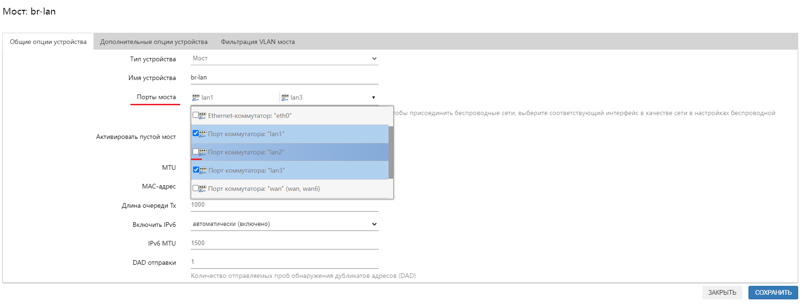
* Нажмите поочередно кнопки "СОХРАНИТЬ" и "ПРИМЕНИТЬ".  
   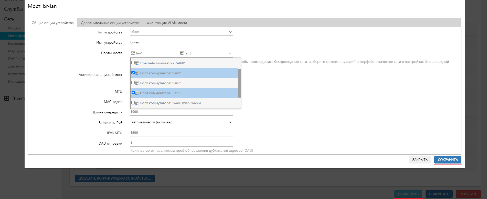

### ***Настройка Интерфейса kndrt41rX***

* Переходим на вкладку "Сеть" → "Интерфейсы" → "Интерфейсы" и нажимаем кнопку "ДОБАВИТЬ НОВЫЙ ИНТЕРФЕЙС".  
   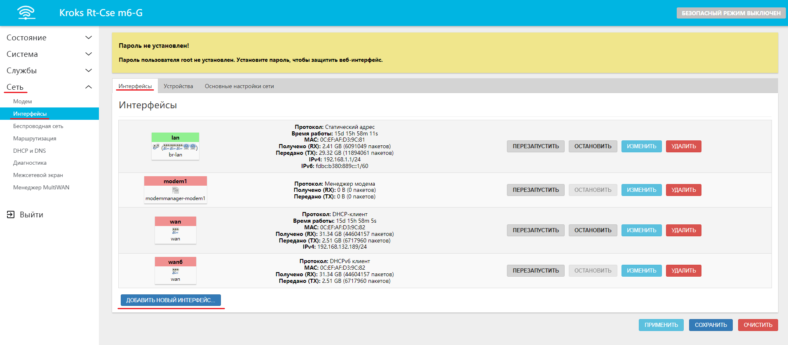
* Заполняем необходимые поля в открывшемся окне:
  * Указываем **Название**, например **wan2**;
  * Указываем **Протокол** - **DHCP-клиент**;
  * Устройство - **lan2**;
  * Нажимаем кнопку "СОЗДАТЬ ИНТЕРФЕЙС".  
  
* В открывшемся окне переходим в настройки межсетевого экрана и выбираем зону **wan**. Последовательно нажимаем кнопки "СОХРАНИТЬ" и "ПРИМЕНИТЬ".  
   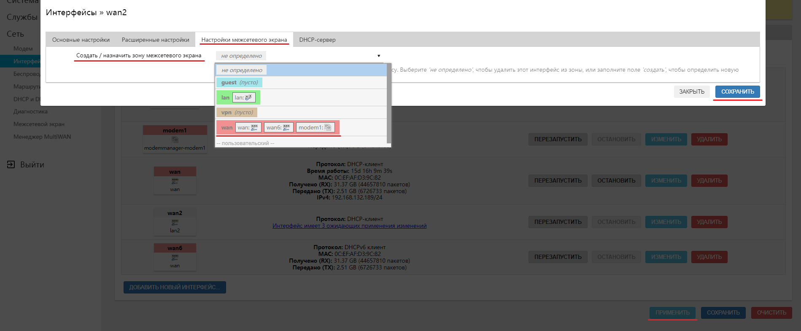

## ***На роутерах kndrt31rX***

:::info
**kndrt31rX** - платформа на которой базируются **100 Мбит** роутеры **KROKS**, где **X** - обозначение конкретной модели, например, kndrt31r**27** или kndrt31r**19**.
:::

### ***Настройка коммутатора kndrt31rX***

* Заходим на вкладку "Сеть" → "Коммутатор".  
   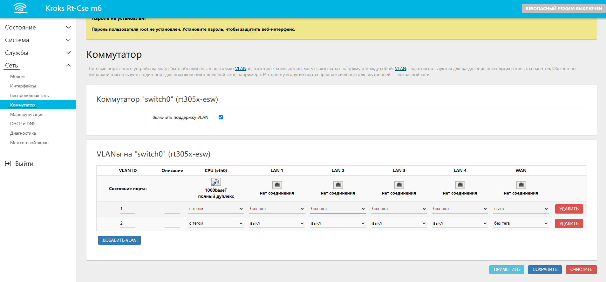
* Находим нужный нам порт, например, **lan2** и под ним на всех селекторах выбираем **Выкл**.  
   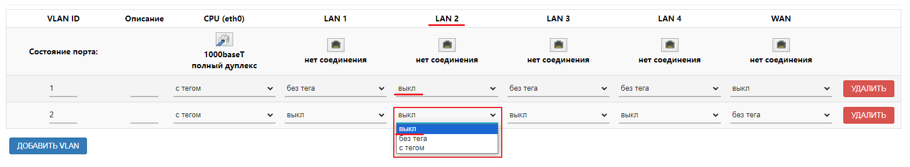
* Нажимаем кнопку "ДОБАВИТЬ VLAN".  
   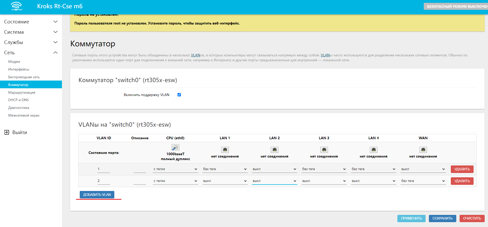
* Заполняем необходимы поля в появившейся строке:
  * В поле **Состояние порта** вводим номер по порядку (в нашем случае он третий по счёту);
  * В селекторе **CPU** выбираем "с тегом";
  * В селекторе **нашего порта** выбираем "без тега" (в нашем случае это **lan2**);
  * Нажимаем кнопку "ПРИМЕНИТЬ".  
  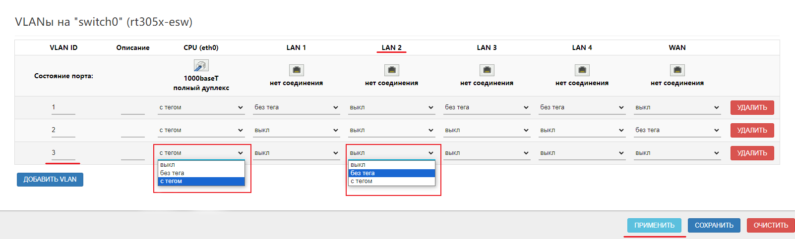

### ***Настройка Интерфейса kndrt31rX***

* Переходим на вкладку "Сеть" → "Интерфейсы" → "Интерфейсы" и нажимаем кнопку "ДОБАВИТЬ НОВЫЙ ИНТЕРФЕЙС…".  
   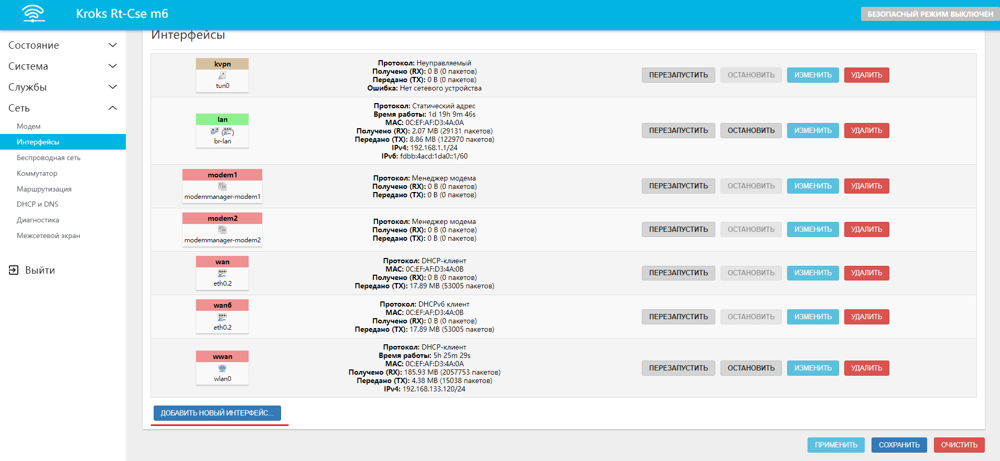
* В открывшемся окне заполняем необходимые поля;
  * Указываем **Название**, например, **wan2**;
  * Указываем **Протокол** - **DHCP-клиент**;
  * Указываем **Устройство - eth0.**(номер, что мы ввели ранее. В нашем случае - 3);
  * Нажимаем кнопку "СОЗДАТЬ ИНТЕРФЕЙС".  
  
* В открывшемся окне переходим в настройки межсетевого экрана и выбираем зону **wan**.

Последовательно нажимаем кнопки "СОХРАНИТЬ" и "ПРИМЕНИТЬ".  
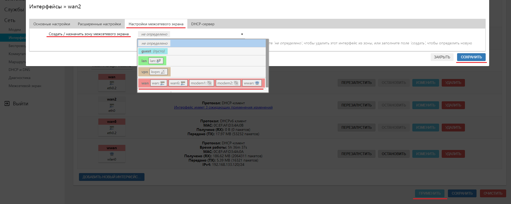
