# Ограничение пропускной способности сетевого трафика (SQM и Nft QoS)

Возможности базовой операционной системы не позволяют ограничивать скорость трафика, однако это можно сделать с помощью специального ПО.

В данной статье мы разберем несколько возможных вариантов регулирования скорости трафика. Например, ограничение по интерфейсам с помощью пакета **SQM** (**Smart Queue Management**) и ограничение по IP или MAC адресу с помощью пакета **Nft QoS**.

**SQM** позволяет ограничить общую скорость соединения с провайдером (WAN), клиентов, подключенных к физическим портам LAN (LAN1, LAN2 и пр.), клиентов, например, гостевой Wi-Fi-сети, VLAN, туннелей и пр. При этом **SQM** не позволяет ограничивать скорость клиентов по IP или MAC-адресам, для чего нам понадобится уже пакет **Nft QoS**.

:::tip
**SQM** может не только ограничивать трафик, но и бороться с таким явлением как [bufferbloat](https://ru.wikipedia.org/wiki/%D0%98%D0%B7%D0%BB%D0%B8%D1%88%D0%BD%D1%8F%D1%8F_%D1%81%D0%B5%D1%82%D0%B5%D0%B2%D0%B0%D1%8F_%D0%B1%D1%83%D1%84%D0%B5%D1%80%D0%B8%D0%B7%D0%B0%D1%86%D0%B8%D1%8F) - нежелательной задержкой, которая возникает, когда маршрутизатор буферизирует слишком много данных.

Устранение излишней буферизации (без прямой необходимости ограничивать трафик) является одной из основных функций SQM и позволяет и позволяет более эффективно использовать пропускную способность канала. Но это тема для отдельной статьи.

:::

## ***Установка***

:::info
Обратите внимание что при настройках роутера по умолчанию у вас может быть активен пункт **Программный flow offloading**. Данный пункт не полностью совместим с используемыми нами пакетам, поэтому перейдите во вкладку "Сеть" → "Межсетевой экран" и уберите галочку с этого пункта, если она есть.  
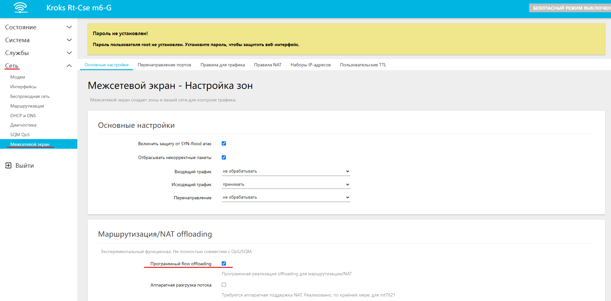

:::

SQM устанавливается как отдельный пакет (luci-app-sqm), после чего он становится доступен в веб-интерфейсе роутера в виде отдельного меню. Подробности в [статье](/docs/routery/prodvinutaya-nastroyka/ustanovka-storonnih-paketov.md) о том, как устанавливать пакеты и на скриншоте ниже.  
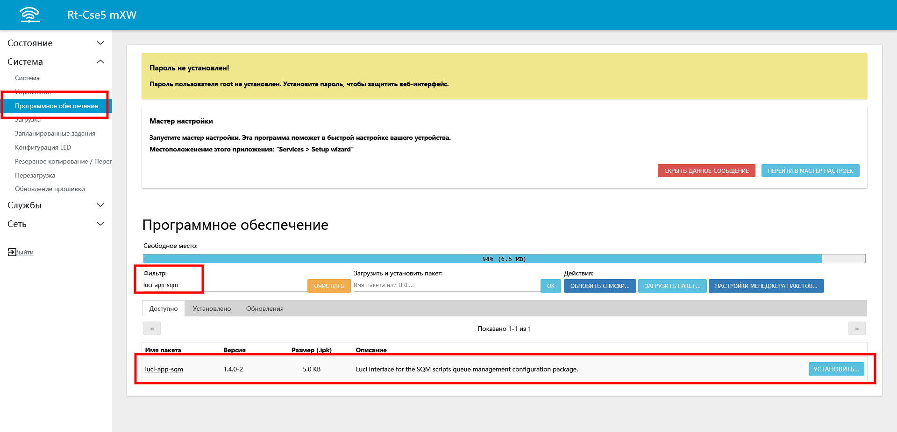

После его установки требуется обновить страницу (в некоторых случаях может потребоваться обновить страницу браузера с очисткой кэша (Ctrl+F5) и/или перезагрузить роутер).

В результате вы увидите в разделе "Сеть" вкладку "SQM QoS".

Аналогичным образом необходимо также установить пакет "luci-app-nft-qos", вследствие чего вы также увидите в разделе "Службы" вкладку "QoS over Nftables".

## ***Пример работы с SQM***

Пункт "Enable this SQM instanse" включает функцию ограничения скорости, и в полях **Download speed** и **Upload speed** вы можете задать скорость в кбит/с для интерфейса, выбранного в поле **Имя интерфейса**.

:::info
Обратите внимание, для регулировки скорости соединения на своём ПК, например для теста, вам необходимо выбрать в селекторе интерфейса **wan**, после установки пакета там может быть указан любой другой.  
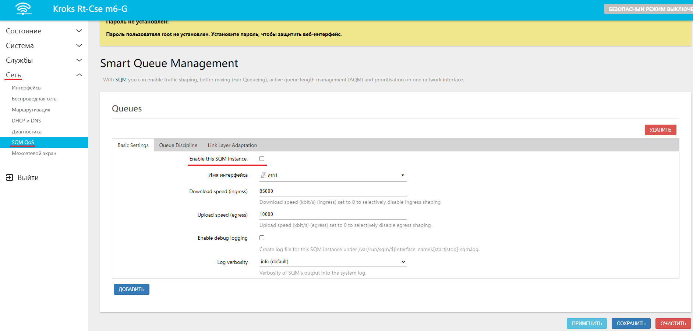

:::

Почти все остальные опции и вкладки, предназначаются для настроек параметров в контексте борьбы с излишней буферизацией. Для ограничения скорости достаточно минимальных, вышеописанных настроек.

Попробуем ограничить общую скорость оператора до 1 Мбит/с.

Для этого сперва проверим максимальную скорость соединения. В нашем случае она доходит до 632 Мбит/с.  
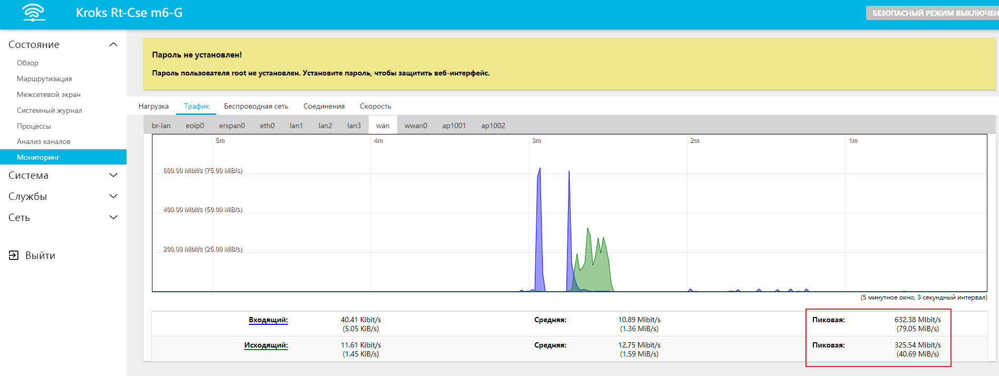

Теперь попробуем ограничить скорость 1000 кбит/с и повторно запустим тест скорости. Как видим, ограничение работает.  
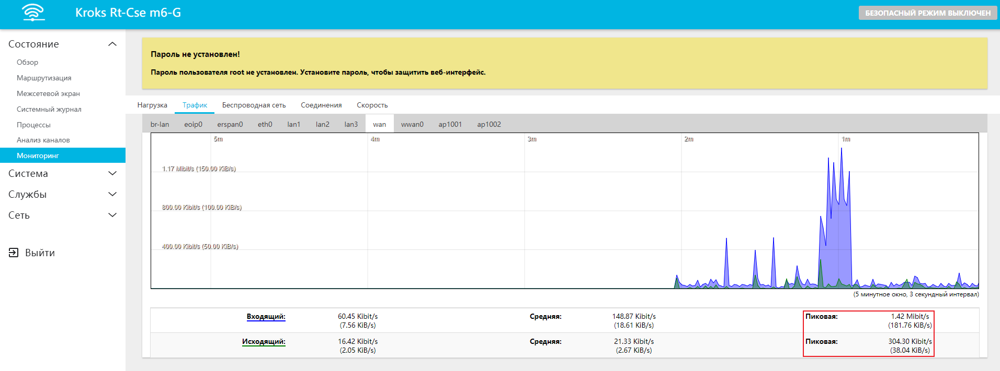

Теперь попробуем выставить ограничение в 2500 кбит/с и повторить тест.  
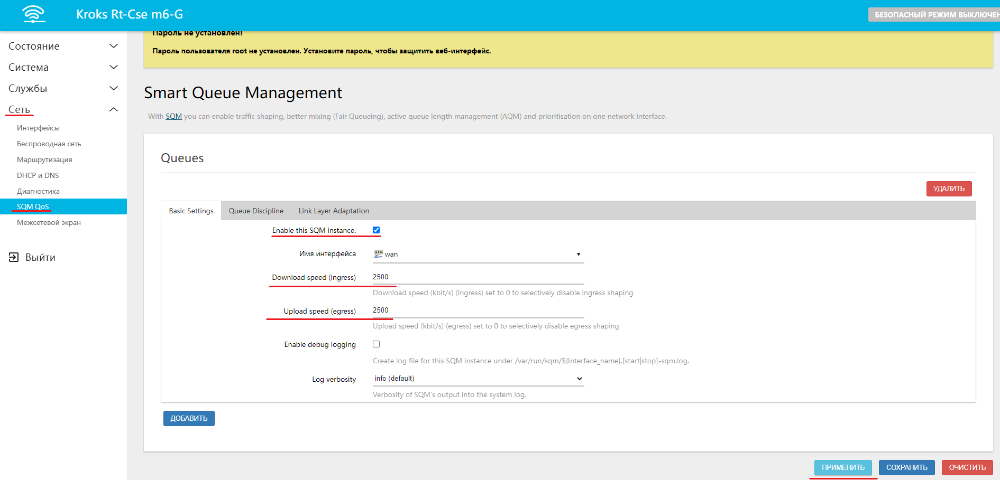  
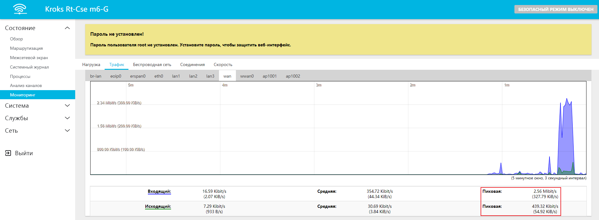

Как видим, всё работает.

## ***Пример работы с Nft QoS***

Для регулировки скорости соединения пользователей с помощью данного пакета, необходимо получить их IP или MAC-адрес.

Для этого мы открываем вкладку "Сеть" → "Беспроводная сеть". Здесь мы видим пункт **Подключенные клиенты**, в котором указаны необходимые нам данные.  
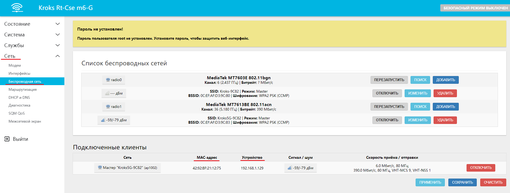

Теперь мы можем перейти во вкладку "Службы" → "QoS через Nftables".

В открывшемся окне по умолчанию активирована возможность [ограничения скорости по IP-адресу устройства](#ограничение-по-ip-адресу-устройства).  
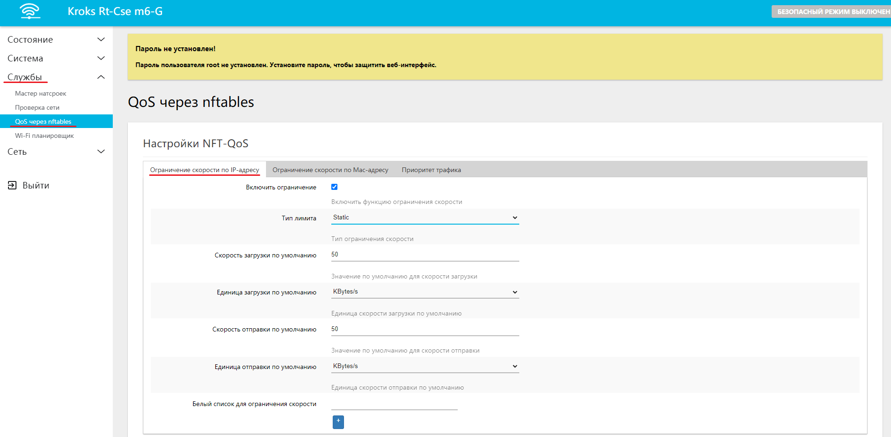

Но также данный пакет позволяет вам реализовать [ограничение пропускной способности сети](#ограничение-пропускной-способности-сети) и [ограничение скорости по MAC-адресу устройства](#ограничение-по-mac-адресу-устройства). Также присутствует возможность регулировки приоритета трафика для разных потребителей, но это тема для отдельной статьи.

### ***Ограничение по IP-адресу устройства***

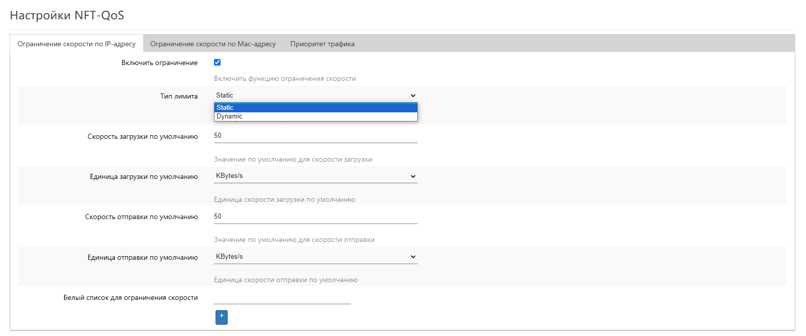

:::info
Данное меню позволяет указать вам:

* **Тип лимита** - в данном селекторе вы можете выбрать один из двух пунктов:
  * **Static** - вариант, при котором происходит ограничение скорости соединения конкретных клиентов;
  * **Dynamic** - вариант, при котором происходит ограничение пропускной способности сразу для целой сети из нескольких клиентов.
* **Скорость загрузки по умолчанию** и **Скорость отправки по умолчанию** - установленные в этих строках значения, будут автоматически присваиваться для устройств, которым вы хотите ограничить скорость соединения;
* **Единица загрузки по умолчанию** и **Единица отправки по умолчанию** - эти пункты служат для удобства регулировки и не являются обязательными. Например вы можете изменить значение с **KByts/s** (килобайт в секунду) на **MByts/s** (мегабайт в секунду), в таком случае значения в строках можно указывать уже не **15 000**, а просто **15**;
* **Белый список для ограничения скорости** - здесь вы можете указать список IP-адресов устройств для которых хотели бы снять ограничения.

:::

Ниже находятся ещё две вкладки в которых вам и нужно будет добавлять новые устройства.

**Статический QoS - скорость загрузки**  и **Статический QoS - скорость отправки**, то есть при желании вы можете ограничить только один из этих параметров.

В необходимой вкладке нажмите кнопку "ДОБАВИТЬ" и введите IP-адрес нужного устройства, а также желаемую скорость, если она будет отличаться от выставленной по умолчанию.

После чего не забудьте нажать на кнопку "СОХРАНИТЬ И ПРИМЕНИТЬ".

В нашем примере мы ограничили скорость загрузки и скорость отправки устройства, но сделали их выше чем значения по умолчанию.  
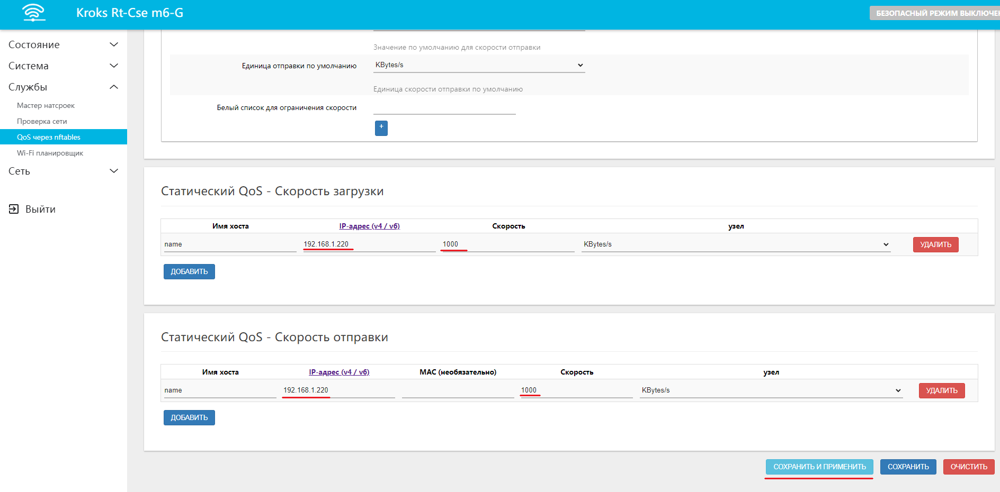

:::info
Обратите внимание, что регулировка скорости происходит в **Мегабайтах**, а тест в **Мегабитах**, поэтому указанные нами **1 000 Килобайт** превратились в  **8 Мегабит**.

Рекомендуем при регулировке скорости отталкиваться от пропорции **1 Мбит/с = 125 KBytes/s**.  

:::

### ***Ограничение пропускной способности сети***

Если изменить **Тип лимита** на **Dynamic**, то в открывшемся окне вы можете ограничить пропускную способность для сети, то есть **суммарно** для всех клиентов находящихся в ней.

Вам требуется только указать желаемые ограничения и целевую сеть, например по умолчанию сеть вашего роутера будет обозначаться **192.168.1.0/24**.

Также при необходимости вы можете указать устройства на которые не будет распространяться ограничение, для этого нужно ввести в строку **Белый список для ограничения скорости** IP-адрес устройства и нажать кнопку **+**.  
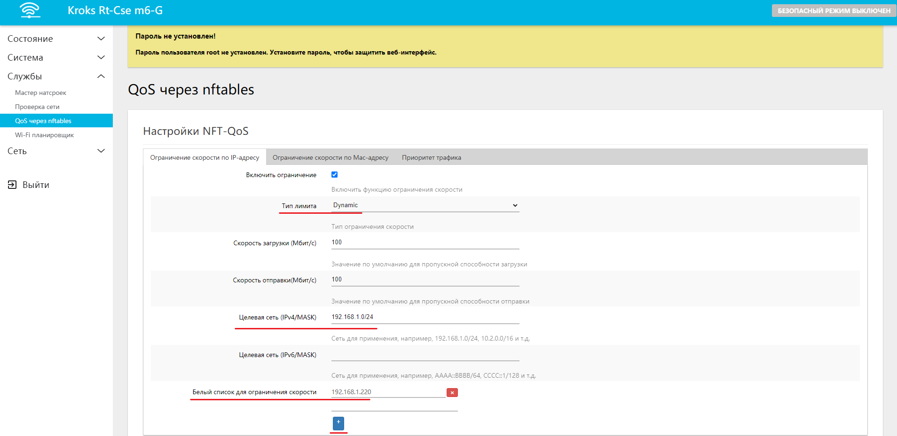

### ***Ограничение по MAC-адресу устройства***

Для того чтобы настроить ограничение скорости по MAC-адресу устройства, необходимо поставить галочку напротив пункта **Включить ограничение** и нажать на кнопку "СОХРАНИТЬ И ПРИМЕНИТЬ". После чего у вас появится новая вкладка "Ограничение скорости трафика по MAC-адресу".

Нажимаем кнопку "ДОБАВИТЬ" и указываем необходимые ограничения в поле. После настройки не забудьте нажать кнопку "СОХРАНИТЬ И ПРИМЕНИТЬ".  
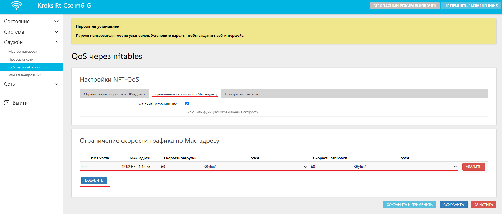

:::warning
На роутерах на базе платформы kndrt31 ограничение по MAC-адресу работает не в полной мере. Для ограничения скорости на этой платформе лучше использовать ограничения по IP-адресу.
:::
