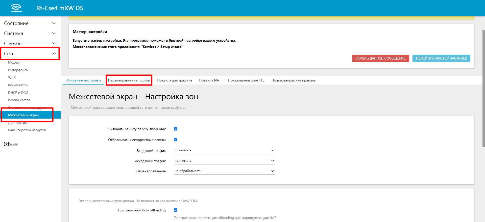
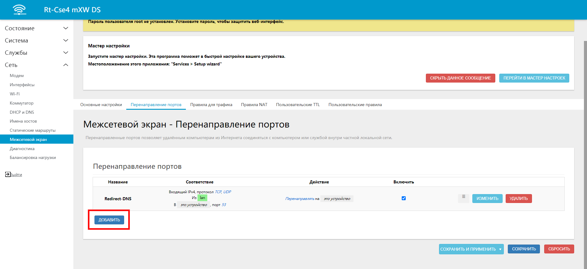
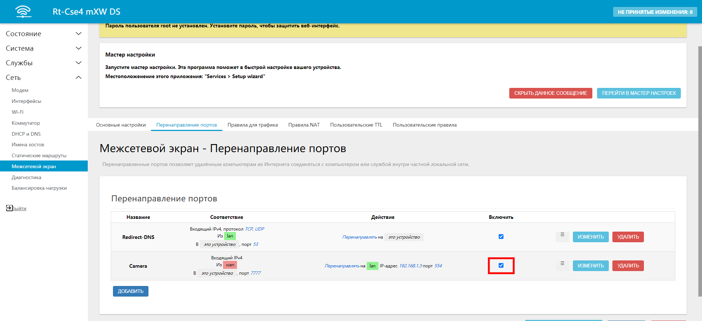

# Перенаправление (проброс) портов

По умолчанию в большинстве роутеров, в том числе и в роутерах Крокс запрещены входящие подключения из интернета к устройствам в домашней сети. Эти ограничения определяются файрволом и это является обычным стандартом безопасности. Но в некоторых случаях доступ нужно открывать. Например:

В вашей домашней сети есть камера, к которой вы хотите получать доступ в любое время и из любого места, где есть интернет. Для этого в роутере необходимо открыть путь конкретно к этой камере, оставляя закрытыми все остальные устройства в локальной сети. Для этого и используется перенаправление (проброс) портов.

**Обязательным условием для перенаправления портов является наличие "белого" статического IP-адреса, присвоенного оператором (провайдером).**

## ***Разбор примера***

Итак, у вас есть статический IP-адрес, полученный от провайдера. Например это 11.22.33.44, адрес роутера во внутренней локальной сети - 192.168.1.1 и адрес камеры 192.168.1.5 Рассмотрим, как открыть доступ к этой камере "извне".

Зайдите в веб-интерфейс роутера во вкладку Сеть - Межсетевой экран - Перенаправление портов:  

Нажмите "Добавить":  

Итак, для того, чтобы мы имели доступ к нашей камере нам необходимо указать:

* **Название** - произвольно;
* **Протокол** - Для разных устройств разные протоколы. Как правило это UDP или TCP. Можно выбрать несколько, либо разрешить все протоколы. В любом случае необходимо обратиться к документации к устройству, к которому будете открывать доступ;
* **Зона источника** - откуда вы хотите получать доступ. Для доступа из внешнего сети интернет оставьте зону wan;
* **Внешний порт** - порт, входящие подключения на который будут перенаправляться на внутренний порт внутреннего IP-адреса (камеры). Может быть задан в диапазоне от 1 до 65535;
* **Зона назначения** - для нашего случая оставляем lan;
* **Внутренний IP-адрес** - IP-адрес камеры. Как мы решили раньше, он у нас 192.168.1.5;
* **Внутренний порт** - порт IP-камеры. Например 80, 8080 если это HTTP или HTTPS, 554, если это RTSP. Если вы не знаете - обратиться к документации на камеру;

Нажимаем сохранить и проверяем, что правило сохранилось и активен чекбокс "Включить", нажимаем "Сохранить и применить":  

После сохранения настроек, наша камера будет доступна в браузере/в VLC-плеере по адресу **11.22.33.44:7777**
