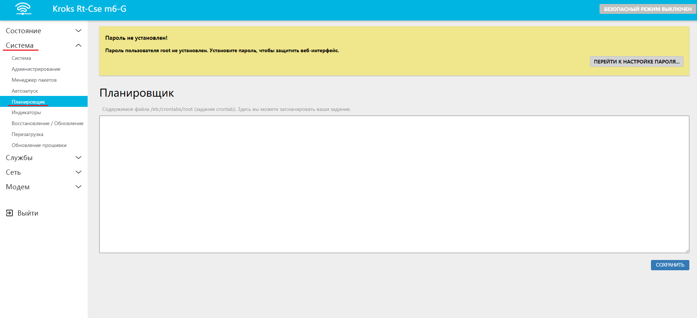
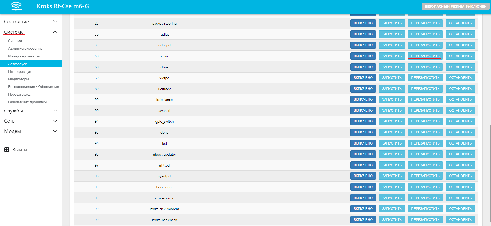

# Перезагрузка роутера по расписанию

Для автоматического выполнения задач роутером используется инструмент, который находится в веб-интерфейсе роутера, во вкладке Система > Планировщик  


Для добавления определенного сценария необходимо знать правила, которые определяются синтаксисом инструмента, на котором построен планировщик задач. Это достаточно популярная служба [cron](https://ru.wikipedia.org/wiki/Cron). Для добавления команды её необходимо ввести в поле ввода и нажать "Сохранить"

Упрощенно можно представить формат задаваемых правил как:

```bash
* * * * * выполняемая команда
- - - - -
| | | | |
| | | | - день недели (0—7) (воскресенье = 0 или 7)
| | | --- месяц (1—12)
| | - день (1—31)
| --- час (0—23)
- минута (0—59)
```

## ***Пример команды***

В случае с автоматической перезагрузкой роутера, например в 03:00 команда будет выглядеть следующим образом:

```bash
0 3 * * * sleep 70 && touch /etc/banner && reboot
```

:::info
При составлении команды не рекомендуется задавать перезагрузку роутера чаще чем 1 раз в .  
**Также, обратите внимание, что данный способ не явлется решением какой-либо возникшей проблемы. Злоупотребление этой функцией может привести к выходу модема из строя.**

:::

## ***Разбор команды***

0 3 \* \* \*  - задают время для выполнения команды в минутах и часах. В нашем случае это 0 минут, 3 часа - 03:00

sleep 70 - таймер ожидания в секундах

&& - двойной амперсанд служит запуска следующей команды после окончания предыдущей

touch /etc/banner - один из вариантов проверки доступности файловой системы для возможности записи

reboot - команда, отправляющая роутер в перезагрузку

## ***Примечание***

__Обратите внимание на комментарий ниже!__

Если это ваше первое правило, то службу cron необходимо перезагрузить через веб-интерфейс во вкладке Система > Автозапуск > Перезапустить, либо подключившись по SSH командой

```bash
/etc/init.d/cron restart
```

Как подключиться по SSH можете прочитать [здесь](/docs/routery/chasto-zadavaemye-voprosy/podklyuchenie-po-ssh.md)  

