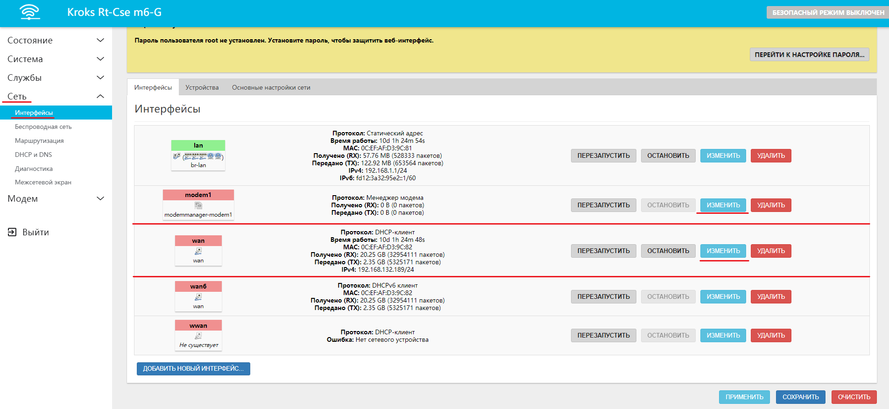
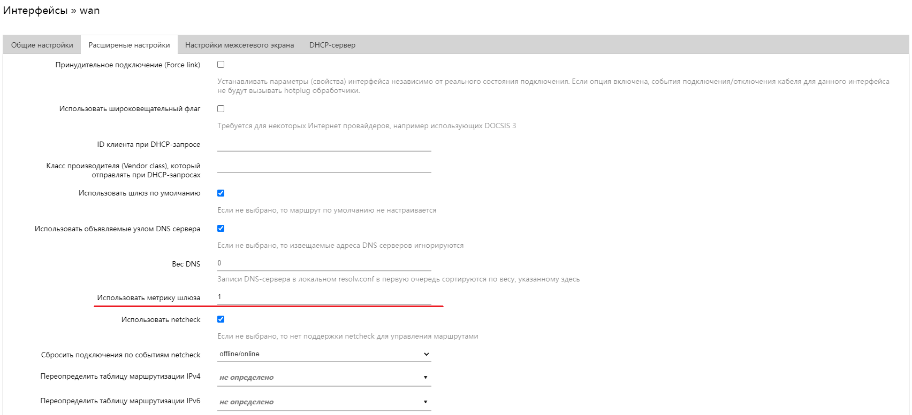
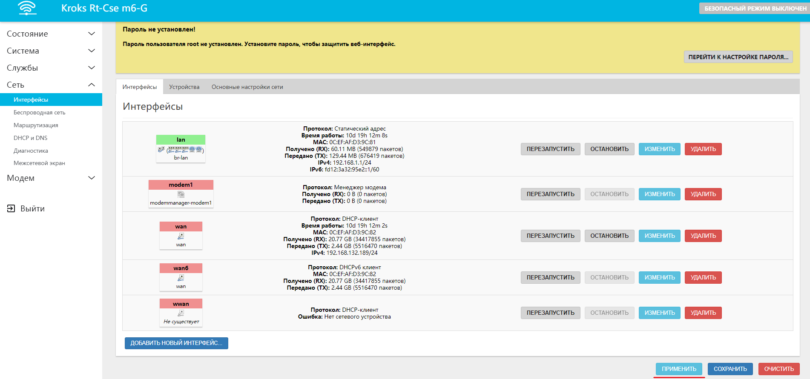
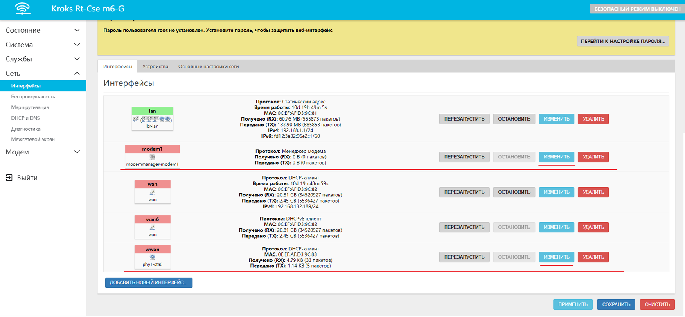
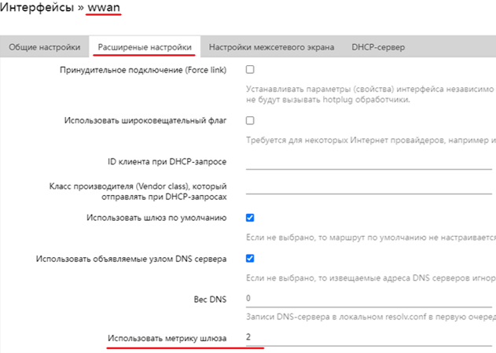
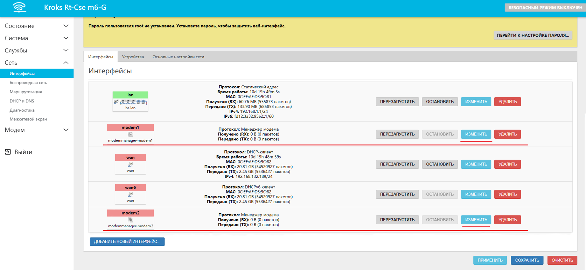
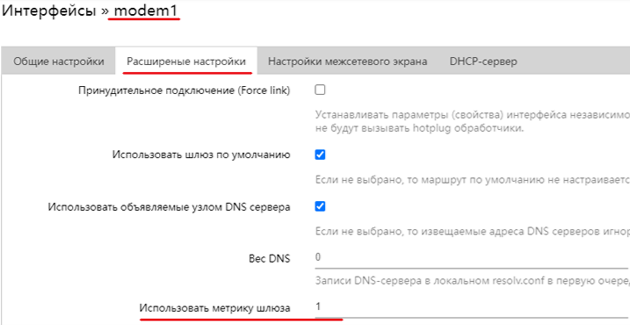
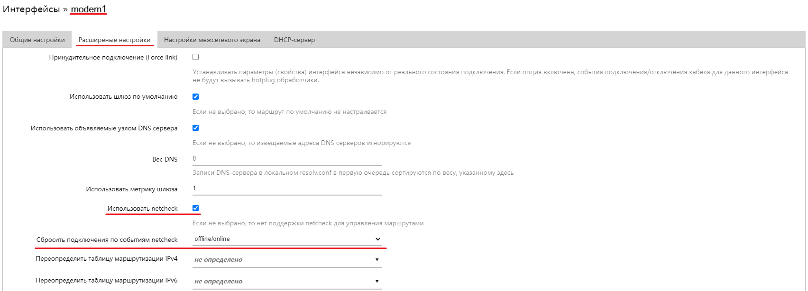
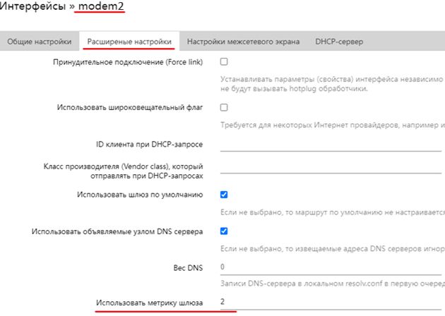

# Примеры резервирования подключения

В этой статье мы рассмотрим несколько разных случаев резервирования на вашем роутере. А также постараемся разобраться в том, как это работает, чтобы при необходимости вы могли создать нужный вам вариант самостоятельно.

Для начала речь пойдёт о резервировании подключения, но также существуют подобные статьи о [суммировании](/docs/routery/prodvinutaya-nastroyka/primery-summirovaniya-trafika.md) и [одновременном использовании суммирования и резервирования](/docs/routery/prodvinutaya-nastroyka/dopolnitelnye-sluchai-rezervirovaniya-i-balansirovki.md).

## ***Условия для резервирования***

Давайте определим каким образом вообще можно задать резервирование.

Существует такое понятие, как **метрика шлюза** - это значение которое определяет приоритет интерфейса.

Сейчас мы перечислим несколько вариантов резервирования подключения, и после разберем каждый из них подробнее.

Итак, например, нас интересуют следующие ситуации:

* **[Основное подключение wan, резервное modem](#основное-подключение-wan-резервное-modem)**

  Такой вариант подходит, если вам необходимо чтобы вся нагрузка была на проводное подключение от провайдера, но в случае неполадок использовалось подключение через модем.

* **[Основное подключение modem, резервное Wi-Fi](#основное-подключение-modem-резервное-wi-fi)**

  Такой вариант подходит, если вам  необходимо чтобы вся нагрузка была на подключении через модем, но в случае неполадок использовалось беспроводное подключение к другому роутеру.

* **[Основное подключение modem1, резервное modem2](#основное-подключение-modem1-резервное-modem2)**

  Такой вариант подходит, если у вас роутер с несколькими встроенными модемами и вы хотите чтобы вся нагрузка шла только на один из них, а в случае неполадок переходила на второй.

### ***Основное подключение wan, резервное modem***

Что бы настроить резервирование подобным образом нам необходимо открыть веб-интерфейс роутера и перейти во вкладку "Сеть" → "Интерфейсы". Здесь нас интересуют строки **wan** и **modem1.**  

По нажатию на кнопку "ИЗМЕНИТЬ" перед нами открывается окно настроек. Выбираем вкладку "Расширенные настройки" и ищем строку **Использовать метрику шлюза**.  

Здесь нам необходимо выставить значение **1 -** это будет означает, что настраиваемый интерфейс имеет высший приоритет и соответственно будет один получать всю нагрузку. После чего нажмите "СОХРАНИТЬ".

Аналогичным образом выставляем **метрику шлюза** для интерфейса **modem1**, но здесь выставляем значение **2**.

Для остальных интерфейсов **красного цвета**, если они у вас остались, необходимо выставить значение **0**. В конце не забудьте нажать кнопку "ПРИМЕНИТЬ".  

### ***Основное подключение modem, резервное Wi-Fi***

:::tip
В этом примере настройка практически идентична первому случаю, за исключением того, что предварительно нужно будет установить [соединение с другим роутером через Wi-Fi](/docs/routery/prodvinutaya-nastroyka/rezhimy-podklyucheniya-routerov-KROKS.md).

:::

Далее процесс настройки происходит аналогичным образом, только теперь нас интересуют подключения **modem1** и **wwan.**

Также нажимаем кнопку "ИЗМЕНИТЬ" напротив каждого из нужных интерфейсов, переходим на вкладку "Расширенные настройки" и устанавливаем метрику шлюза (**1** для интерфейса **modem1** и **2** для интерфейса **wwan**).  
  
  

Для остальных интерфейсов **красного цвета**, если они у вас остались, необходимо выставить значение **0**. В конце не забудьте нажать кнопку "ПРИМЕНИТЬ".

### ***Основное подключение modem1, резервное modem2***

Такой вариант настройки подходит если ваш роутер имеет несколько встроенных модемов и вы, например, используете для каждого из модемов SIM карты разных операторов или с разными тарифами. Но для постоянного использования вам нужен лишь один.

Настройка резервирования происходит также как и в предыдущих примерах, небольшие осложнения нас ждут на этапе суммирования, но это мы разберем чуть позже.

А сейчас давайте уже известным нам образом откроем настройки необходимых интерфейсов, перейдем во вкладку "Расширенные настройки" и установим метрику **1** для интерфейса **modem1**.  
  
  
Также в этом меню нужно поставить "галочку" напротив пункта **Использовать netchek**, и выбрать **offline/online** в селекторе **Сбросить подключения по событиям netcheck**.  
Это необходимо для того чтобы соединение переключалось обратно с резервного на основное, после возобновления работы **modem1**.

А для интерфейса **modem2** следует выставить метрику **2**.

В конце не забудьте нажать кнопку "ПРИМЕНИТЬ".
