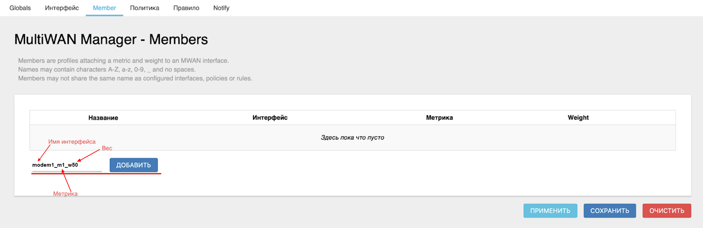
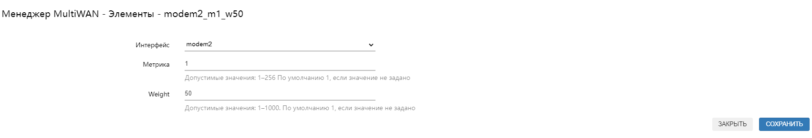
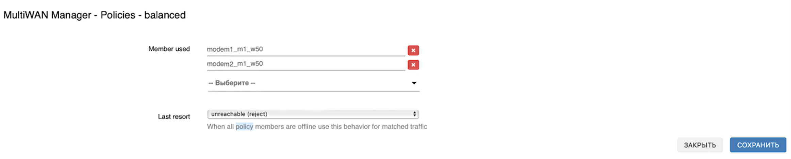
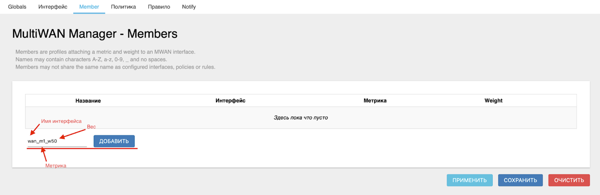
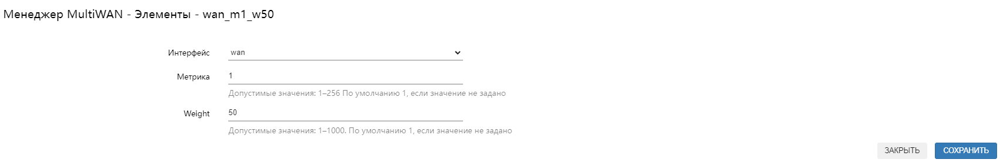
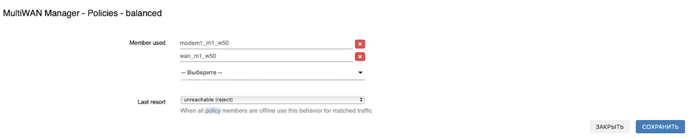

# Примеры суммирования трафика

После [резервирования](/docs/routery/prodvinutaya-nastroyka/primery-rezervirovaniya-podklyucheniya.md) попробуем разобраться с **суммированием**.

Эта функция может вам пригодиться, если вы хотите чтобы активны были несколько интерфейсов одновременно, но при этом у вас имелась возможность регулировать нагрузку на них.

Для регулировки суммирования, нам также понадобится задать **метрику**( но уже не шлюза, а относительную) и ещё **вес**.

:::tip
**Вес метрики** - это число определяющее приоритет интерфейса, если их метрики одинаковы. Чем выше вес, тем большая нагрузка идёт на интерфейс, при одинаковых метриках.

:::

:::tip
Обратите внимание, что перед тем как приступать к настройке суммирования, вам необходимо установить пакет ***luci-app-mwan3.***

О том как устанавливать дополнительные пакеты, вы можете узнать [здесь](/docs/routery/prodvinutaya-nastroyka/ustanovka-storonnih-paketov.md).

:::

 Здесь мы также для примера разберем несколько ситуаций:

* [Суммирование modem1- 50% и modem2 - 50%](#суммирование-modem1-и-modem2)
* [Суммирование modem1- 50% и wan - 50%](#суммирование-modem1-и-wan)
* [Суммирование modem1 - 50% и wan подключение от другого роутера - 50%](#суммирование-modem1-и-wan-подключения-от-другого-роутера)

## ***Условия для суммирования***

:::warning
Обратите внимание, во всех настраиваемых интерфейсах должна быть выключена галочка на против пункта ***netchek***.  

:::

:::tip
Обратите внимание, что в устройствах с несколькими встроенными модемами имеется ряд важных особенностей.

:::

На роутере с 2 и более модемами по умолчанию идёт видоизмененный менеджер **mwan3**. Для настройки IP-адресов и проверки в этом случае необходимо использовать сервис проверки сети, расположенный во вкладке "Службы" → "Проверка сети".  

Далее, в настройке проверок добавляем новую проверку. Например, **check_google_1**. После нажатия на кнопку "Добавить проверку" в списке появится **check_google_1**. Введем в поле Хост(IPv4) IP-адрес сервера DNS Google.  

Далее выбираем в блоке **Настройка интерфейса** наш модем modem1 и нажимаем "Добавить интерфейс".  

Интервал поставим 10000мс и выберем отслеживание check_google_1. Нажмем кнопку "Запустить отслеживание".  
  

### ***Суммирование modem1 и modem2***

#### ***Создание Member***

Теперь перейдём на вкладку "Member".

Здесь необходимо также удалить каждый пункт с помощью кнопки "УДАЛИТЬ".  

Далее нам необходимо создать новый **Member** согласно следующему правилу:

* Сначала в названии идёт имя интерфейса, например **modem1**;
* За ним, через нижнее подчеркивание «_*» следует его **метрика**, на этот раз не та, что мы указывали в "Сеть"* → "Интерфейсы", а относительная. Например, **m1** (где **m** - metric (метрика), а **1** - значение метрики);
* Далее идёт **вес** метрики. Задаётся числом от 0 до 1000. Мы рекомендуем для повышения читаемости задавать вес в процентах. Так, например, распределение нагрузки равномерно по 4 интерфейсам будет иметь вес 25.  
В нашем же случае для wan укажем вес 50, так как он делит нагрузку с Wi-Fi в равной степени - **w50** (где **w** - weight (вес), а **50** - значение веса).

Получаем итоговое название в виде - **modem1_m1_w50**.  

Нажмите кнопку "ДОБАВИТЬ", выберите настраиваемый интерфейс и введите его метрику и вес. После чего нажмите кнопку "СОХРАНИТЬ".  

:::tip
Не забывайте менять **Интерфейс** в соответствующем селекторе на настраиваемый.

:::

Аналогичным образом добавляем **Member** для **modem2**.  
  

#### ***Создание политики***

Теперь перейдём на вкладку "Политика". Удаляем каждую политику нажатием кнопки "Удалить" и создаём новую. Назовём её **balanced**. Нажмите кнопку "ДОБАВИТЬ".  

В открывшемся окне выберете ранее созданные интерфейсы в селекторе **Member used**.

Поле **Last resort** можно оставить без изменений.

Нажмите кнопку "СОХРАНИТЬ".  

#### ***Создание правила***

Теперь перейдём на вкладку "Правило".

Создаём новое правило. Для примера назовём его **default**.

Нажмите кнопку "ДОБАВИТЬ".  

Теперь необходимо заполнить открывшееся окно:

* В поле **Internet Protocol** выбираем **Только IPv4**;
* В поле **Протокол** оставляем **all**;
* В поле **Sticky** выберите **Нет**;
* В поле **Policy assigned** выберите созданную нами политику **balanced**;

Нажмите "СОХРАНИТЬ".

Нажмите кнопку "ПРИМЕНИТЬ".  

### ***Суммирование modem1 и wan***

В этом случае настройка производится таким же образом.

Сначала мы создаём **[Member](#создание-member)** для **modem1**.  
  

Отличием будет только то, что вторым мы будем создавать **Member** для **wan**.  
  
  

:::tip
Не забывайте менять **Интерфейс** в соответствующем селекторе на настраиваемый.

:::

Далее мы также создаём [политику](#создание-политики), но в этом случае она соответственно будет состоять уже из других **Member.**  

После чего создаём [правило](#создание-правила).

### ***Суммирование modem1 и wan подключения от другого роутера***

Также допускается возможность суммирования с другим роутером. В качестве примера мы приведём суммирование с другим роутером, подключенным с помощью провода.

Для начала вы необходимо установить соединение между используемыми роутерами. Для этого просто достаточно вместо кабеля от провайдера вставить в порт **WAN** кабель от **LAN** порта уже настроенного роутера.

После чего настройка происходит аналогичным образом.

Создаём **Member** для **modem1**.  
  

:::tip
Не забывайте менять **Интерфейс** в соответствующем селекторе на настраиваемый.

:::

Далее снова создаём **Member** для **wan**, потому что в нашем случае через него теперь происходит подключение к сети Интернет от другого роутера.  
  

:::tip
Не забывайте менять **Интерфейс** в соответствующем селекторе на настраиваемый.

:::

Последующая настройка идентична [предыдущему](#суммирование-modem1-и-wan) варианту.

Подобным образом вы можете настроить суммирование, например, для беспроводного подключения к другому роутеру. Остальные способы подключения роутеров ***KROKS*** указаны в [этой](/docs/routery/prodvinutaya-nastroyka/rezhimy-podklyucheniya-routerov-KROKS.md) статье.

Также советуем вам ознакомиться со статьёй о [резервировании подключения](/docs/routery/prodvinutaya-nastroyka/primery-rezervirovaniya-podklyucheniya.md).

А кроме того существуют менее распространенные варианты настройки, как одновременное использование и резервирования и суммирования или суммирование более двух интерфейсов.

Ознакомиться с подобными ситуациями вы можете [здесь](/docs/routery/prodvinutaya-nastroyka/dopolnitelnye-sluchai-rezervirovaniya-i-balansirovki.md).
