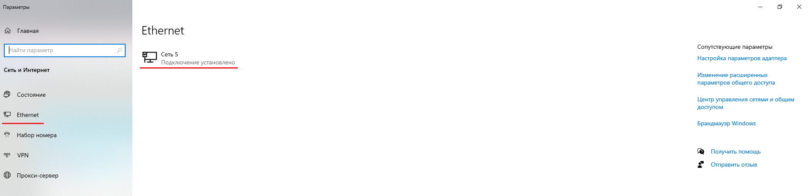
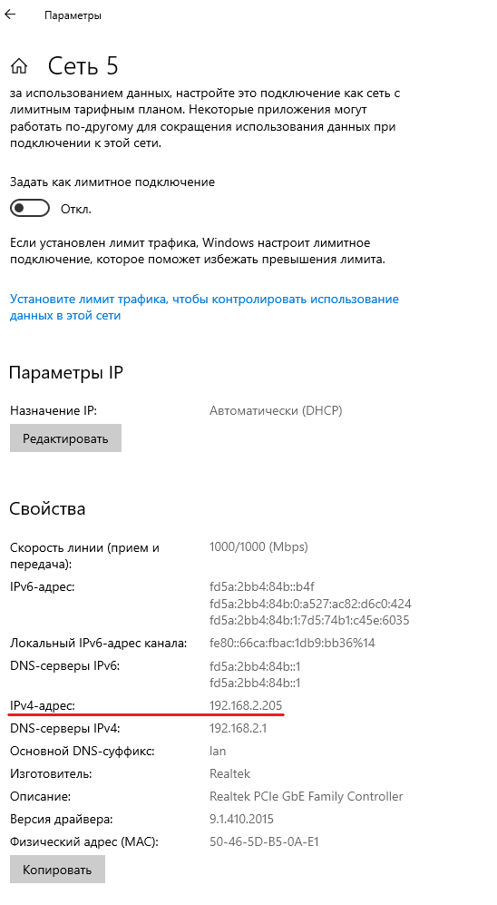
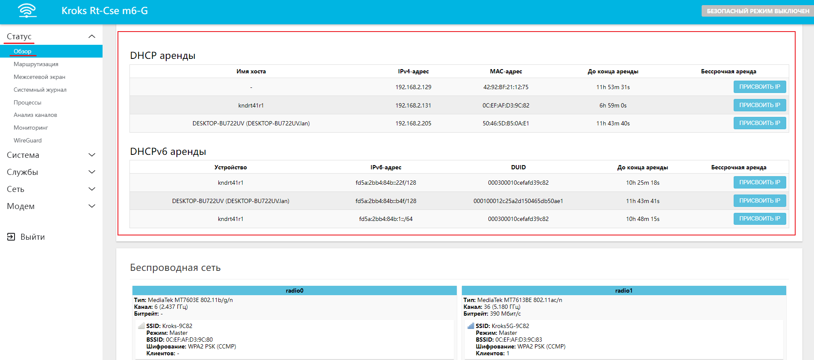
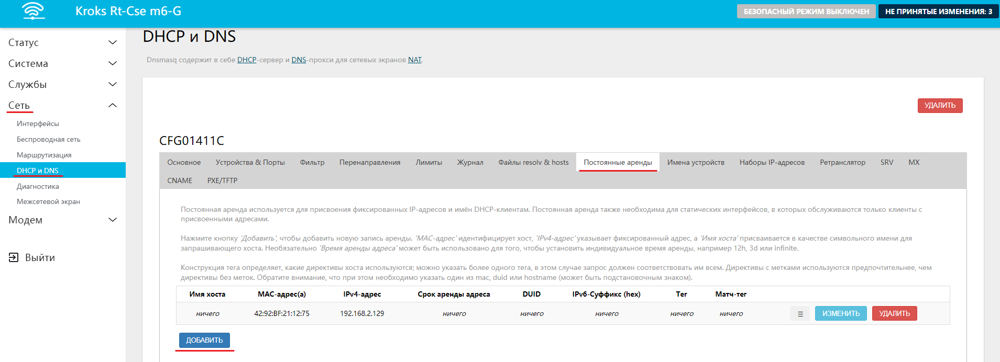
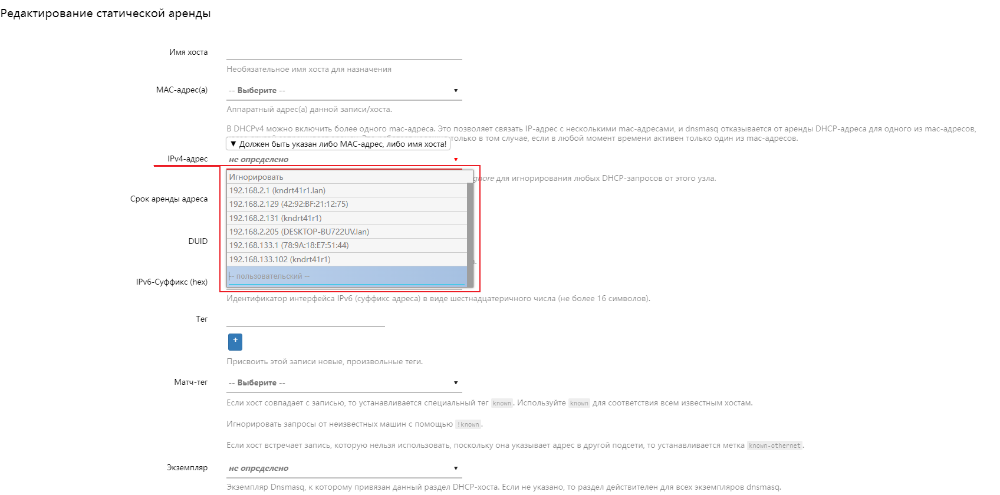

# Присвоение статического IP-адреса устройству в домашней сети

В этой статье мы разберём как присвоить определенный IP-адрес конкретному устройству в сети. Для начала необходимо узнать IP или МAC адрес устройства, под котором оно находится в сети сейчас.

В примере мы будем использовать IP-адрес, узнать его можно в разделе "Параметры" → "Ethernet" вашего компьютера.  
  

:::tip
Для мобильного устройства IP-адрес можно узнать в сведениях о Wi-Fi сети.

:::

Далее откройте веб-интерфейс вашего роутера и на вкладке "Статус" → "Обзор" перейдите в раздел **DHCP аренды**. Здесь вы увидите таблицу со всеми подключёнными к вашей сети устройствами.  

:::tip
Здесь вы можете нажать кнопку "ПРИСВОИТЬ IP" и в таком случае за устройством закрепится адрес, указанный в столбце **IPv4-адрес**.

:::

Если же вам необходимо задать устройству определенный IP-адрес, тогда перейдите на вкладку "Сеть" → "DHCP и DNS" → "Постоянные аренды".  

Здесь вам необходимо нажать кнопку "ДОБАВИТЬ" и в открывшемся окне ввести необходимый вам **IP-адрес** и по желанию **Имя хоста**, остальные настройки рекомендуется оставить без изменения.  

После чего поочередно нажмите кнопки "СОХРАНИТЬ" и "ПРИМЕНИТЬ".
