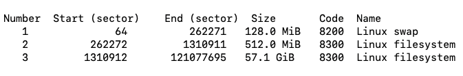
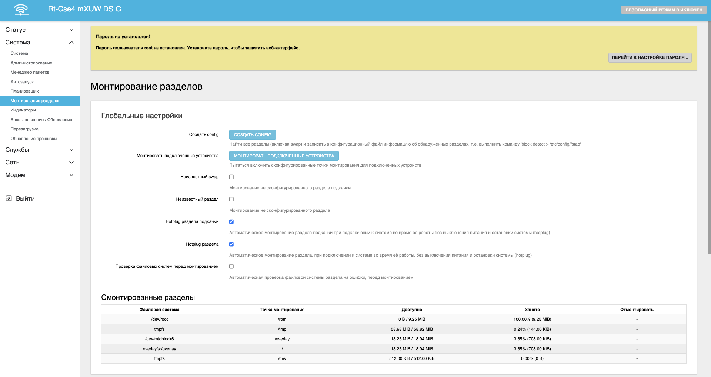

# Работа с USB

В версиях роутеров Крокс с USB-разъёмами существует возможность работать с внешними USB-накопителями. Можно как копировать файлы на роутер и обратно, так и использовать роутера как полноценный NAS.

## ***Подготовка***

::: info
Все манипуляции с USB-носителем мы будем производить с помощью роутера и его операционной системы openwrt. Если вы можете самостоятельно разметить накопитель и отформатировать его под ext4, можете пропустить этот шаг.
:::

Для того чтобы операционная система роутера могла работать с флеш-накопителем, на нём необходимо создать разделы и отформатировать их. В примерах мы будем использовать формат **ext4**. Для этого нам понадобится установить на роутер два пакета: *gdisk* и *e2fsprogs*. Первый позволит нам разметить диск на разделы, второй же поможет отформатировать диск в нужную нам файловую сиситему.

::: info
Все дальнейшие манипуляции с USB-носителем мы будем производить в терминале через стандартное [ssh соединение](/docs/routery/chasto-zadavaemye-voprosy/podklyuchenie-po-ssh.md).
:::

::: warning
Перед началом работы необходимо вставить флеш-накопитель в USB-порт роутера.
:::

### ***Установка пакетов***

Сперва установим пакеты. Вы можете это сделать как через терминал, так и через [веб-интерфейс](/docs/routery/prodvinutaya-nastroyka/ustanovka-storonnih-paketov.md). Для примера в инструкции будет использован терминал.

Сперва нам необходимо обновить списки пакетов, доступных для установки. Делается это командой  
``` bash
opkg update
```

Далее устанавливаем пакеты gdisk и e2fsprogs.  
``` bash
opkg install gdisk e2fsprogs
```

Для работы с USB-накопителями нам понадобится пакет block-mount.  
``` bash
opkg install block-mount
```

### ***Определение имени диска***

Для того чтобы увидеть все подключенные диски и разделы мы воспользуемся командой   
``` bash
ls /dev/sd*
```

В результате мы увидим диск с названием sda. Это название диска, которое будет использоваться в дальнейшем. sda1 - первый раздел диска, sda2 - второй и т.д.

### ***Разметка диска***

Как уже упоминалось ранее, разметка диска будет происходить с помощью пакета gdisk. Для этого воспользуемся командой  
``` bash
gdisk /dev/sda
```

Запустится интерактивный режим разметки диска. Для того чтобы увидеть все доступные варианты, введите **h**. Нам же нужно удалить таблицу разделов и создать один новый. Для этого сначала введём d, это удалит все разделы, а после создадим новый раздел введя n. Все настройки оставим по умолчанию, для этого просто нажмите Enter при каждом новом запросе. Осталось лишь записать изменения, для этого введите w, и подтвердите буквой y. В случае успеха вы увидите строчку **The operation has completed successfully.** Это означает что всё прошло удачно и на нашем диске появился новый раздел.

### ***Форматирование диска***

Для форматирования диска мы будем использовать пакет e2fsprogs. Для этого воспользуемся командой  
``` bash
mkfs.ext4 /dev/sda1
```  
Не забудьте подтвердить клавишей y. Все параметры оставьте по умолчанию. В случае успеха вы увидите строчку **Writing superblocks and filesystem accounting information: done**. Это означает что диск был успешно отформатирован.

## ***Монтирование раздела для работы с USB-носителем***

Для того чтобы работать с USB-носителем мы должны его монтировать. Для этого воспользуемся командой  
``` bash
mkdir -p /mnt/usb
mount -o rw,sync,iocharset=utf8 /dev/sda1 /mnt/usb
```

Эта команда создаёт папку в /mnt/usb и монтирует диск в нее. После этого мы можем работать с USB-носителем как с обычной папкой в linux.

Для примера, скопируем на флешку результаты сканирования вышек сотовой связи из сервиса модема.   
``` bash
cp /tmp/kroks.dev.modem.cell.json /mnt/usb
```

Теперь файл лежит на флешке и мы можем открыть его на компьютере.

## ***Размонтирование раздела***

Перед извлечение накопителя крайне реккомендуется во избежании случайного повреждения, размонтировать диск. Для этого воспользуемся командой  
``` bash
umount /dev/sda1
```

После этого мы можем извлечь накопитель.

## ***Продвинутое использование USB-носителей***

При помощи USB-накопителя мы можем расширить возможности роутера а так же использовать его в качестве NAS-хранилища.

Для этого создадим на флешке 3 раздела:

* Раздел подкачки (swap) - 128МБ - если роутеру не будет хватать размера опреативной памяти, то он будет использовать этот раздел как дополнительную ОЗУ
* Раздел overlay - 512МБ - здесь будут храниться дополнительные установленные пакеты
* Раздел данных  - всё оставшееся место - будет использоваться для хранения файлов, которые будут доступны для всех клиентов домашней сети

### ***Разметка диска***

Открываем дисковую утилиту. Для этого воспользуемся командой  
``` bash
gdisk /dev/sda
```  

В первую очередь необходимо удалить все предыдущие разделы. сделаем это командой d. После этого создаём новые разделы.

Создаём первый раздел - swap. Для этого введём n. Откроется интерактивный интерфейс создания раздела. Partition number и First sector оставляем без изменений. Last sector вводим следующий: 128 * 1024 * 1024 / 512 + 64 = 262208. Параметр Hex code or GUID отвечает за вид раздела, и только для раздела swap нам необходимо ввести 8200. Остальное так же оставляем без изменений.

::: info
Как рассчитать размер сектора? Очень просто, достаточно лишь знать, что один сектор равен 512 байтам. Далее лишь математика - переводим инетрисующие нас величины в байты и делим на размер одного сектора. Также не забываем прибавить номер первого сектора. В нашем сллучае мы перевили Мегабайты в Байты (128 * 1024 * 1024), разделили на размер одного сектора (/ 512) и прибавили номер первого сектора (+ 64).
:::

По аналогии создаём остальные разделы. В конце с помощью команды p вы увидите все созданные разделы.



Не забудьте записать изменения на диск введя w и подтвердив y.

### ***Форматирование разделов***

Для форматирования разделов мы будем использовать пакет e2fsprogs. Для этого воспользуемся командой  
``` bash
mkfs.ext4 /dev/sda2
mkfs.ext4 /dev/sda3
```

::: warning
Раздел swap форматировать не нужно.
:::

### ***Настройка системы***

После установки пакета block-mount в интерфейсе можно найти вкладку Система - Монтирование разделов. Здесь мы будем работать с USB-носителем.

::: info
Если данная вкладка у вас отсутствует, а пакет точно установлен, попробуйте перезагрузить роутер. После перезагрузки вкладка должна появиться в интерфейсе.
:::



В первую очередь необходимо создать конфигурацию. Делается это кнопокой Создать Config. После настроим разделы swap и overlay. Делается это очень просто.

Для создания внешнего overlay необходимо в карточке Монтирование разделов найти второй сектор (на 512 МБ) и нажать кнопку Изменить напротив него. В открышемся окне введите:

* Включен - отметьте галочкой
* Точки монтирования - выберите Использовать как внешний overlay

Нажмите Сохранить.

Не забудем настроить основное хранилище. В карточке Монтирование разделов найти третий сектор на 57ГБ и нажать кнопку Изменить напротив него. В открышемся окне введите:

* Включен - отметьте галочкой
* Точки монтирования - Выберите пользовательский и введите **/media**

Нажмите Сохранить. Примените настройки.

Снова возвращаемся в терминал. Для корректной работы роутера после перезагрузки с новым overlay необходимо перенести старые данные на новый overlay. Делается это командой  
``` bash
mount -o rw,sync,iocharset=utf8 /dev/sda2 /mnt
cp -a -f /overlay/. /mnt
umount /mnt
```

Осталось лишь настроить swap. Делается это командой  
``` bash
mkswap /dev/sda1
swapon /dev/sda1
```

Чтобы проверить что swap настроен, введите команду  
``` bash
swapon -s
```

Осталось только перезагрузить роутер. После перезагрузки мы увидим что раздел overlay уыеличен до 500МБ, а опреативная память до 128МБ.
