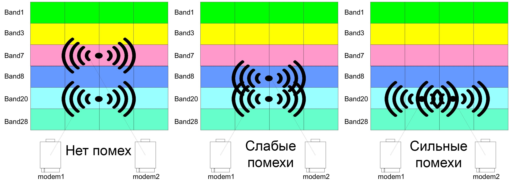
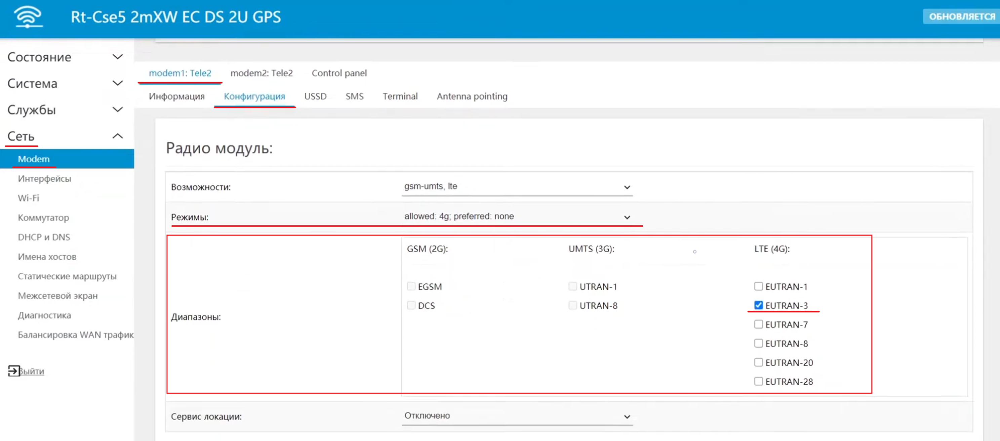
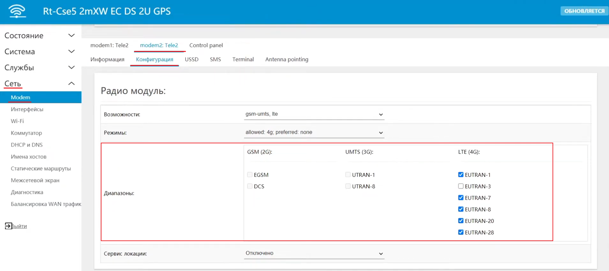

# Разнесение модемов по частотам в роутерах с несколькими встроенными модемами

## ***Введение***

В линейке роутеров ***KROKS*** существуют роутеры с несколькими встроенными модемами и одной из распространенных проблем при использовании таких устройств могут быть **взаимные помехи**, которые создают модемы во время работы на одинаковых или близких друг к другу частотах.  

Решение при возникновении такой ситуации заключается, например, в разнесении модемов по разным частотам. Для этого мы рекомендуем использовать разные **бэнды*** при работе модемов в режиме суммирования.

:::tip
**BAND (бэнд)** - понятие бэнд в простых словах означает определенные частотные диапазоны, используемые в сотовой связи. Например BAND 7 указывает на работу мобильной 4G-сети в диапазоне 2600 МГц. Полный список утвержденных бэндов и соответствующих частот легко доступен в справочной литературе и открытых источниках в интернете. Также вы можете ознакомиться со списком поддерживаемых модемом бэндом в веб-интерфейсе вашего роутера. Это видно на скриншотах ниже.

:::

## ***Настройка***

Принудительное разделение модемов по частотам совсем не сложная задача. От вас требуется только открыть веб-интерфейс вашего роутера и перейти во вкладку "Сеть" → "modem1" → "Конфигурация".  

Здесь мы можем, например, выбрать предпочтительный тип соединения (у нас это **4g**), а также в блоке **Диапазоны** вы можете увидеть галочку напротив пункта **EUTRAN-3** — это значит что модем использует для подключения к сети Интернет **только** **бэнд 3**. Соответственно, если открыть вкладку "Конфигурация" для "modem2". Там мы увидим выбранными все остальные бэнды кроме **EUTRAN-3**.  

:::tip
Обратите внимание, данное разделение по бэндам было выбрано в качестве примера, вы же можете разделять их любым вам удобным способом.  
**Но стоит заметить что не все бэнды могут оказаться доступным.**  
Поэтому если у вас возникают проблемы с интернет соединением, **после разделения по частотам**, попробуйте поменять бэнды на другие.

:::

После того как вы определитесь с необходимыми вам бэндами, остаётся только нажать кнопку "ПРИМЕНИТЬ" и дождаться пока интерфейс снова станет активен.
