# Режимы подключения роутеров KROKS

## ***Вступление***

Существует достаточно широкий спектр возможных вариантов подключения маршрутизаторов **KROKS**. От самых простых и часто используемых решений для доступа в Интернет, до возможности создать целую сеть из нескольких устройств, причём для такой задачи существует также несколько вариантов исполнения. В этой статье мы рассмотрим следующие пункты:

* **[ПРОСТОЕ ПОДКЛЮЧЕНИЕ](#простое-подключение)**
  * [Напрямую к провайдеру](#к-провайдеру-напрямую) - этот вариант подходит тем, у кого есть возможность заключить договор об оказании услуг с местным провайдером интернета и провести в квартиру кабель типа "витая пара".  
   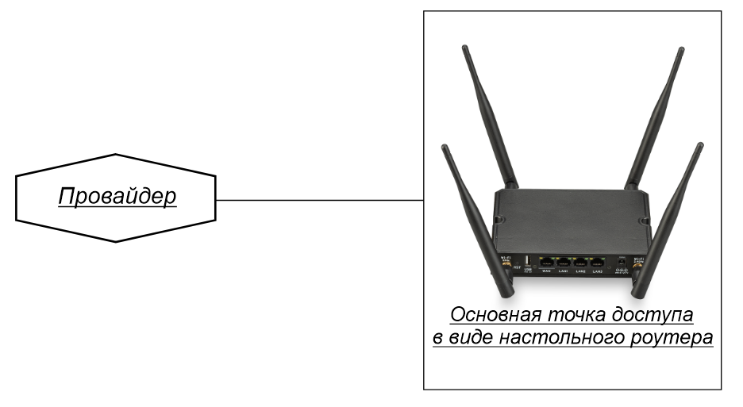
  * [Модемное подключение](#модемное-подключение) - этот вариант для тех, у кого нет возможности подключиться к провайдеру, но есть уверенное покрытие мобильной связи.  
  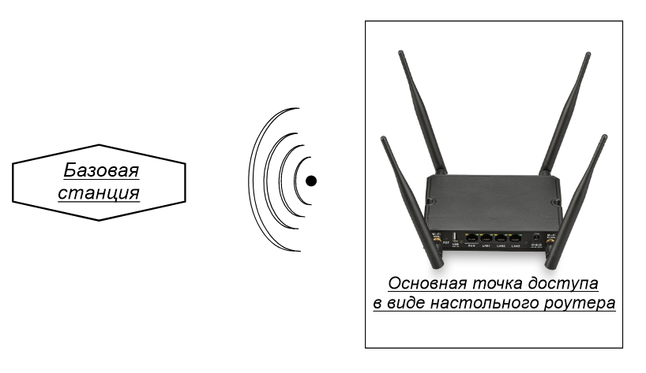

:::tip
Для того, чтобы подключиться к сети интернет с помощью модемного подключения необходим роутер со встроенным модемом, внутренняя или наружная антенна, а так же SIM-карта с оплаченным пакетом услуг, **включающим в себя доступ к сети интернет для роутеров**.

:::

Если у вас уже есть настроенный роутер и вам недостаточно его зоны покрытия, рекомендуем обратиться к одному из следующих пунктов **[Расширение сети](#расширение-сети)** или **[Подключение к другому роутеру](#подключение-к-другому-роутеру)**.

* **[ПОДКЛЮЧЕНИЕ К ДРУГОМУ РОУТЕРУ](#подключение-к-другому-роутеру)**
  * [По Wi-Fi](#по-wi-fi) - этот способ используется, когда нет возможности провести кабель к другим роутерам. В таком случае доступ в сеть Интернет происходит с помощью беспроводного соединения.  
  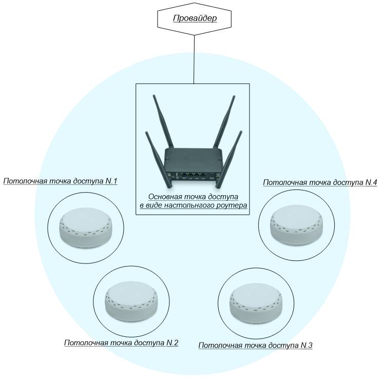
* **[РАСШИРЕНИЕ СЕТИ](#расширение-сети)**
  * [По Wi-Fi MESH](#по-wi-fi-mesh) - вариант подключения, при котором объединение устройств в одну сеть происходит с помощью беспроводной технологии MESH. Этот вариант подходит только для настройки **точки доступа**  MESH.  
  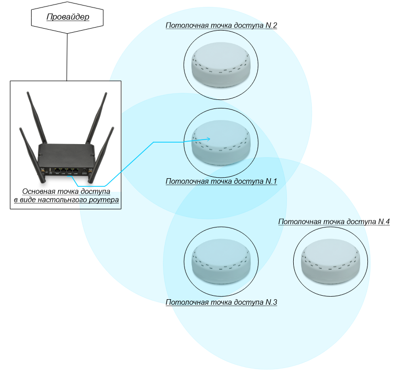
  * [По проводу](#по-проводу) - вариант подключения, при котором объединение устройств в одну сеть происходит путем соединения их кабелем "витая пара" через порты LAN.

    * Топология звезда - вариант подключения, при котором каждая точка доступа подключена к главному роутеру.  
    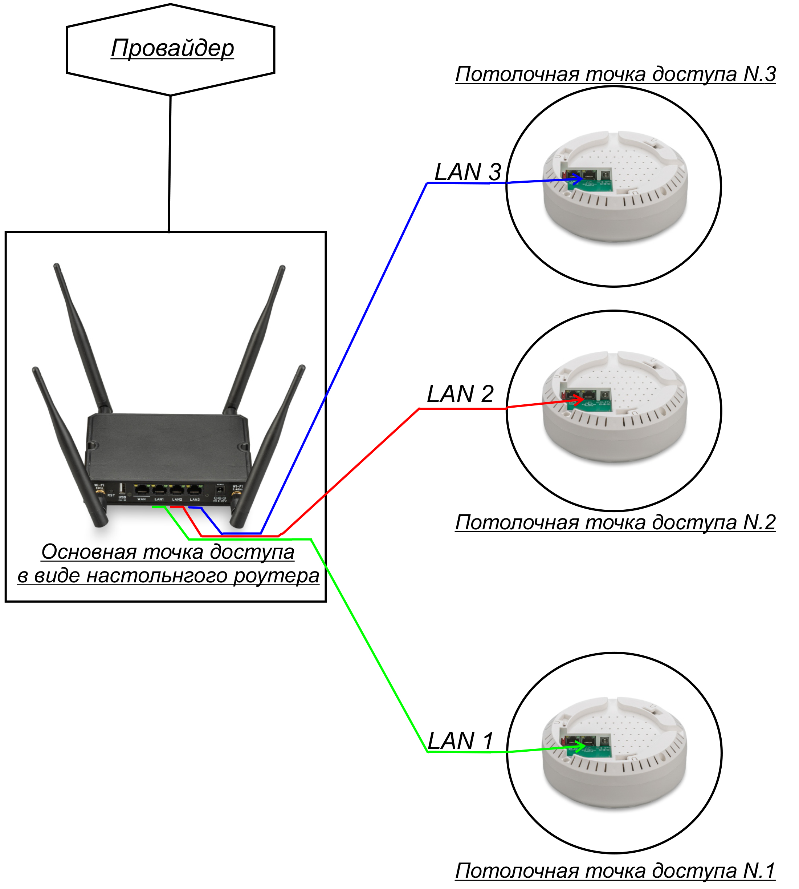
    * Шлейфом - вариант подключения, при котором только одна из точек доступа соединена с главным роутером. Оставшиеся соединены между собой.  
    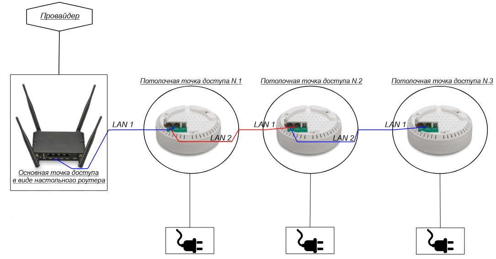
    * [POE-ГИРЛЯНДА](#poe-гирлянда)  
   Вариант построения сети из нескольких POE роутеров, подключенных цепочкой друг за другом. Используется, когда нет возможности подвести к каждому роутеру отдельное питание. Роутеры могут как расширять сеть главного роутера, так и раздавать свою собственную, используя главный роутер как источник подключения к сети интернет.  
   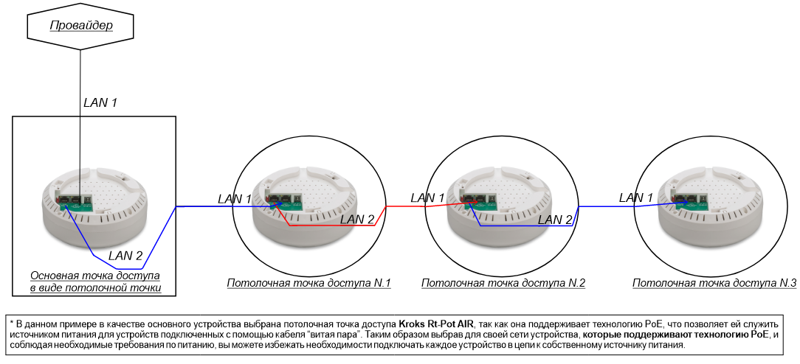

Теперь разберем каждый из описанных выше пунктов подробнее, включая основные шаги для их настройки.

## ***Простое подключение***

### ***К провайдеру напрямую***

Первым шагом необходимо вставить кабель, установленный провайдером, в разъём **WAN** вашего роутера и убедиться в надежности крепления.  

Далее нам необходимо подключиться к роутеру, вы можете установить соединение через порты **LAN** роутера и своего ПК (ноутбука) с помощью патч-корда, или просто подключившись к созданной роутером Wi-Fi сети.

Теперь мы можем попасть в веб-интерфейс роутера. Для этого необходимо ввести в адресной строке браузера IP адрес вашего роутера, по умолчанию это **192.168.1.1**.  
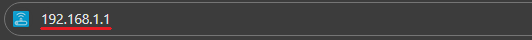

Введите **Имя пользователя** и **пароль**, после чего нажмите кнопку "ВОЙТИ" (по умолчанию **Имя пользователя** - **root**, пароля нет).  

В боковом меню выберите вкладку "Сеть" → "Интерфейсы".

Удалите все интерфейсы, помеченные красным, с помощью кнопки "УДАЛИТЬ".  

После удаления нажмите кнопку "ДОБАВИТЬ НОВЫЙ ИНТЕРФЕЙС".

В появившемся окне введите следующие настройки:

* **Название** - **wan**. Это имя которым будет отображаться созданный интерфейс, оно может быть любым, но обычно используется wan;
* **Протокол** - выберите протокол, указанный в вашем договоре об оказании услуг (L2TP/PPTP/PPPOE);
* **Устройство** - выберите **WAN**.

Нажмите кнопку "СОЗДАТЬ ИНТЕРФЕЙС".

:::tip
Обратите внимание, если у вас в договоре указан протокол **L2TP**, тогда настройте этот интерфейс как **DHCP-клиент** и в поле **Устройство** выберите **wan**. После добавьте ещё один новый интерфейс, где в качестве протокола выберите уже **L2TP**.  
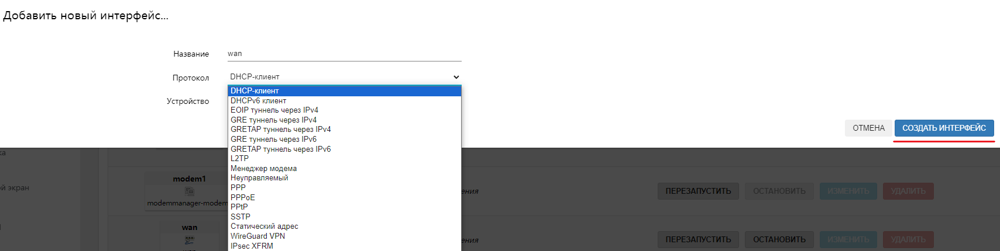
:::

В следующем окне введите данные из договора об оказании услуг, они могут отличаться в зависимости от выбранного протокола подключения к сети Интернет.

Далее выберите в этом окне вкладку **Настройки межсетевого экрана** и выберите зону **wan**, после чего нажмите кнопку "СОХРАНИТЬ".  

Нажмите кнопку "ПРИМЕНИТЬ" во вкладке интерфейсов.  

Готово, вы настроили проводное подключение к провайдеру интернета.

### ***Модемное подключение***

Подключение с использованием встроенного в роутер модема работает при настройках по умолчанию. В данном случае от вас не требуется ничего, только установить SIM-карту с оплаченным пакетом услуг, **включающим в себя доступ к сети Интернет для роутеров**.

:::info
Но в случае если ваш оператор указал дополнительные данные для подключения, такие как **APN** сервер, **Имя пользователя**/**пароль** и т. д. То необходимо добавить эти настройки в систему.

:::

Для указания дополнительных настроек переходим во вкладку "Сеть" → "Модем". Здесь необходимо выбрать нужный модем, если в вашем устройстве их несколько, и перейти в раздел "Конфигурация".  

Далее мы пролистываем страницу до блока **SIM Карта**. Здесь вы можете выбрать используемую SIM-карту и указать для неё дополнительные настройки, после чего останется только нажать на кнопку "СОХРАНИТЬ И ПРИМЕНИТЬ".  

## ***Подключение к другому роутеру***

### ***По Wi-Fi***

Для начала нам необходимо войти в веб-интерфейс роутера.

Следующим шагом перейти во вкладку "Сеть" → "Беспроводная сеть".

:::tip
Если ваш роутер поддерживает и 2,4 и 5 ГГц Wi-Fi, то сначала нужно определиться, на какой частоте работает необходимая Wi-Fi точка доступа. Сделать это можно двумя способами. Либо зайти в веб интерфейс роутера и проверить там, либо, косвенно можно понять по имени Wi-Fi сети.

Например, если Имя сети содержит подпись **2G** либо не имеет никакой дополнительной подписи вообще, то, скорее всего, сеть расположена на частоте 2,4 ГГц. Соответственно, если в конце имени есть подпись **5G**, то это сеть с частотой 5 ГГц.

:::

Выбрав нужно частоту, нажмите кнопку "ПОИСК" (в примере это 2,4 ГГц точка доступа).  
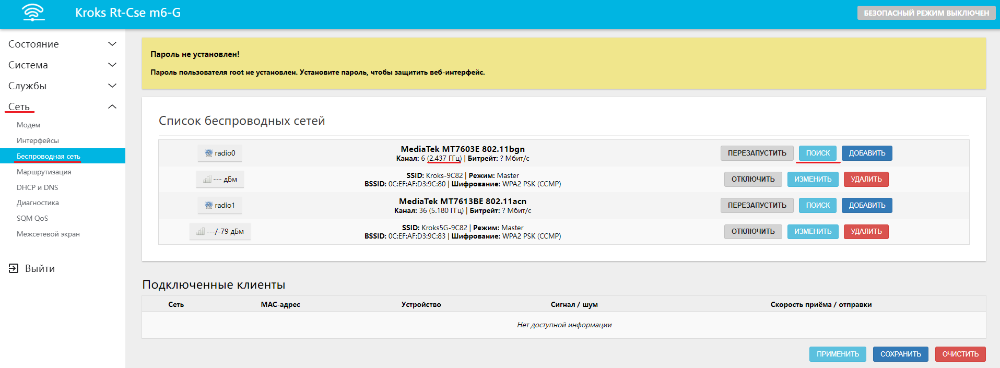

Дождитесь окончания сканирования.  
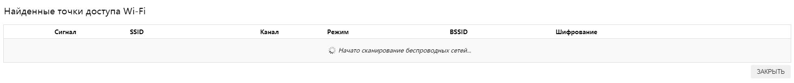

В появившемся списке выберите искомую точку доступа и нажмите кнопку "ПОДКЛЮЧЕНИЕ К СЕТИ".

Введите пароль от точки доступа, остальные настройки рекомендуется оставить по умолчанию после чего нажмите на кнопку "ПРИМЕНИТЬ".  
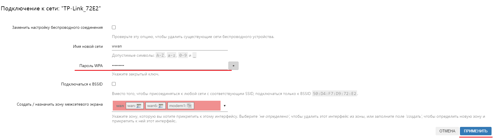

В открывшемся окне оставьте все без изменений и нажмите на кнопку "СОХРАНИТЬ".  
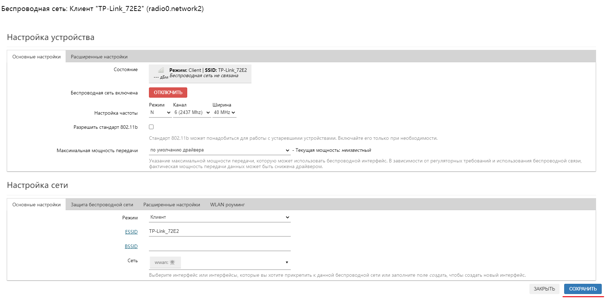

Далее перейдите во вкладку "Сеть" → "Интерфейс".

Найдите интерфейс LAN, отмеченный зеленым цветом и нажмите кнопку "Изменить".  

В строке **IPv4-адрес** введите адрес, подсеть которого отличается от основного роутера и нажмите кнопку "СОХРАНИТЬ".

:::info
Подсеть это третье число в IP адресе, например, если у основного роутера IP-адрес равен 192.168.**1**.1, то введите IP адрес 192.168.**2**.1 (в качестве подсети можно выбрать любое число от 1 до 254 включительно).

:::

Нажмите кнопку "Применить".  

Готово, теперь ваш роутер подключен к главному по Wi-Fi.

Если этого не случилось, проверьте правильность введенного пароля. Для этого перейдите во вкладку "Сеть" → "Беспроводная сеть".

Найдите вашу точку доступа, к которой происходило подключение.

Нажмите кнопку "ИЗМЕНИТЬ".  

В пункте **Настройка сети** выберите вкладку **Защита беспроводной сети** и нажмите на звездочку напротив строки **Пароль (ключ)**. Теперь вы сможете увидеть введенный ранее пароль и по необходимости его изменить, после чего нужно нажать на кнопку "СОХРАНИТЬ".  
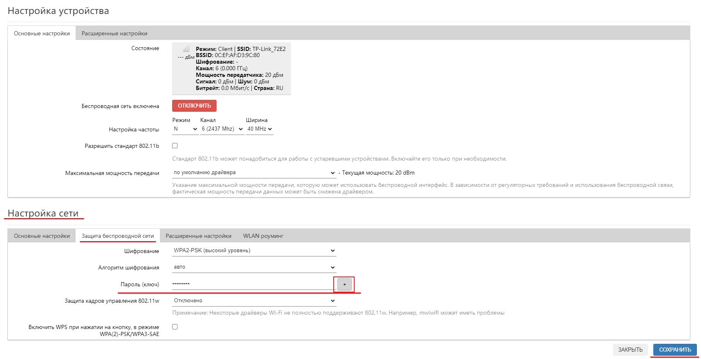

## ***Расширение сети***

### ***По проводу***

:::warning
Обратите внимание, на этапе настройки роутеры пока что **не должны** быть соединены между собой кабелем.

:::

Первым для настройки выбираем роутер, который будет главным в нашей сети. После того как вы определились с главным роутером и настроили для него [простое подключение](#простое-подключение) к сети Интернет, можно приступить к настройке дополнительных точек.

Для этого заходим в веб-интерфейс роутера, который будет расширителем.

Переходим во вкладку "Сеть" → "Интерфейсы".

Удалите все интерфейсы, выделенные красным цветом, с помощью кнопки "УДАЛИТЬ".  

Найдите интерфейс LAN, выделенный зеленым цветом и нажмите кнопку "ИЗМЕНИТЬ".  
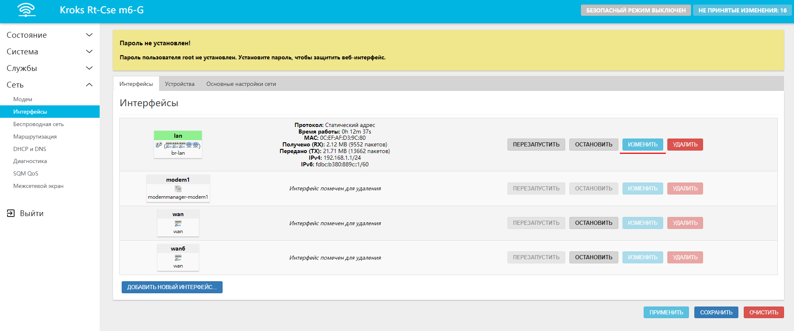

В открывшемся окне измените **Протокол** на **DHCP-клиент**, подтвердите выбор нажатием кнопки "ИЗМЕНИТЬ ПРОТОКОЛ".  

Во вкладке "DHCP-сервер" поставьте галочку напротив строки **Игнорировать интерфейс** и нажмите кнопки "СОХРАНИТЬ" и после "ПРИМЕНИТЬ".  
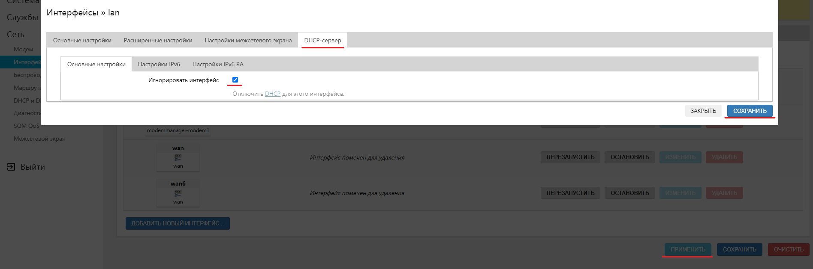

На этом этапе можно соединить основной роутер с настраиваемым с помощью кабеля. Первый конец кабеля вставьте в главный роутер в любой порт **LAN**. Другой конец кабеля вставьте в настраиваемый роутер, **так же в любой порт LAN**.

:::tip
Если вам недостаточно портов, то можно настроить порт WAN для использования в качестве порта LAN. Подробнее об этом мы поговорим в [другой статье](/docs/routery/prodvinutaya-nastroyka/nastroyka-kommutatora-na-routerah-KROKS.md).

:::

Готово, теперь ваш роутер настроен как расширитель существующей сети.

:::info
Обратите внимание, теперь по адресу **192.168.1.1** открывается только интерфейс Главного роутера, независимо от того, к какому роутеру вы подключены. Чтобы определить новый IP-адрес настраиваемого роутера, зайдите в веб-интерфейс главного роутера, вкладка "Состояние" → "Обзор". В самом низу страницы раздел **Подключенные клиенты**, где вы обнаружите имя **rt41r1** (или любое похожее). Это и есть ваш настраиваемый роутер. И в колонке **Устройство** вы можете видеть его актуальный IP адрес вида **192.168.1.10**. Если вбить этот адрес в адресную строку браузера, откроется веб-интерфейс настраиваемого роутера.

:::

### ***По Wi-Fi MESH***

Первым для настройки выбираем роутер который будет главным  в нашей сети. После того как вы определились с главным роутером и настроили для него [простое подключение](#простое-подключение) к сети Интернет, необходимо настроить все роутеры в сети, **включая главный**, следующим образом:

* Войдите в веб-интерфейс роутера и откройте вкладку "Сеть" → "Беспроводная сеть".

:::tip
Если ваш роутер поддерживает и 2,4 и 5 ГГц Wi-Fi, то сначала нужно определиться, на какой частоте работает необходимая Wi-Fi точка доступа. Сделать это можно следующим способом: зайти в веб-интерфейс роутера и проверить там, либо, косвенно можно понять по имени Wi-Fi сети.

Например, если Имя сети содержит подпись **2G**, либо не имеет никакой дополнительной подписи вообще, то, скорее всего, сеть расположена на частоте 2,4 ГГц. Соответственно, если в конце имени есть подпись **5G**, то это сеть с частотой 5 ГГц.

:::

Вы брав нужную частоту, нажмите "ДОБАВИТЬ". В принципе мы будем использовать точку с частотой 2,4 ГГц.  
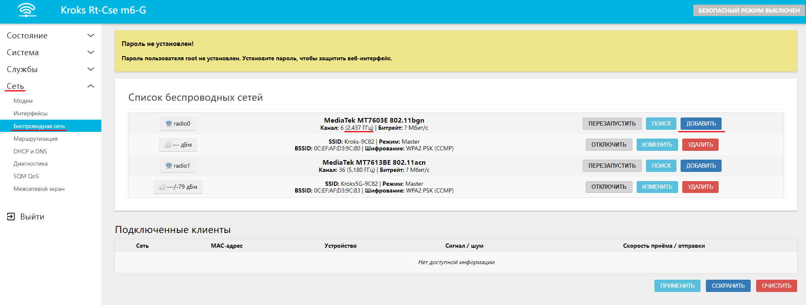

В открывшемся окне в разделе **Настройка сети** откройте селектор **Режим** и выберите **802.11s**.

Введите **MESH ID** сети - это имя вашей будущей MESH сети, обратите внимание, что оно должно быть **одинаковым у всех устройств** в ней.

В селекторе **Сеть** выберите **LAN**.  
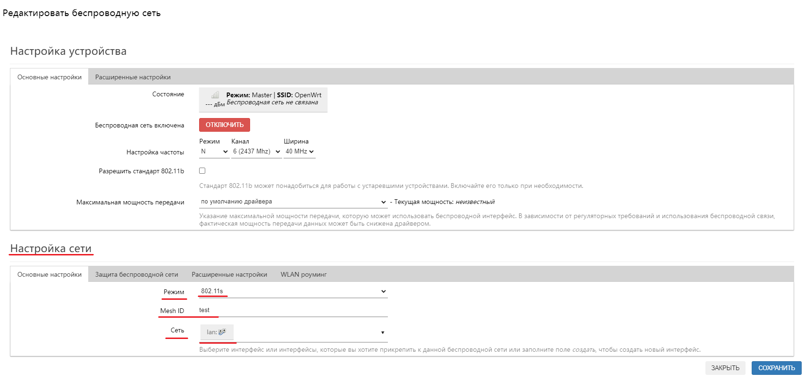

Далее перейдите во вкладку "Защита беспроводной сети" и выберите используемый тип шифрования (в примере это **WPA3-SAE**), после чего введите желаемый пароль. Обратите внимание, созданный пароль будет необходимо ввести на каждом устройстве в MESH сети, поэтому сохраните его. По окончанию настройки нажмите на кнопку "СОХРАНИТЬ".  
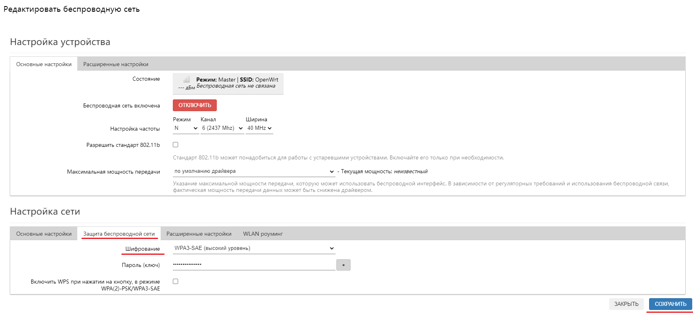

:::info
Следующие настройки необходимо производить только с роутерами, настраиваемыми как **точка доступа**.

:::

---

Перейдите во вкладку "Сеть" → "Интерфейсы".

Найдите интерфейс **LAN**, отмеченный зеленым цветом и нажмите кнопку "ИЗМЕНИТЬ".  
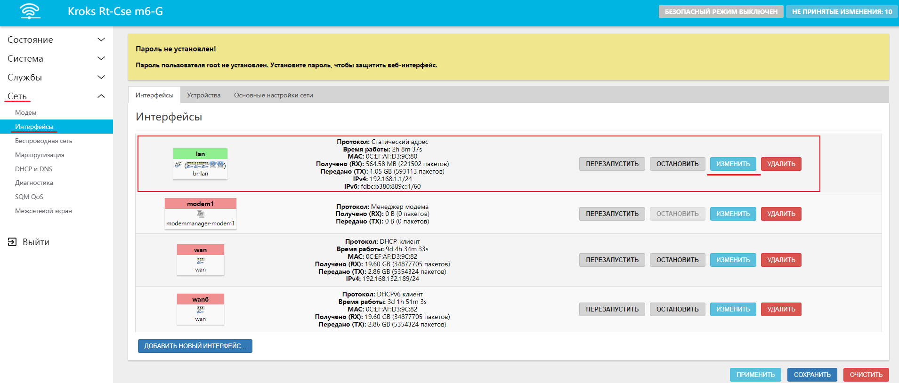

В открывшемся окне измените протокол на **DHCP-клиент**, после чего подтвердите выбор нажав на кнопку "ИЗМЕНИТЬ ПРОТОКОЛ".  
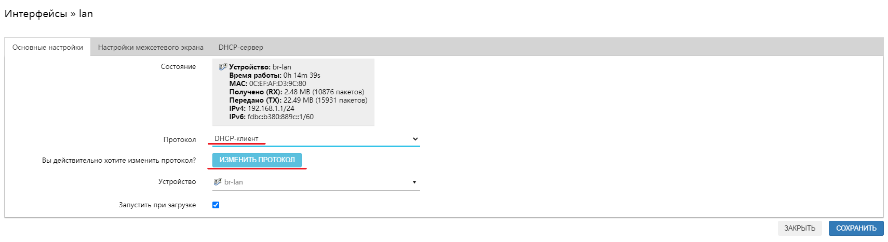

Во вкладке "DHCP-сервер" поставьте галочку **Игнорировать интерфейс**, после чего последовательно нажмите кнопки "СОХРАНИТЬ" и после "ПРИМЕНИТЬ".  
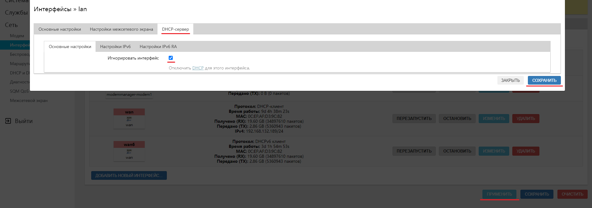

Готово, теперь ваш роутер подключен к главному по технологии Wi-Fi MESH.

Если этого не случилось, и к роутеру невозможно подключиться в течении длительного времени, то сбросьте роутер на заводские настройки и попробуйте ещё раз.

:::info
Обратите внимание, теперь по адресу **192.168.1.1** открывается только интерфейс Главного роутера, независимо от того, к какому роутеру вы подключены. Чтобы определить новый IP адрес настраиваемого роутера, зайдите в веб-интерфейс главного роутера, вкладка "Состояние" → "Обзор". В самом низу страницы раздел **Подключенные клиенты**, где вы обнаружите имя **rt41r1** (или любое похожее). Это и есть ваш настраиваемый роутер. И в колонке **Устройство** вы можете видеть его актуальный IP адрес вида **192.168.1.10**. Если вбить этот адрес в адресную строку браузера, откроется веб-интерфейс настраиваемого роутера.

:::

### ***POE-Гирлянда***

Для данного способа подключения вам понадобятся несколько роутеров с **поддержкой технологии питания POE**. На главном роутере произведите настройку [простого подключения](#простое-подключение) к сети Интернет удобным вам способом, переведите тумблер **POE** питания в положение **ON**. На этом настройка главного роутера завершена.  
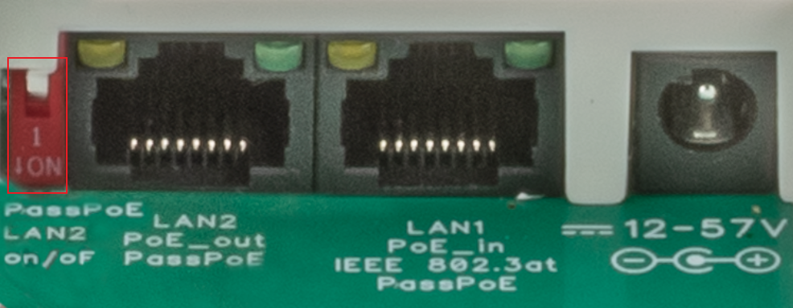

Далее берем каждый роутер по отдельности, подключаем в сеть и заходим в веб-интерфейс.

Далее следует настройка устройства аналогичная пункту о расширении сети с помощью [проводного соединения](#по-проводу).

Следующим этапом можно подключить роутер к основному при помощи кабеля.

:::warning
Обратите внимание, кабель должен соответствовать категории не ниже **5E**, **иметь 4 пары** (8 жил), а также не допускается использовать алюминиевый кабель, **только медный**.

:::

Перед тем как подключать провода, убедитесь, что порт, который поддерживает технологию **POE_OUT**. Главного роутера будет соединен с портом, который поддерживает технологию **POE_IN**, настраиваемого, постарайтесь не перепутать их. Осталось лишь перевести тумблер **POE** питание в положение **ON** и на этом настройка роутера закончена. Если всё соединено верно, то на настраиваемом роутере загорятся индикаторы работы.

Остальные устройства в сети настраиваются аналогичным образом.
