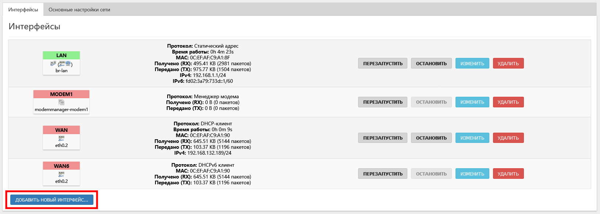
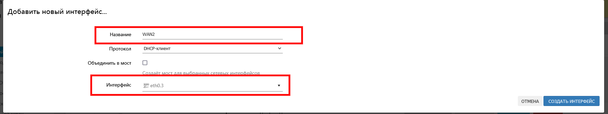
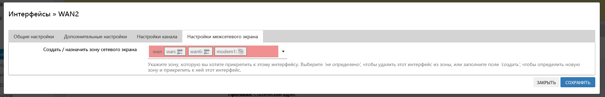
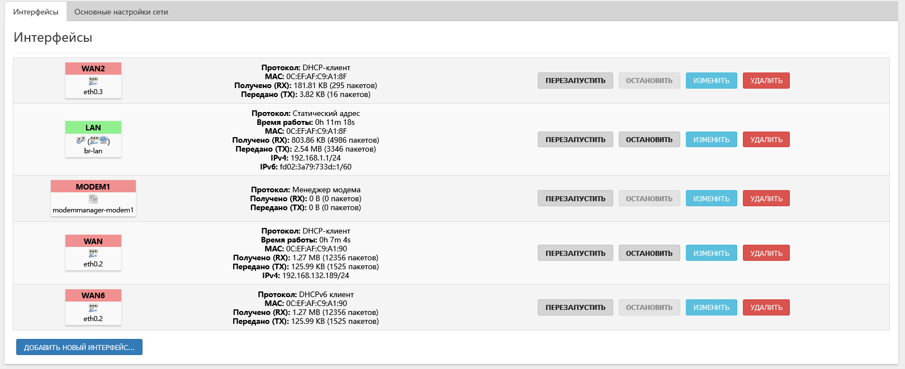
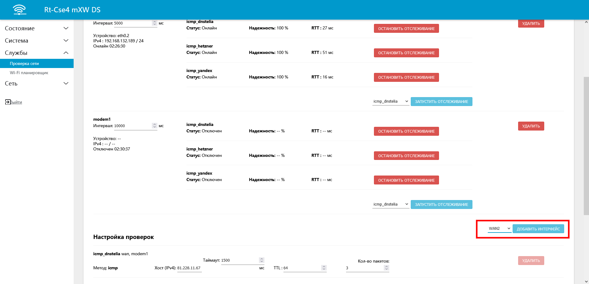
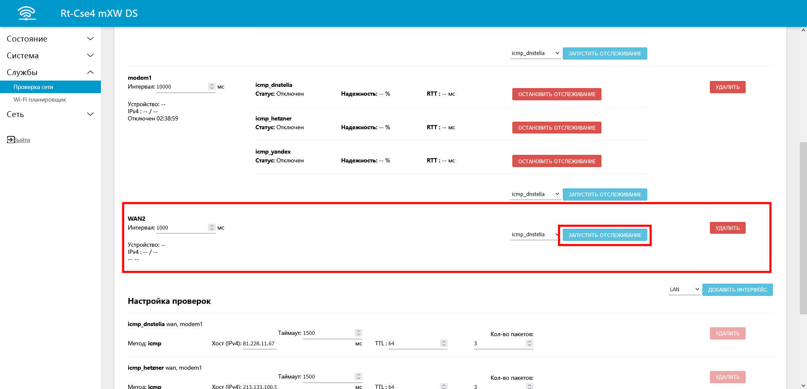
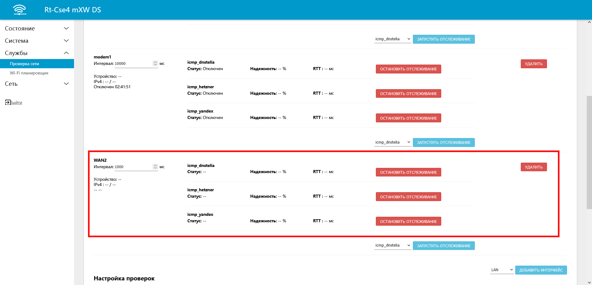

# Суммирование двух и более провайдеров интернета

Пример суммирования (резервирования) двух модемов подробно рассматривался [здесь](https://kroks.ru/useful-articles/stati/nastrojka-summirovaniya-i-rezervirovaniya-internet-kanala-na-dvux-modemnom-routere-kroks/). Аналогично ему можно суммировать интернет от провайдера по витой паре через WAN порт и 4G интернет модема. Для этого в настройках суммирования необходимо один из интерфейсов (MODEM1 или MODEM2) заменить на WAN. Все остальные настройки будут аналогичны тем, которые рассматриваются в видео.

Но что делать в случае, если необходимо суммировать несколько провайдеров, предоставляющих доступ в интернет по витой паре? Разберём подобную ситуацию. Предположим, что у нас есть две витые пары от двух разных провайдеров. И если с первым провайдером проблем нет, то для второго провайдера необходима предварительная настройка

## ***Настройка коммутатора***

Первым пунктом необходимо будет настроить коммутатор, чем мы уже занимались в [соответствующей статье](/docs/routery/prodvinutaya-nastroyka/nastroyka-kommutatora-na-routerah-KROKS.md).

## ***Создание и настройка нового интерфейса***

Перейдём во вкладку Сеть — Интерфейсы и создадим новый интерфейс с названием, например, WAN2 и выберем в выпадающем списке новый созданный виртуальный интерфейс eth0.3, в настройках межсетевого экрана назначим ему зону WAN/WAN6/MODEM1

  
  

Сохраняем и применяем. Вкладка Сеть — Интерфейсы должна выглядеть так

## ***Создание и настройка проверок***

Теперь для того, чтобы суммирование модема могло работать корректно, необходимо создать и настроить несколько проверок для созданного интерфейса WAN2. Откроем вкладку Службы — Проверки сети и добавим новый интерфейс WAN2, как на примере ниже.

В выпадающем меню выберем интерфейс WAN2 – Добавить интерфейс, после чего для него поочерёдно добавим три типа отслеживания: icmp_dnstelia, icmp_hetzner, icmp_yandex. В результате вид поверок должен стать как у интерфейсов MODEM1 и WAN.

  

Готово. После перезагрузки роутера он будет готов для настройки суммирования по аналогии с примером, рассматриваемом в этом [видео](https://kroks.ru/useful-articles/stati/nastrojka-summirovaniya-i-rezervirovaniya-internet-kanala-na-dvux-modemnom-routere-kroks/).
