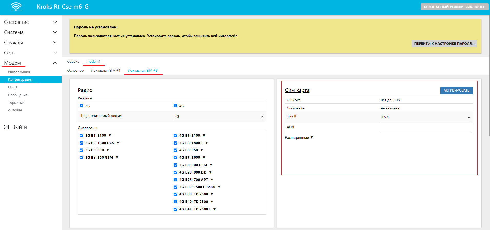
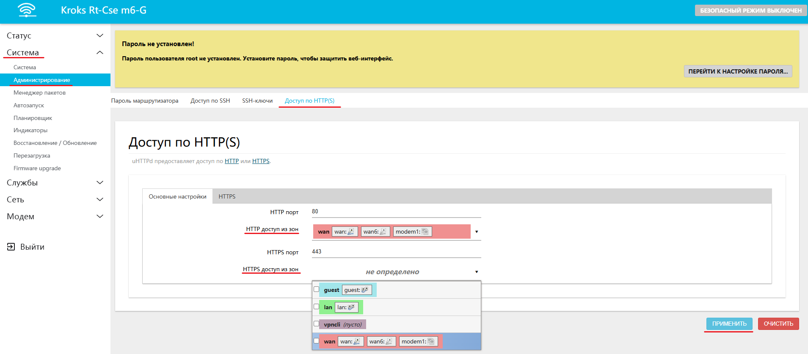

# Удаленное управление роутером

Возможности роутера позволяют удаленное подключение к нему с любого внешнего IP-адреса. Для этого должны быть соблюдены пара условий:

* К тарифному плану sim-карты в роутере должна быть подключена услуга внешнего ("белого") статического IP-адреса;
* В межсетевом экране роутера должно быть включено правило, разрешающее получить доступ "извне" по определенному порту роутера;

## ***Настройка***

Для подключения услуги белого статического IP-адреса вам необходимо обратиться к оператору, предоставляющему услугу мобильного интернета. Часто с подключением услуги клиенту могут быть выданы параметры APN, для самостоятельной настройки роутера. В таком случае это необходимо сделать в веб-интерфейсе, во вкладке Модем > Конфигурация, здесь вам необходимо будет выбрать нужные модем и SIM-карту для него (в примере, modem1 > Локальная SIM #2)

После подключения услуги вам необходимо перейти во вкладку Система > Администрирование > Доступ по HTTP(S), в селекторах **HTTP доступ из зон** и **HTTPS доступ из зон** выбрать зону **wan**. После чего нажать кнопку **ПРИМЕНИТЬ**

Web-интерфейс роутера будет доступен по адресу: XXX.XXX.XXX.XXX:80, где XXX.XXX.XXX.XXX - белый статический IP-адрес роутера
