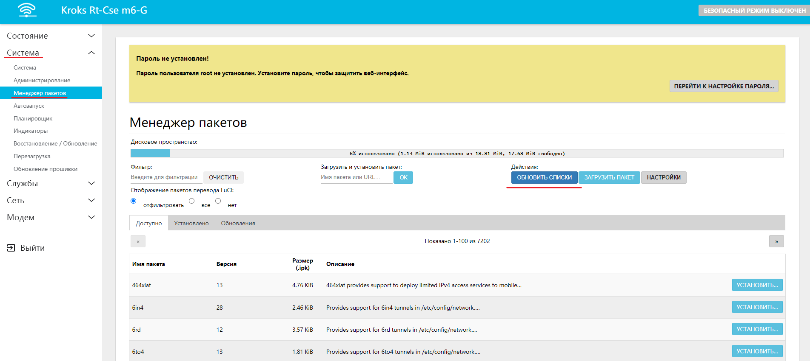
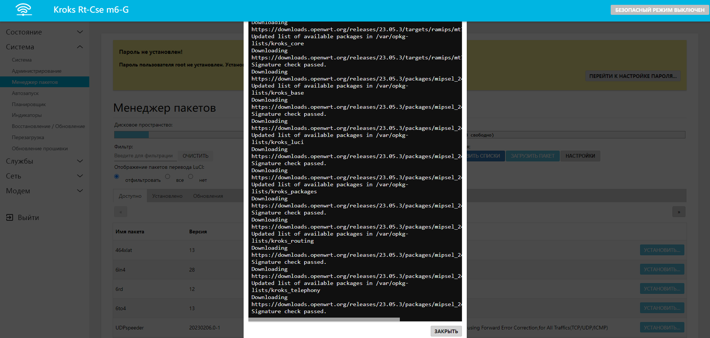
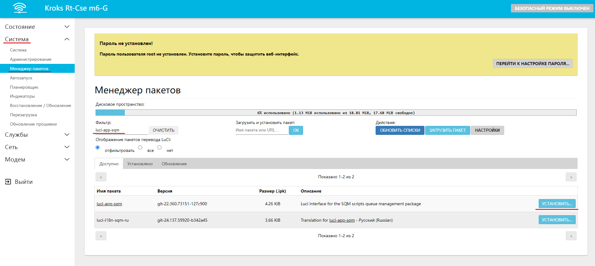
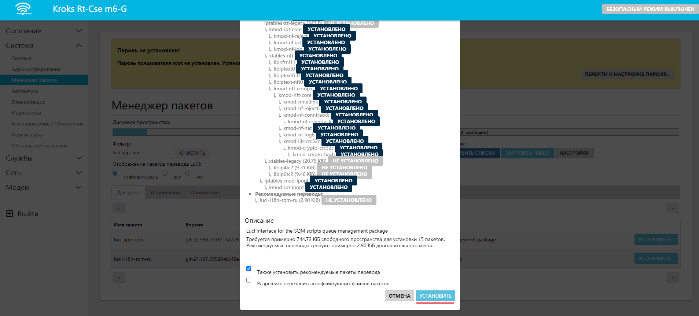
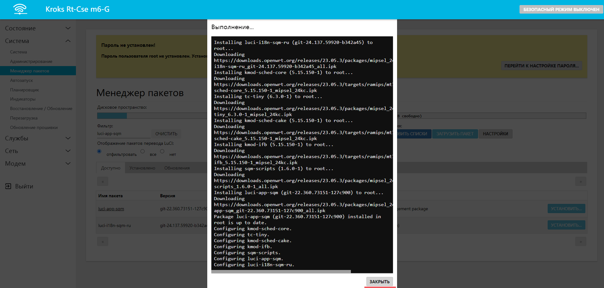

# Установка сторонних пакетов

В некоторых случаях необходимо установить/переустановить или обновить некоторые пакеты, необходимые для работы каких-либо сервисов. Это можно сделать несколькими путями, как через SSH, так и через веб-интерфейс самого роутера. В этой статье мы разберем второй вариант.

1. Зайдите в веб-интерфейс браузера (по умолчанию 192.168.1.1) во вкладку "Система" - "Менеджер пакетов" и нажмите кнопку "Обновить списки" как на скриншоте ниже:

    

    После обновления пакетов вы увидите информационное окно. Это значит, что можно двигаться дальше.

    :::warning
    Для обновления и установки пакетов необходимо активное подключение к интернету

    :::

    

2. В поле Фильтр введите частично или полностью название интересующего вас пакета и после появления его в списке ниже нажмите "Установить"

      
    

3. После появления окна, как на скриншоте ниже можете считать установку пакета выполненной успешно.

    
