# Выборочная маршрутизация по доменному имени

В случае работы внутри корпоративных сетей существует необходимость доступа как к внутренним ресурсам компании, так и во внешнюю сеть. В этом случае в роутерах Крокс предусмотрен механизм выборочной маршрутизации по доменному имени. Так, например, site.kroks.ru будет открываться через корпоративную (внутреннюю) сеть компании с помощью модема и корпоративной симкарты, а yandex.ru через обычное подключение к сети интернет через wan интерфейс.

## ***Сбор доменов***

Для точечной маршрутизации по доменным именам в первую очередь необходимо составить список доменных имён. В нашем случае список выглядит так:

* site1.kroks.ru
* site2.kroks.ru
* example.com
* example.ru
* speedtest.net

## ***Настройка маршрутизации***

### ***Создание набора IP адресов***

В первую очередь нам необходимо создать набор ip адресов, в него будут складываться
ip адреса доменов при обработке dns запросов. Именного его мы далее будем заполнять и именно его будет использовать роутер для маршрутизации. Для создания перейдём в Сеть - Межсетевой экран - Наборы IP-адресов.

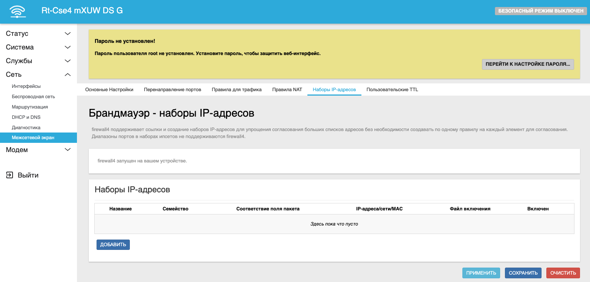

Нажимаем Добавить и заполняем следующие поля:

* Название - modem. Можно любое на латинице, но учтите, что дальше оно будет использоваться в других местах, так что необходимо запомнить его
* Соответствие поля пакета - dest_net. Эта настройка отвечает за вид списка. Конкретно в нашем случае мы настраиваем наш список как список домменных имён в качестве пунктов назначения

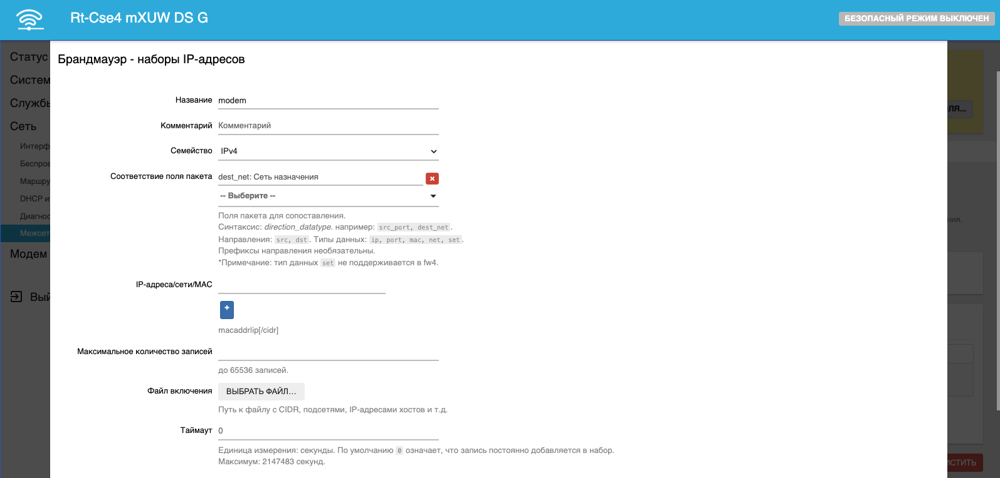

Не забудьте сохранить изменения.

### ***Заполнение набора IP адресов***

Для того чтобы заполнить список перейдите на вкладку Сеть - DHCP и DNS - Наборы IP-адресов.

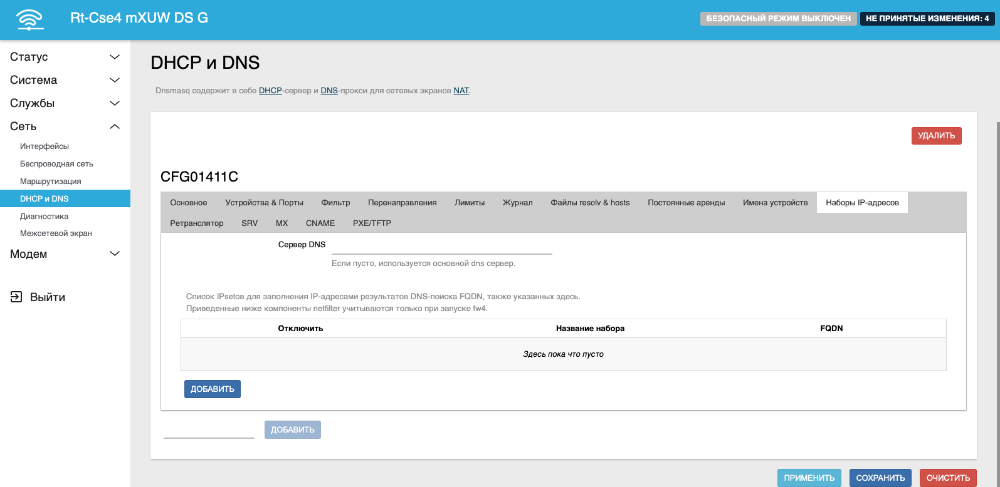

Здесь нам необходимо нажать кнопку Добавить и заполнить следующие поля:

* Название набора - из предыдущего пункта вводим modem
* FQDN - Это непосредственно список доменных имён. После ввода каждого имени нажимайте Enter либо кнопку + для ввода следующего доменного имени

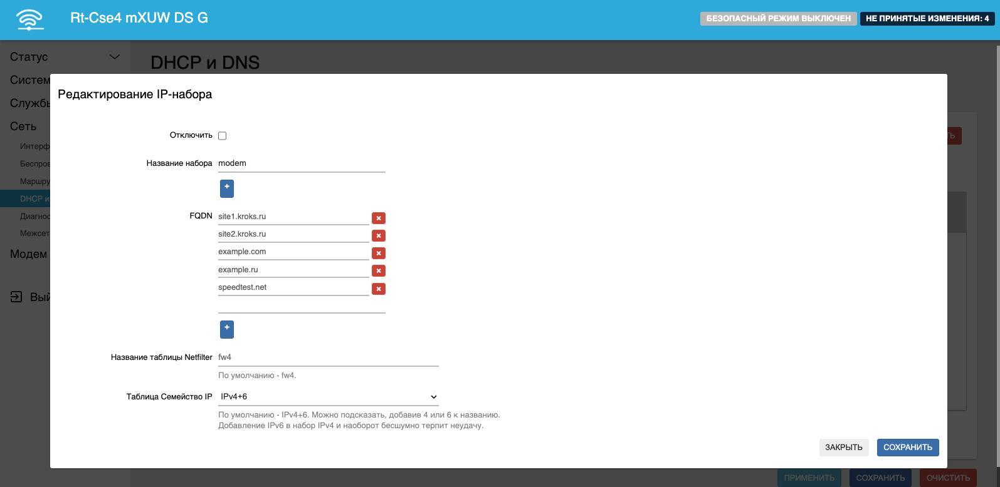

Не забудьте сохранить изменения.

::: info
Если в вашей сети отдельный dns-сервер, пропишите его на этом шаге в поле Сервер DNS.
:::

### ***Настройка межсетевого экрана***

Для того чтобы система могла перенаправить трафик к конкретному сайту из списка через определённый интерфейс необходимо промаркировать его. В роутерах фирмы Крокс такая настройка находится на вкладке Сеть - Межсетевой экран - Правила для трафика.

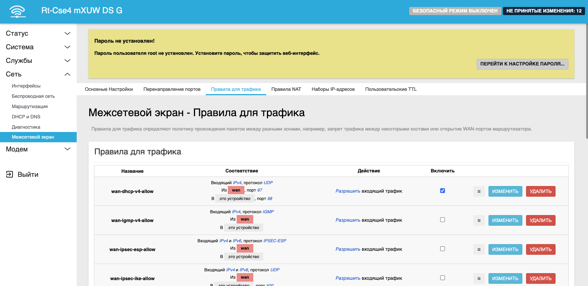

В самом низу находим кнопку Добавить и вводим следующие поля:

* Название - mark_modem. Можно любое на латинице
* Протокол - выбираем пункт "Любой"
* Зона источника - LAN
* Зона назначения - выбираем пункт "Любая зона"
* Действие - Применить метку брендмауэра
* Установить метку - 0x1. Подойдёт любое число в шестнадцатеричном формате

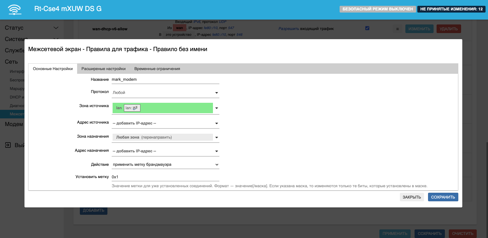

Не покидая этого окна открываем вкладку Расширенные настройки.

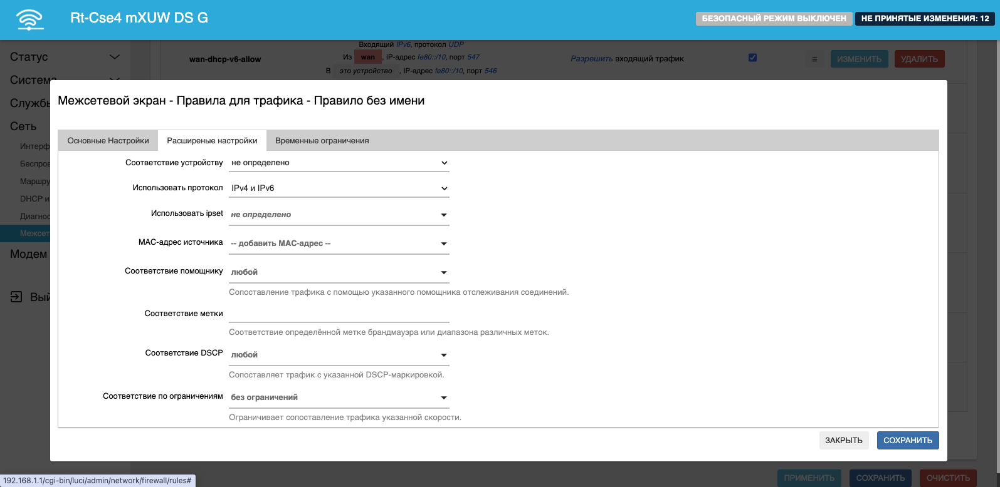

На этой вкладке нам нужно выбрать набор IP адресов, который создавали ранее, для этого откройте селектор "Использовать ipset". У нас здесь только список modem. Сохраняем правило.

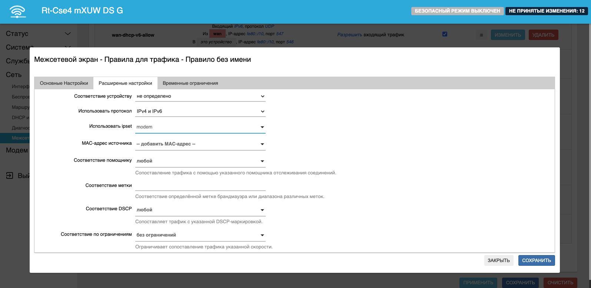

### ***Настройка маршрутизации***

Последним пунктом нам необходимо показать роутеру, через какой интерфейс будут идти запросы на сайты из нашего списка. Делается это на странице Сеть - Маршрутизация.

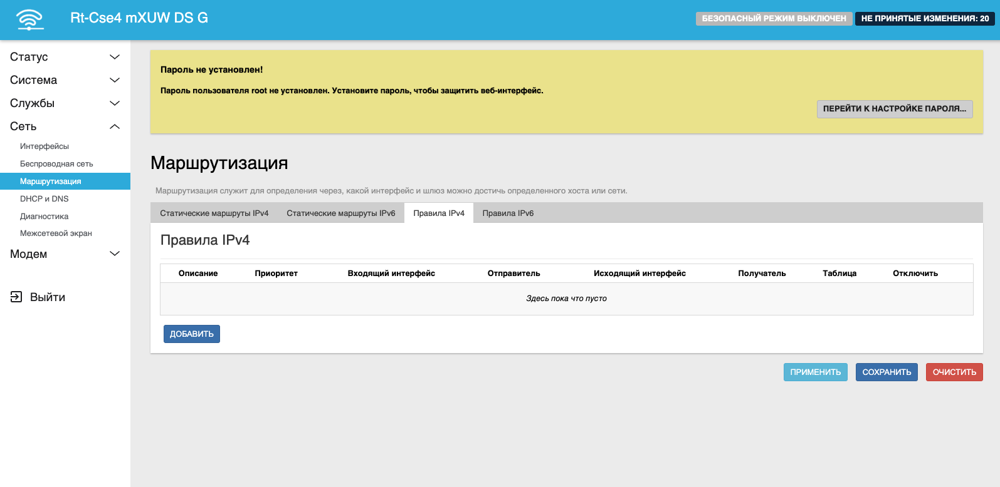

Здесь нам необходимо создать правило, которое позволит обрабатывать промаркированный трафик через отдельную таблицу маршрутизации. Для этого нажимаем кнопку Добавить и заполняем следующие поля:

* Приоритет - 100. Можно любое число до 100 включительно. Всё что выше - отдано под системные нужды
* Таблица - 99. Можно любое не занятое число, главное чтобы оно было меньше любого числа из занятых, иначе маршрутизация не будет работать

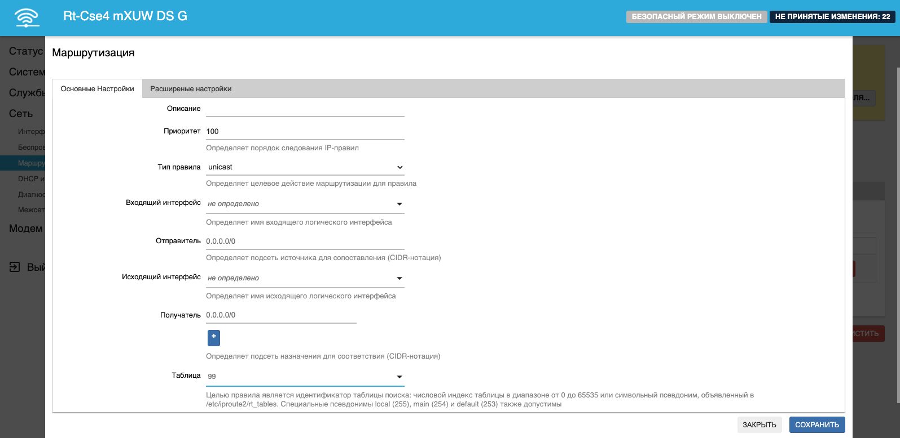

Не покидая этого окна открываем вкладку Расширенные настройки.

Здесь нам осталось лишь указать, какая именно метка у нужных нам пакетов. Соответственно вводим в поле Метка межсетевого экрана
значение 0x1.

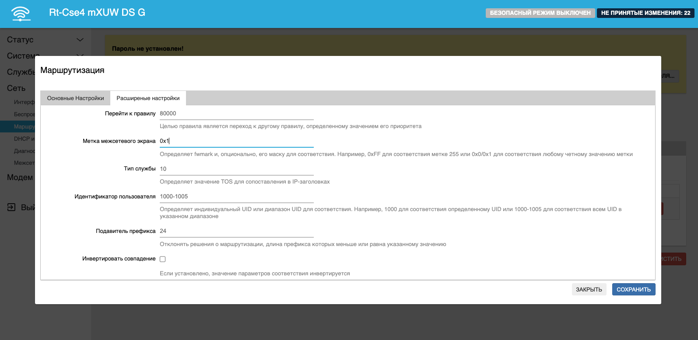

Теперь нужно лишь прописать маршрут - указать роутеру, что созданная нами таблица маршрутизации будет идти через нужный интерфейс. В нашем случае это modem1. Открываем вкладку Статические маршруты IPv4.

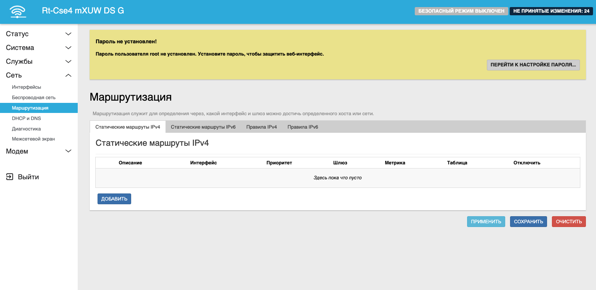

Внизу нажимаем кнопку Добавить и заполняем следующие поля:

* Интерфейс - отмечаем modem1
* Приоритет - **ЗАПОЛНЯЕМ** 0.0.0.0/0, иначе работать не будет

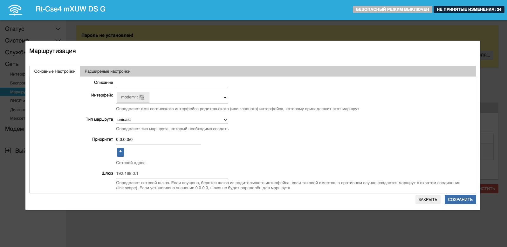

Не покидая этого окна открываем вкладку Расширенные настройки.

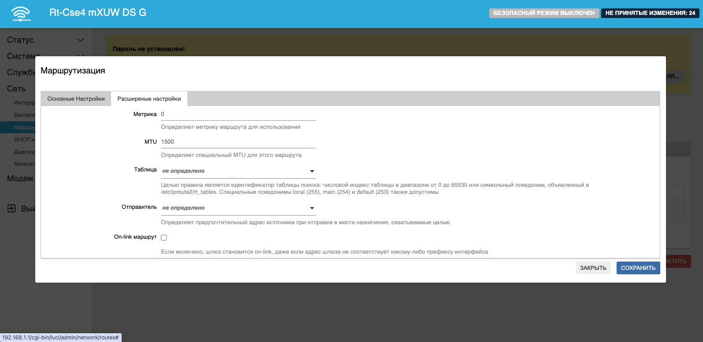

Здесь нам осталось лишь связать наше правило с ранее созданной таблицей маршрутизации. Для этого в поле Таблица вводим нашу ранее созданную таблицу - 99. Для этого в выпадающем списке выберите пункт Пользовательский и введите туда нужное число.

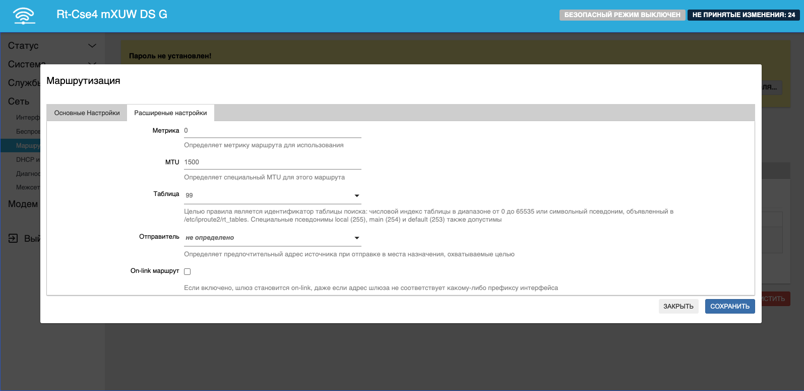

Нажимаем Сохранить и применяем настройки. На этом настройка закончена.

## ***Проверка маршрутизации***

Для проверки достаточно перейти на любой сайт из списка. Например, сайт, находящийся во внутренней, корпоративной сети, будет открываться без проблем, как и сайт, находящийся во внешней сети. Для проверки возьмём два сайта. Один из них - qms.ru должен быть открыт через modem1. Второй сайт - 2ip.ru - будет открыт через WAN-интерфейс.

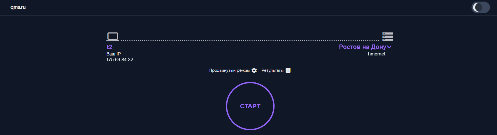

Как видим, он обнаружил что мы подключены через T2 по мобильному интернету. Теперь откроем 2ip.ru.

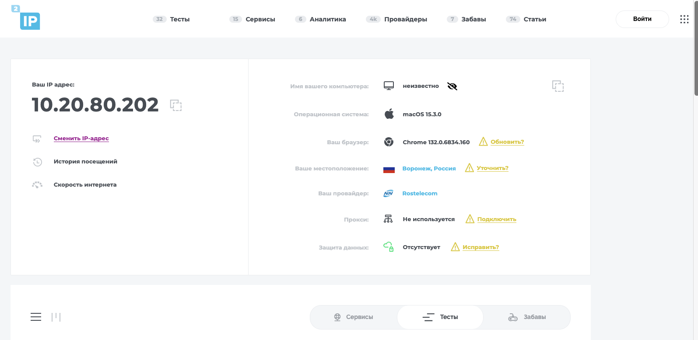

Здесь же подключение произошло через WAN-интерфейс.
