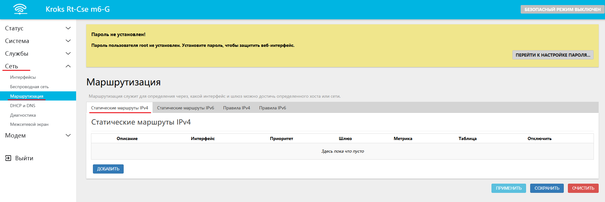
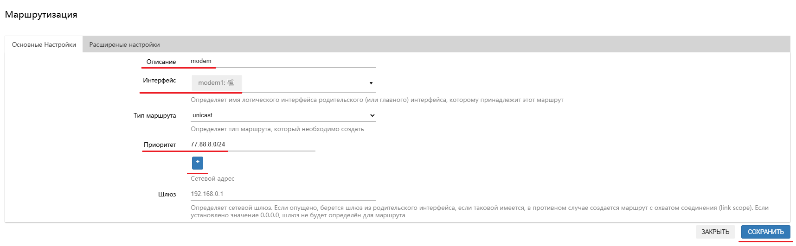
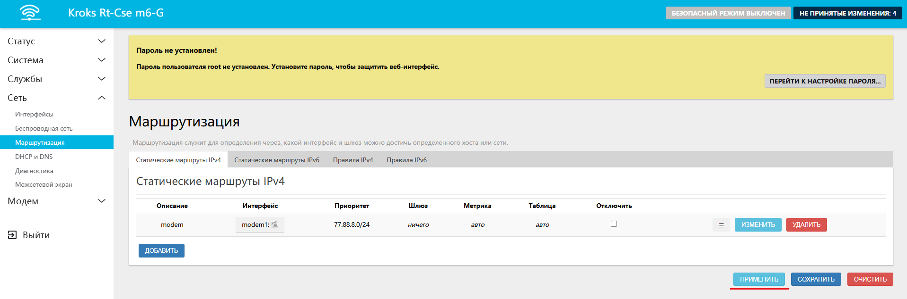

# Выборочная маршрутизация по IP

В этой статье мы разберем случай, при котором у вас может возникнуть необходимость разделить проходящий трафик из разных источников.  
Например, вы хотите чтобы трафик на некоторые IP адреса проходил через модем, а остальной трафик через WAN.  
Тогда от вас требуется лишь создать подходящее правило. Для этого перейдите на вкладку "Сеть" -> "Маршрутизация" -> "Статические маршруты IPv4".

Здесь вам нужно нажать кнопку "ДОБАВИТЬ".  
В открывшемся окне необходимо заполнить следующие поля:  
* **Описание** — текст с описанием правила, рекомендуется на латинице. В примере мы подписали это правило как *modem*;  
* **Интерфейс** — здесь нужно выбрать через какой интерфейс будет идти трафик, у нас это модем;
* **Приоритет** — в этом поле указывается список IPv4 адресов для которых должно работать правило. В примере мы указали yandex - dns.  
    * Обратите внимание, что ip адрес необходимо указывать с префиксом. Префикс показывает какой сети пренадлежит IP адрес. Любой клиент подключающийся к роутеру Kroks получит по умолчанию ардес с префиксом **/24**.  
    * Так же в случае необходимости добавить несколько IPv4 адресов вы можете нажать на кнопку "+" под введенным вами адресом, после это появится ещё одна строка.

После создания правила вам остаётся лишь нажать кнопку "ПРИМЕНИТЬ" и дождаться пока роутер станет снова доступным.

:::info
Обратите внимание, после применения настроек, рекомендуется сбросить кэш маршрутов.  
Для этого достаточно отключить клиентов от роутера и подключить заново.

:::