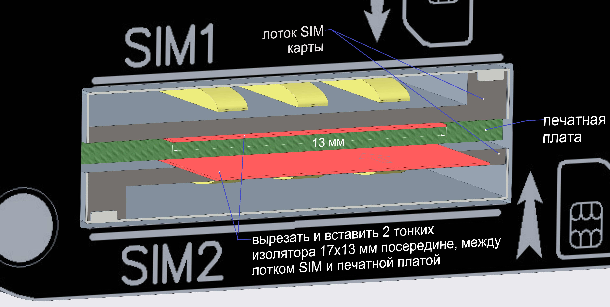
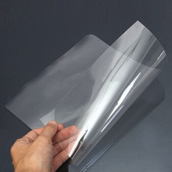

# Доработка сим-инжектора

На некоторых моделях сим-инжекторов (арт. [1957](https://kroks.ru/shop/3g-modems-and-routers/routers-with-sim-injector/kroks-sim-injector/), [1958](https://kroks.ru/shop/3g-modems-and-routers/routers-with-sim-injector/kroks-rt-cse-sim-injector-ds/)), выпущенных ранее января 2023 была замечена проблема - сим-карта не определяется в слоте инжектора.

Дефект является гарантийным, оборудование подлежит отправке в СЦ.

В случаях, когда отправка в СЦ невозможна, есть вариант самостоятельного решения проблемы.

Для этого необходимо вставить два тонких изолятора между лотками сим-карты и печатной платой, как это показано на рисунке ниже:

В качестве изолятора может подойти пленка для печати на принтере (можно приобрести один лист в типографии) или склеенный в два слоя полиамидный скотч.

  

