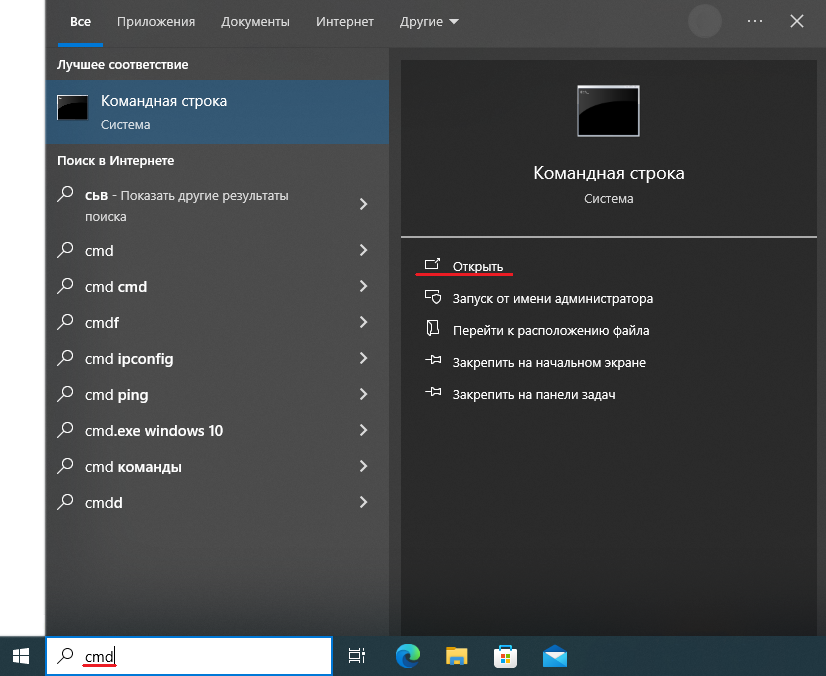
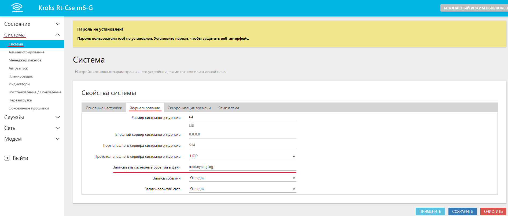

# Сохранение журнала логов

:::warning
Обратите внимание, данная инструкция не является обязательным действием, и рекомендуется к использованию только по мере необходимости. Если оставить эту функцию включенной на постоянной основе, то это приведёт к выходу из строя вашего роутера.

:::

Существую ситуации когда пользователь может столкнуться с тем, что для грамотной помощи в решении его проблемы, техподдержка запрашивает журнал логов устройства. В некоторых случаях, например, в результате сбоя в работе, какой-либо неисправности или самим пользователем устройство перезагружается, а **после каждой перезагрузки журнал логов очищается**.

Это руководство поможет вам сохранить журнал логов в отдельный файл и таким образом избежать потери данных.

## ***Настройка***

Для начала вам необходимо войти в веб-интерфейс вашего роутера и открыть вкладку "Система" → "Система" → "Журналирование". Здесь вы можете указать директорию, в которую будет сохраняться журнал логов, например:

```bash
/root/syslog.log
```

где, **root** - по умолчанию имя пользователя;  
**syslog.log** - название файла, в котором будет храниться журнал логов.

Остальные пункты рекомендуется оставить по умолчанию.

Не забудьте нажать кнопку "ПРИМЕНИТЬ" по окончанию необходимых настроек.


## ***Скачивание журнала логов***

После того как вы применили настройки, автоматически создаётся файл в который будет дублироваться журнал логов, начиная с этого момента. Вам остаётся только дождаться возникновения проблемы, которую вы хотите локализовать и скачать журнал логов.

Для того чтобы скачать необходимый файл нужно:

* Открыть командную строку на ПК, который подключен к вашему роутеру. Для этого достаточно ввести в поисковую строку сокращение **cmd** и в полученном окне нажать кнопку "Открыть".

  
* В открывшемся окне необходимо ввести команду:

```bash
scp root@192.168.1.1:/root/syslog.log C:/Users/Admin/Documents/syslog.log
```

где, **scp** - команда необходимая для подключения к роутеру по SSH;  
**root** - по умолчанию имя пользователя;  
**192.168.1.1** - по умолчанию ip адрес устройства;  
**:/root/syslog.log** - директория сохранения, которую вы указывали в первом шаге;  
**C:/Users/Admin/Desktop/syslog.log -** путь куда вы хотите сохранить полученный файл с журналом логов.

Готово! Вы получили файл с журналом логов беспокоящей вас ошибки.

:::warning
Внимание! После того как вы получили журнал логов, необходимо обязательно очистить поле, которое вы заполняли в первом шаге, и нажать кнопку ПРИМЕНИТЬ.



В противном случае журнал логов продолжит дублироваться и перезаписывать созданный файл, что в конечном итоге приведет к выходу из строя устройства.

:::
