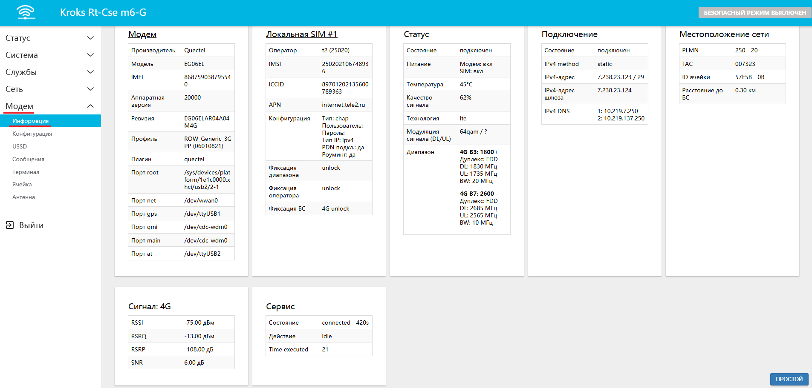
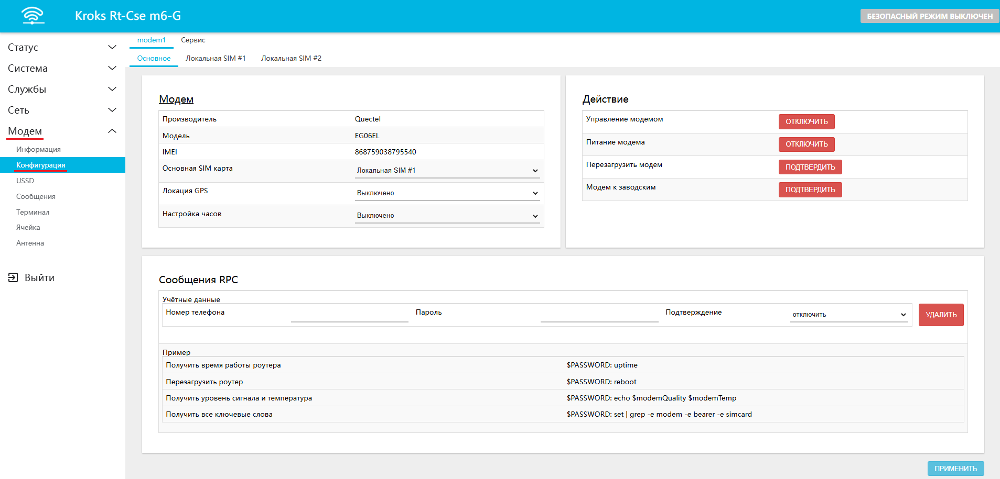
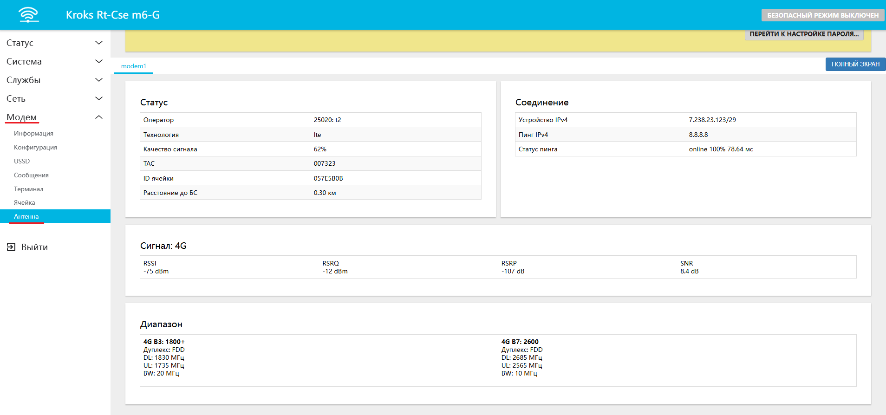
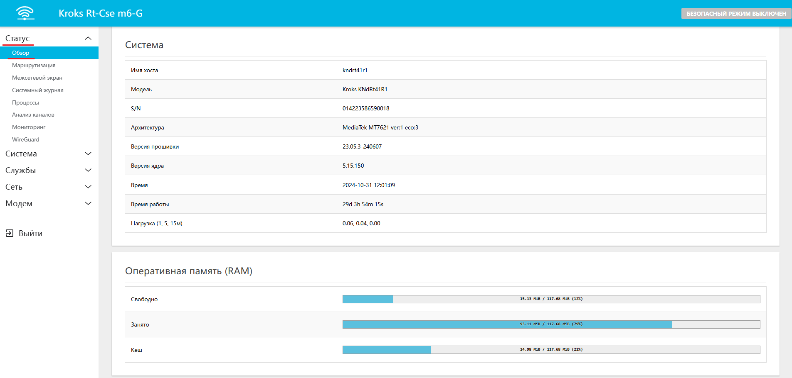
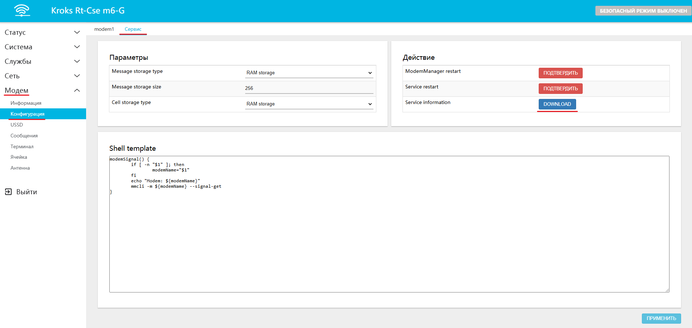

# Рекомендации по обращению в техподдержку

:::warning
Настоятельно рекомендуем вам ознакомиться с данной статьёй перед обращением в техническую поддержку, для получения наиболее грамотной и быстрой помощи от наших специалистов.

:::

## ***Перед обращением в техподдержку***

Для начала рекомендуем вам произвести несколько простых действий, которые могут помочь вам справится с проблемой без обращения в техподдержку.

* Обновите прошивку.
* [Произведите сброс устройства на заводские настройки](/docs/routery/chasto-zadavaemye-voprosy/sbros-ustroystva-na-zavodskie-nastroyki.md).
* Проверьте наличие подходящей статьи на нашем интернет-портале в разделе [часто задаваемые вопросы](/docs/routery/chasto-zadavaemye-voprosy.md).

## ***Обращение в техподдержку***

Если перечисленные в прошлом пункте способы не помогли вам решить возникшую проблему, в таком случае следует обраться в техническую поддержку. Сейчас мы разберем, как это сделать правильно.

### ***Приложите к письму несколько скриншотов из веб-интерфейса роутера***

Вам необходимо прикрепить к письму кадры следующих вкладок:

* "Модем" → "Информация"

Советуем нажать кнопку "ДЕТАЛЬНЫЙ" в правом нижнем углу экрана, чтобы привести более подробные данные, как на примере ниже.

* "Модем" → "Конфигурация"

* "Модем" → "Антенна"

* "Статус" → "Обзор"

### ***Приложите к письму несколько файлов***

Перейдите на вкладку "Модем" → "Конфигурация" → "Сервис". И нажмите кнопку **DOWNLOAD** в строке **service information**.

Скаченный файл прикрепите при отправлении письма.

Также к письму необходимо [приложить журналы](/docs/routery/tehnicheskaya-podderzhka/sohranenie-zhurnalov.md) из веб интерфейса роутера, **после того как произойдёт ошибка**.

:::info
Если же возникающая ошибка приводит к выключению вашего устройства, в таком случае следуйте [этой инструкции](/docs/routery/remont/sohranenie-zhurnala-logov.md).
:::
