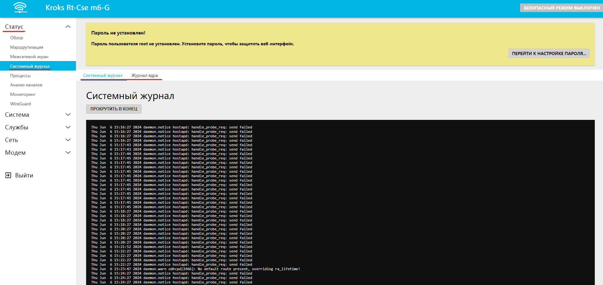
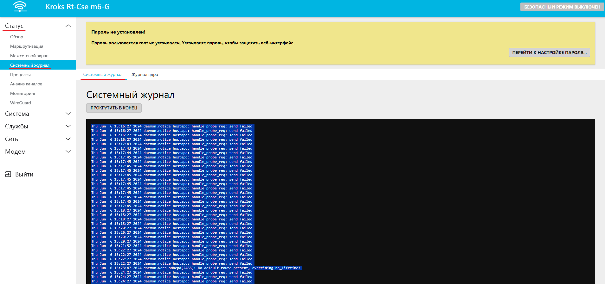
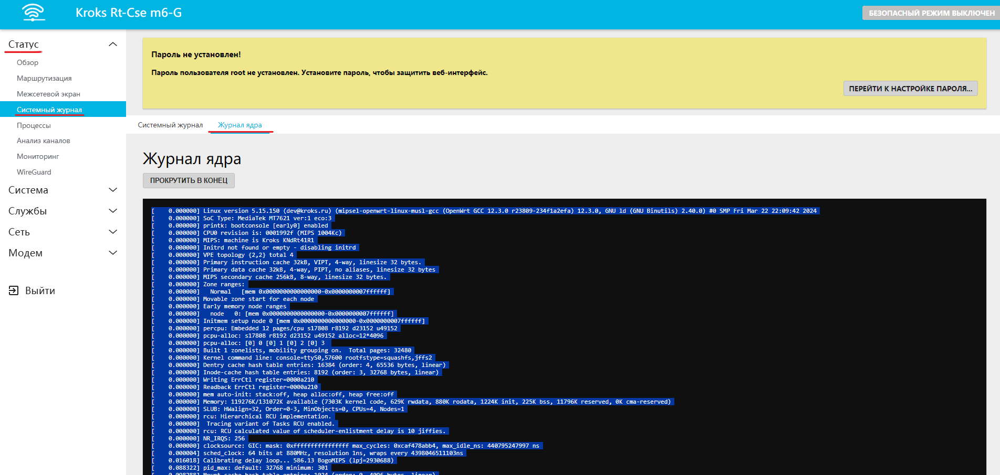

# Сохранение журналов

1. Зайдите в веб-интерфейс роутера (по умолчанию ''192.168.1.1'')

2. Найдите во вкладке ''Статус'' вкладки ''Системный журнал'' и ''Журнал ядра'':  

3. Перейдите во вкладку ''Системный журнал'', выделите весть текст, как это изображено ниже (например с помощью клавиш Ctrl+A), скопируйте, вставьте в пустой текстовый документ и сохраните его с названием "Системный журнал.txt"  

4. Повторите аналогичные действия с журналом ядра:  

5. Прикрепите оба созданных файла к письмо с описанием проблемы.
