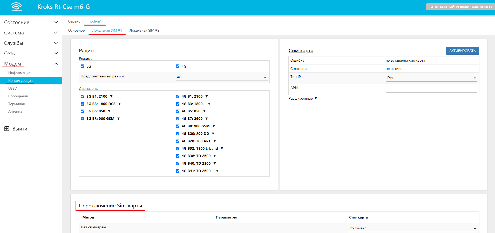
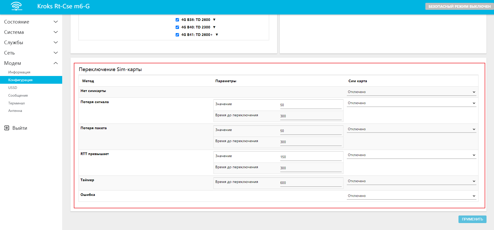
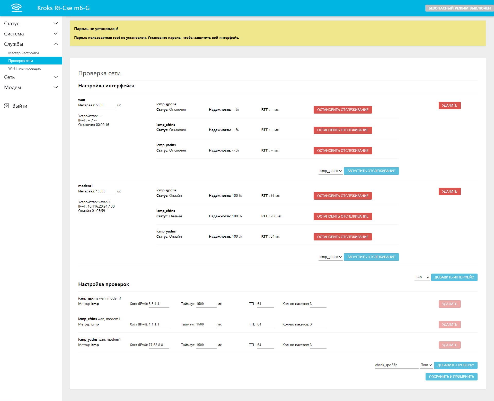

# Автоматическое переключение сим карты

В роутерах с одним модемом и несколькими слотами под SIM-карту есть возможность переключаться с одной SIM-карты на другую. Например, при нестабильном или отсутствующем подключении к интернету. По умолчанию переключение SIM-карт в роутере не настроено, поэтому необходимо задать условия переключения вручную. Рассмотрим эту возможность подробнее.

:::tip
Перед использованием вам необходимо убедиться, что обе SIM-карты определяются модемом, на обоих положительный баланс и соответсвующий тариф.
:::

## ***Описание методов***

Настройка методов переключения может быть выполнена в веб-интерфейсе роутера, во вкладке "Модем" -> "Конфигурация" -> "modem1", в примере выбрана Локальная SIM #1. Здесь внизу страницы вы можете наблюдать блок **Переключение SIM-карты:**

Есть шесть основных методов, при которых возможно переключение. Это:

* **Нет симкарты** - переключение происходит в случше, если SIM-карта извлечена.
* **Потеря сигнала** - определяется мощностью (%) и временем до переключения (сек). Т.е. мощность - 50 и таймаут 300 означает, что переключение на другую SIM-карту произойдёт, если в течение 300-секундного интервала мощность сигнала от базовой станции мобильного оператора будет менее 50%;
* **Потеря пакета** - определяется надежностью (%) и временем до переключения (сек). Т.е. надёжность - 50 и таймаут - 300 означает, что переключение на другую SIM-карту произойдёт если за 300-секундный интервал будет потеряна половина отправленных диагностических запросов;
* **RTT превышает** - определяется RTT (мс) и временем до переключения (сек). Т.е. RTT - 150 и таймаут - 300 означает, что переключение на другую SIM-карту произойдёт если за 300-секундный интервал среднее значение скорости ответа диагностических запросов будет превышать 150 мс;
* **Таймер** - определяется пользователем и позволяет вручную переключать SIM-карту по истечении определенного времени в секундах;
* **Ошибка** - переключение происходит в случае любых проблем конфигурации и работы модема.

:::tip
Обратите внимание, в примере настройка методов переключения происходит для **SIM 1**, а в стобце "Сим карта" устанавливается на какую SIM-карту будет происходить переключение в случае необходимости.

Если вы выбрали ту же Сим-карту, с которой присходит переключение, то сим-карта просто перезагрузится. Это полезно, если у вас только одна сим-карта.
:::

Можно использовать как один, так и несколько методов одновременно. Для каждой из SIM-карт можно задать собственные методы со своими параметрами. Методы, по которым осуществляются проверки находятся во вкладке "Службы" -> "Проверка сети". Там же вы можете выбрать интерфейсы, к которым необходимо применять проверки, добавлять узлы, которые будут опрашиваться и пр.:  

