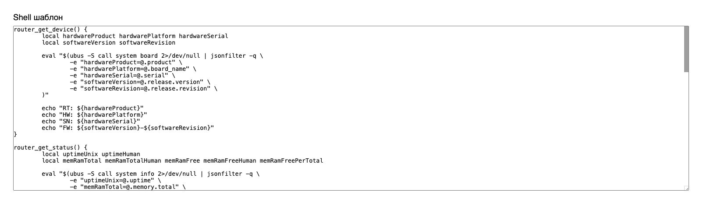
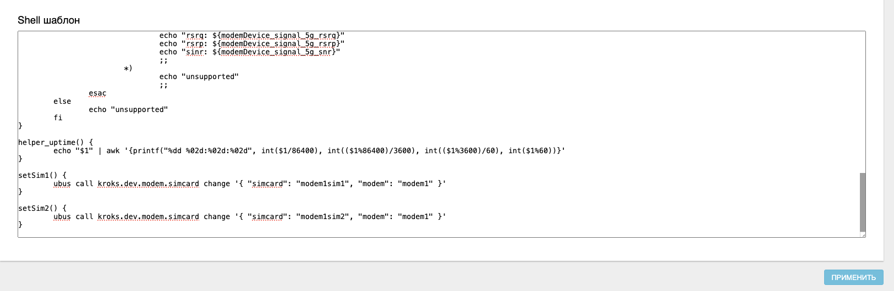
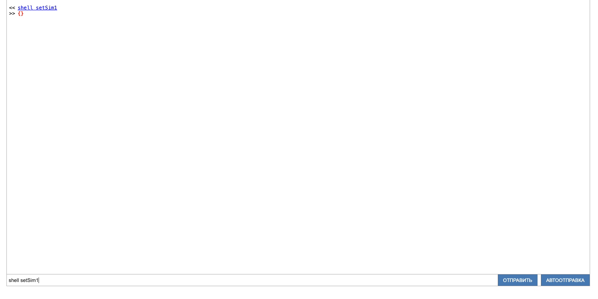

# Добавление собственных Shell шаблонов


## ***Введение***

Одним из способов удаленного управления роутером является управление по СМС. В соответствующей [статье](/docs/routery/upravlenie-modemom/upravlenie-routerom-cherez-sms.md) раскрыты подробности настройки такого режима управления. В данной статье мы расмотрим написание собственных Shell-шаблонов для расширения функционала удалённого управления.

## ***Редактор Shell-шаблонов***



Редактор Shell-шаблонов расположен на карточке "Модем" -> "Конфигурация" -> вкладка "Сервис" -> "Shell-шаблон". Внутри уже есть несколько примеров, которые можно использовать в качестве основы для написания собственных скриптов. Для примера, давайте добавим пару функций, которые будут активировать одну из сим-карт роутера. Для этого установите курсор в самом конце поля ввода. отступите одну строку от последнего символа и введите:  
```bash
setSim1() {
	ubus call kroks.dev.modem.simcard change '{ "simcard": "modem1sim1", "modem": "modem1" }'
}

setSim2() {
	ubus call kroks.dev.modem.simcard change '{ "simcard": "modem1sim2", "modem": "modem1" }'
}

```

После нажмите кнопку Применить внизу страницы. На этом шаблон будет готов.



## ***Проверка скриптов***

Если вы ещё не настроили удалённое управление, то для начала проведите настройку согласно этой [инструкции](/docs/routery/upravlenie-modemom/upravlenie-routerom-cherez-sms.md). После этого вы сможете отправить команду на модем, например:  
```bash
0000: setSim2
```  
:::tip
Обратите внимание, что отправлять СМС нужно на активную сим-карту. Если сим-карт не активна, то команда не будет выполнена.
:::

Результатом работы скрипта станет переключение сим-карты. Обратите внимание, никакого ответа на эту команду не последует, даже если вы попытаетесь, например, ввести  
```bash
    echo "Успешно!"
```  
так как в этот момент роутер будет отключен от мобильной сети.

## ***Отладка пользовательских Shell-шаблонов***

Для того чтобы можно было вызывать пользовательские скрипты не отправляя СМС каждый раз, можно вызывать их через Модем - Терминал. Для вызова команды введите  
```bash
    shell setSim1
```  


Более подробная инструкция по использованию терминала доступна в этой [статье](/docs/routery/upravlenie-modemom/rabota-s-terminalom.md).
