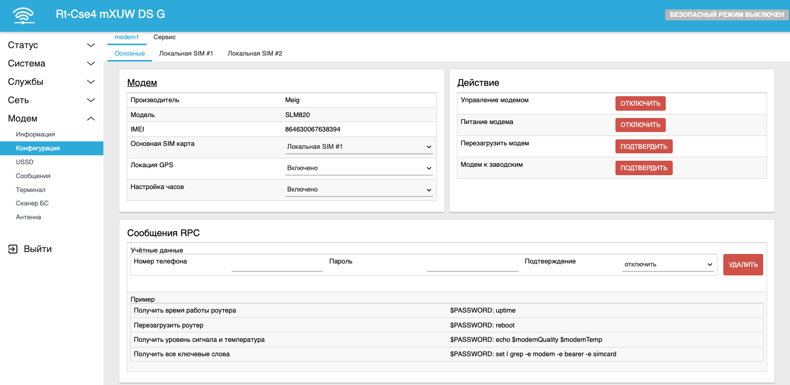
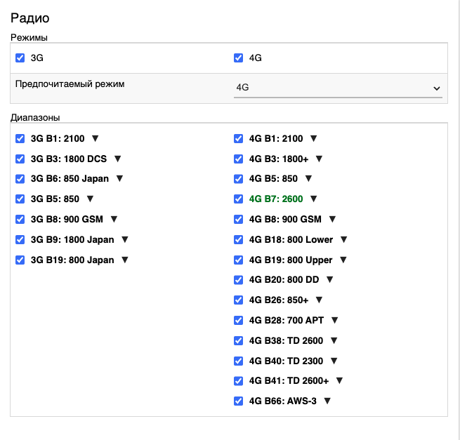
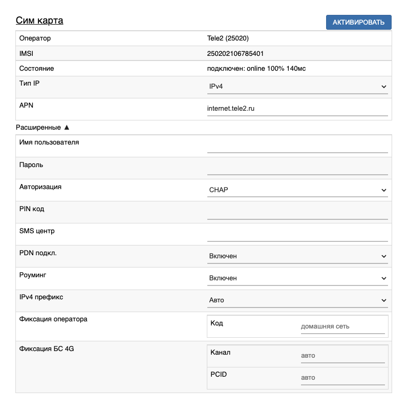
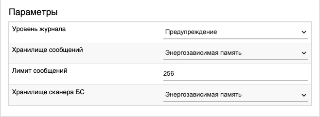

# Конфигурация модема

## ***Настройки модема***

### ***Модем***

* Модем - название производителя модема
* Модель - модель модема
* IMEI - уникальный номер модема
* Основная SIM карта - SIM-карта, которая используется модемом по умолчанию. Подробнее в этой [статье](/docs/routery/upravlenie-modemom/vybor-sim-karty-po-umolchaniyu.md)
* Локация GPS - включение GPS-локации на модемах, которые поддерживают GPS-локацию. Подробнее в этой [статье](/docs/routery/upravlenie-modemom/GPS-lokaciya.md)
* Настройка часов - включение синхронизации внутренних часов роутера с помощью вышек базовых станций. Необходимо для коррекции внутренних часов роутера в случае отсутствия возможности синхронизации по NTP. Например, в корпоративных изолированных сетях

### ***Действие***

* Управление модемом - отключение и включение управления модемом. Останавливает машину состояний конкретного модема и позволяет проводить манипуляции с ним, например, для ввода AT-команд или настроек, которым может помешать стандартная логика управления модемом.
* Питание модема - отключение и включение питания модема на физическом уровне
* Перезагрузить модем - завершение всех процессов и служб обслуживающих модем, софтверная перезагрузка и последущая инициализация модема
* Модем к заводским - сброс всех настроек модема и возвращение его в состояние по умолчанию. Позволяет перезагрузить модем с его исходными настройками. Необходимо в случае неисправимых ошиок связанных с конфигурацией модема, например, в следствии неудачной [фиксации БС](/docs/routery/upravlenie-modemom/skanirovanie-i-fiksaciya-bs.md)

### ***Сообщения RPC***

Позволяет удалённо исполнять различные команды на роутере через СМС-сообщения. Подробно об этом разделе можно узнать в этой [статье](/docs/routery/upravlenie-modemom/upravlenie-routerom-cherez-sms.md)

## ***Настройки SIM-карты***

### ***Радио***

Интерфейс управление радиомодулем модема. Позволяет отключать неиспользуемые или нежелательные частоты. Подробнее об этом в [статье](/docs/routery/upravlenie-modemom/otklyuchenie-neispolzuemyh-chastot.md)

### ***SIM-карта***

* Оператор - если вставлена и активирована симкарта то данное поле отображает имя опреатора связи и его PLMN в скобочках. PLMN - уникальный идентификатор опреатора и состоит из 2 частей. Первые 3 цифры являются MCC - Mobile Country Code, последующие 2 - MNC - Mobile Network Code. В нашем примере 250 означает, что опреатор обслуживает клиентов в РФ, а 20 - код t2
* IMSI - International Mobile Subscriber Identity - уникальный идентификатор SIM-карты
* Ошибка - при наличии каких-либо ошибок сервис будет отображать их в этом поле
* Состояние - состояние подключения симкарты. В примере также отображается что симкарта не только подключена к сети оператора, но и имеет выход в инетрнет (online), не имеет потерь пакетов (100%) и время пинга составляет 140 миллисекунд
* Тип IP [IPv4|IPv6|IPv4/IPv6] - тип подключения к сети. Обычно IPv4 является универсальным параметром работающим в большинстве случаев, но иногда может потребоваться установить иные параметры. Подробности уточняйте у вашего оператора
* APN - Access Point Name - имя точки доступа - идентификатор, обеспечивающий модему получение информации, необходимой для передачи данных. Требуется в случаях подключения услуги белого IP-адреса или при использовании симкарты, работающей в корпоративных сетях
* Имя пользователя - логин для подключения к сети опреатора. Если оператор дал вам авторизационные данные в договоре подключения к сети, то необходимо ввести их в это поле
* Пароль - пароль для подключения к сети опреатора. Если оператор дал вам авторизационные данные в договоре подключения к сети, то необходимо ввести их в это поле
* Авторизация - метод авторизации для подключения к сети опреатора. По умолчанию используется CHAP как самый безопасный из доступных
* PIN-код - Personal Identification Number — персональный идентификационный номер. Чтобы защитить свою SIM-карту от использования другими лицами для совершения телефонных вызовов либо передачи данных по сотовой сети, можно установить PIN-код SIM-карты. После этого при каждом извлечении SIM-карты и перезапуске устройства SIM-карта будет автоматически блокироваться. В таком случае в это поле введите установленный заранее PIN-код симкарты
* SMS-центр - это специальный номер оператора связи, через который отправляются SMS. Он хранится в памяти SIM-карты и вписывается через настройки. Если поле пустое будет использоваться sms-центр по умолчанию
* PDN-подключение - авторизация в сети провайдера через 4g
* Роуминг - роцедура предоставления услуг сотовой связи абоненту вне зоны обслуживания «домашней» сети абонента с использованием ресурсов другой (гостевой) сети. При этом абоненту не требуется заключать договор с непринимающим оператором, а плата за услуги списывается с его счёта
* IPv4 префикс - настройка префикса IPv4 для подключения к сети опреатора. Требуется при использовании Статического (Белого) IP-адреса
* Фиксация опреатора - подробнее в статье [Сканирование и фиксация БС](/docs/routery/upravlenie-modemom/skanirovanie-i-fiksaciya-bs.md)
* Фиксация БС 4G - подробнее в статье [Сканирование и фиксация БС](/docs/routery/upravlenie-modemom/skanirovanie-i-fiksaciya-bs.md)

### ***Переключение SIM-карты***

Здесь можно настроить переключение SIM-карт. Подробнее в [статье](/docs/routery/upravlenie-modemom/avtomaticheskoe-pereklyuchenie-sim-karty.md).

## ***Сервис***

### ***Параметры***

* Уровень журнала - уровень сообщений которые записываются в лог от сервиса модема. Для отладки подключения к сети или инциализации модема лучше включить уровень Отладка. Если сообщения мешают в общем журнале - можно поставить уровень Fatal
* Хранилище сообщений - место где лежат СМС-сообщения - в опреативной (энергоЗависимой) памяти или в памяти роутера (энергоНезависимой) памяти. После перезагрузки из оперативной памяти удалятся все сообщения, а при продолжительной записив память роутера последняя начнёт деградировать что может приветси к разнообразным ошибкам вплоть до полной неработоспособности роутера
* Лимит сообщений - максимальное число сообщений хранимых на роутере. задаётся числом от 1 до 512. При достижении лимита новые сообщения будут удалять самые старые 
* Хранилище сканера БС - аналогично Зранилищу сообщений. Подробнее о сканере бс в этой [статье](/docs/routery/upravlenie-modemom/skanirovanie-i-fiksaciya-bs.md)

### ***Действие***

* Перезапустить ModemManager - перезапускает ModemManager - сервис по управлению модема на уровне операционной системы
* Перезапустить сервис - перезапускает сервис по управлению модемом
* Информация сервиса - позваляет скачать всю информацию о работе сервиса по управлению модемом для техподдержки

### ***Shell-шаблон***

Позволяет добавлять функции для удалённого управления роутером через смс. Подробнее [здесь](/docs/routery/upravlenie-modemom/upravlenie-routerom-cherez-sms.md) и [здесь](/docs/routery/upravlenie-modemom/dobavlenie-sobstvennyh-Shell-shablonov.md).
