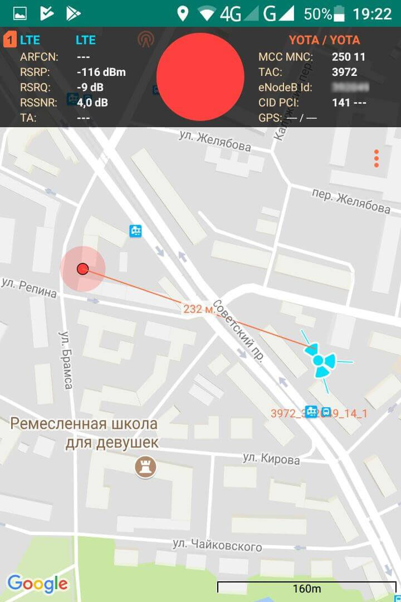
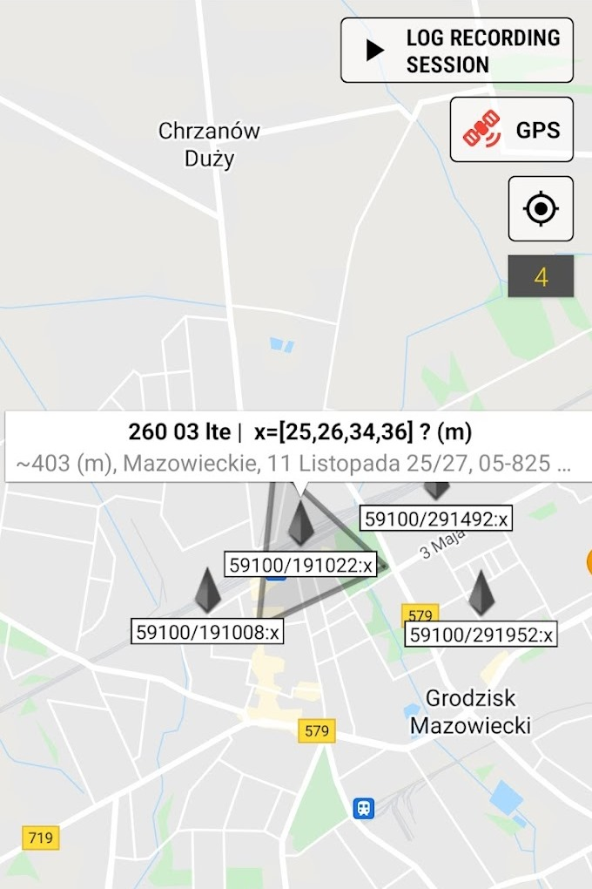
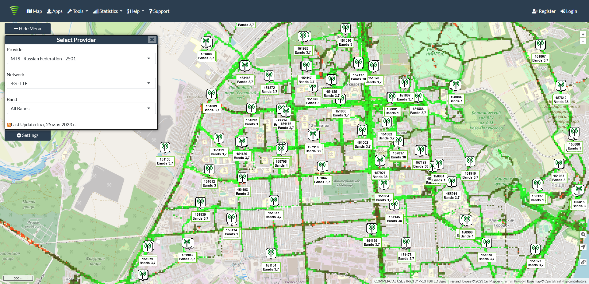
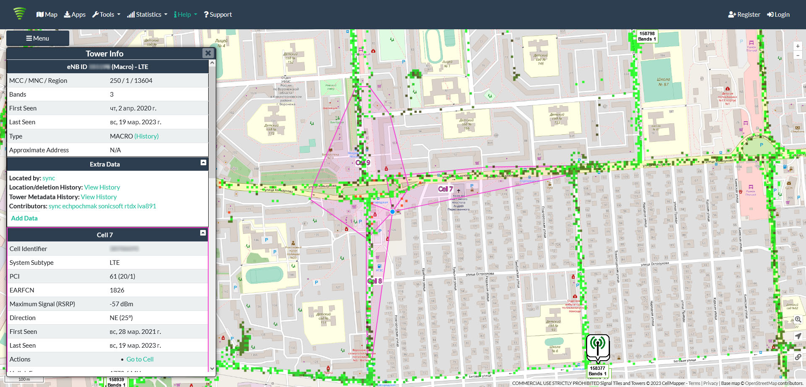
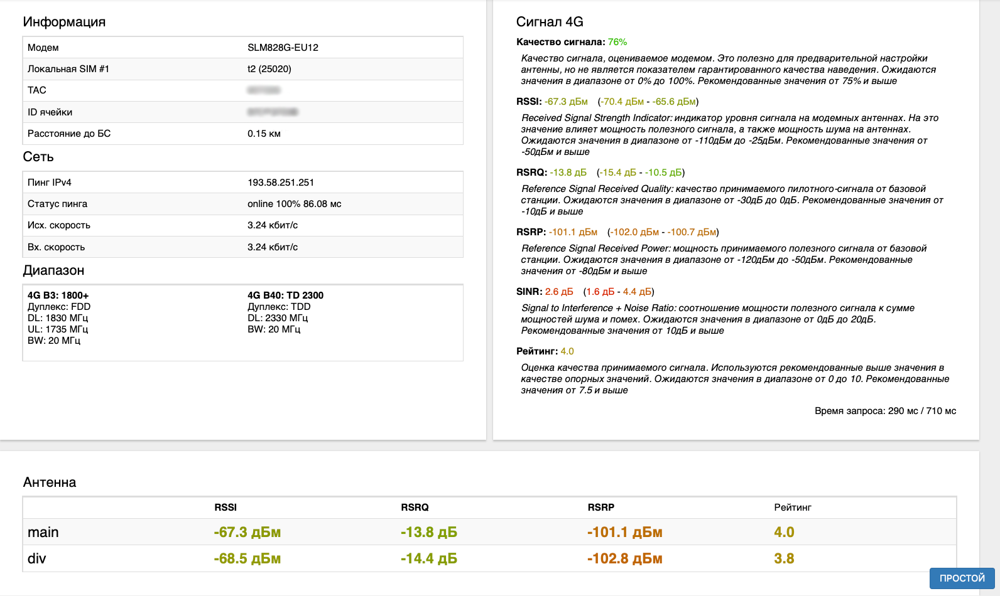
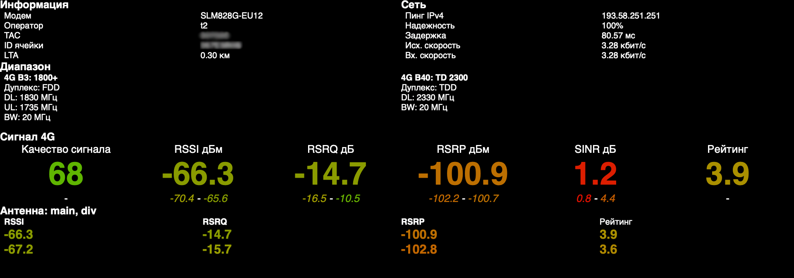

# Наведение антенны

Для стабильного подключения к сети интернет вашего роутера Крокс через модем необходимы внешние антенны. Они бывают двух видов:

* Всенаправленная антенна - предназначена для работы в местах с отличным покрытием сети (например в городе) в непосредственной близости от Базовой станции и обычно идёт в комплекте с настольными роутерами Крокс с модемом.  Отличительной особенностью является отсутствие необходимости наведение таких антенн на Базовую станцию, так как она одинаково принимает сигнал от неё со всех сторон
* Направленная антенна - Предназначена для работы в местах с недостаточным покрытием сети и в некотором удалении от Базовой станции. Такие антенны лучше всего принимают сигнал от Базовой станции когда направлены в её сторону

Более подробно об антеннах и принципах их работы рассказано в цикле [Как работают антенны простыми словами](/docs/antenny/kak-rabotayut-antenny-prostymi-slovami.md). В данной статье мы рассмотрим какими способами можно навести **Направленную антенну** на Базовую станцию и получить стабильное подключение к интернету. 

Для получения стабильного подключения необходимо выполнить следующие действия:

* Найти базовую станцию.
* Выбрать место установки антенны.
* Подключиться и проверить параметры сигнала.

## ***Поиск базовой станции***

Важно знать, что каждая базовая станция имеет свои характеристики, такие как частота, ширина канала, мощность и зона покрытия. Поэтому при её выборе не всегда стоит пользоваться случайной БС или ближайшей к вам. Экспериментируйте с наведением антенны на разные БС пока не добьётесь лучшего результата.

Для самостоятельного поиска БС можно воспользоваться двумя способами:

### ***Приложение для смартфона***

Примером может быть "Сотовые Вышки, Локатор", "Netmonitor: Cell & WiFi" и т.п. Приложения доступны для смартфонов с ОС Android на Google Play.

Приложения покажут местоположение БС, расстояние до неё, поддерживаемые частоты и пр.

  

### ***Специализированные сайты***

Мы реккомендуем несколько сайтов для поиска БС:

* [www.cellmapper.net](https://www.cellmapper.net) - международный проект по составлению и актуализации списка базовых станций по всему миру. В последнее время поддержка СНГ регионов не самая активная. Но, если вы живёте в дали от больших городов, то данные могут быть вполне актуальными
* [www.4cells.ru](https://www.4cells.ru) - Российский проект по составлению и актуализации списка базовых станций. В последнее время активно развивается и содержит самый актуальный список базовых станций. К сожалению, могут быть проблемы с отдалёнными городами и поселениями

Оба проекта существуют за счёт энтузиастов по всему миру, которые делятся данными об окружающих их Базовых станций. Поэтому, если ваы заметили неточность:, то можете оставить заявку на её исправление, поделившись с ними данными.

Ниже мы приведём алгоритм поиска Базовых станций на примере сайта [www.cellmapper.net](https://www.cellmapper.net)

После перехода на сайт вам предложат определить ваше местоположение автоматически - можете дать соответствующее разрешение браузеру. В выпадающих списках слева выберите провайдера, поколение сети и частоту (необязательно). При нажатии на БС будет показана подробная информация о неё в столбце слева и зона её покрытия на карте.  
  

Для обозначения частот часто используется термин "бэнд" (band).

Например:

| Обозначение | Частота |
|----|----|
| Band 1,  (B1) | 2100 МГц |
| Band 3,  (B3) | 1800 МГц |
| Band 7,  (B7) | 2600 МГц |
| Band 8,  (B8) | 900 МГц |
| Band 20,  (B20) | 800 МГц |
| Band 38,  (B38) | 2600 МГц |

Полную таблицу соответствия можете найти [здесь](/docs/repitery/standarty-i-diapazony-chastot-mobilnyh-operatorov.md).

Частота на выбранной вами БС должна соответствовать частоте вашей антенны. Например антенна [KAA15-1700/2700](https://kroks.ru/shop/antenny-gsm-3g-4g-wifi/shirokopolosnaia-3g4g-mimo-antenna-kaa15-17002700-usileniem-15-db/) будет работать с БС с частотами 1800 МГц, 2100 МГц, 2600 МГц. Учитывайте это как при выборе антенны, так и при выборе БС.

## ***Установка антенны***

Местом для крепления антенны может быть стена дома, труба, мачта и т.д. Важно закрепить антенну как можно выше и обеспечить прямую видимость БС. На пути от антенны до базовой станции не должно быть никаких высоких препятствий (здания, горы, холмы, лесопосадки и т.п.) мешающих распространению сигнала. Крупные объекты (высокие деревья, крыши домов) могут отражать радиоволны, ухудшая качество связи. Если у вас остался излишек кабеля, используйте его для поднятия антенны вверх над землёй.

Не устанавливайте антенну рядом с устройствами, которые могут повлиять на усиление антенны. Это могут быть металлические конструкции, генераторы, работающее промышленное и бытовое оборудование, прочие радиоизлучающие устройства.

Основные рекомендации по установке антенны также есть в её паспорте.

## ***Проверка качества сигнала***

Подключите кабелями антенну к роутеру, подключите питание роутера, вставьте сим-карту и подключитесь к роутеру через LAN разъем или Wi-Fi.

В браузере откройте страницу 192.168.1.1, вкладка Модем - Антенна. Если вы находитесь на открытой местности под лучами солнца - можете нажать в нижнем правом углу кнопку Простой для открытия упрощённгого интерфейса.  
  

Для оценки качества сигнала обратите внимание на следующие значения:

| Параметр | Описание |
|----|----|
| **RSSI** | Первый, но, пожалуй, наименее полезный параметр - показатель значения общей мощности сигнала, принимаемого антенной. RSSI учитывает как полезный, так и побочные сигналы, поэтому может использоваться только для для общей оценки входящего сигнала (включая помехи, тепловой шум и пр.). |
| **SNR** | Отношение полезного сигнала к шуму. Это более полезный параметр, плохое значение которого говорит о высоком уровне помех - посторонние излучающие устройства, металлические конструкции, повреждение кабелей, нарушение контакта в разъемах, переходниках, пигтейлах. |
| **RSRP** | Технология LTE использует опорные сигналы - сигналы, передаваемые всеми близлежащими сотовыми вышками, чтобы модем всегда мог подключиться к той, у которой лучший сигнал. Модем использует эти синалы для оценки состояния соединения с данной вышкой сотовой связи. RSRP - это измеренная мощность опорных сигналов LTE, получаемых модемом от БС. |
| **RSRQ** | Спецификация LTE также определяет второе значение - RSRQ - качество принятого опорного сигнала, как отношение мощности опорных сигналов к мощности помех. Соединение с высоким RSRQ должно быть хорошим, даже если RSRP низкий, т.к. модем способен извлекать информацию из слабого сигнала из-за минимального шума. Если значения RSRP двух вышек незначительно отличаются друг от друга, модем использует RSRQ в качестве основы для своего выбора. |

Из всего вышеперечисленного, можно сделать вывод, что для работы 4G наиболее приоритетным будет значение RSRQ, однако при настройке наведения антенны, необходимо стремиться, чтобы все параметры были не ниже удовлетворительного уровня.

Уровни сигналов приведены ниже в таблице.

| Параметр | Отлично | Хорошо | Удовлетворительно | Плохо |
|----|----|----|----|----|
| RSSI | > -65 дБм | -65 дБм... -75 дБм | -75 дБм... -85 дБм | -85 дБм... -95 дБм |
| RSRP | ≥ -80 дБм | -80 дБм... -90 дБм | -90 дБм... -100 дБм | ≤ -100 дБм |
| SNR | ≥ 20 дБ | 13 дБ... 20 дБ | 0 дБ... 13 дБ | ≤ 0 дБ |
| RSRQ | ≥ -10 дБ | -10 дБ... -15 дБ | -15 дБ... -20 дБ | ≤ -20 дБ |

## ***Ручное наведение антенны***

Если вам не удалось определить в какой стороне находится Базовая станция, то оптимальным вариантом будет вращать антенну на 1/8 круга и следить за изменениями параметров сигнала. Чем выше рейтинг - тем более точно вы наведены на Базовую станцию, к которой подключены. 
