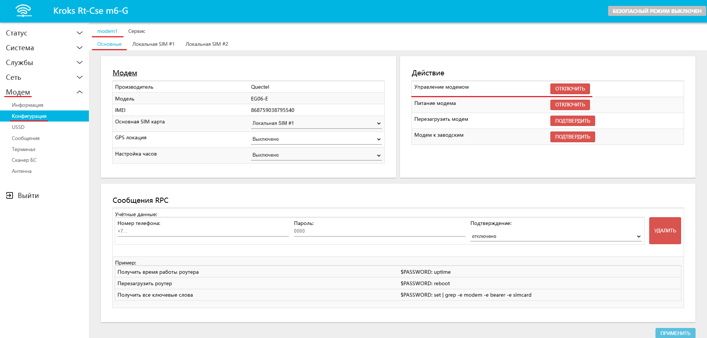
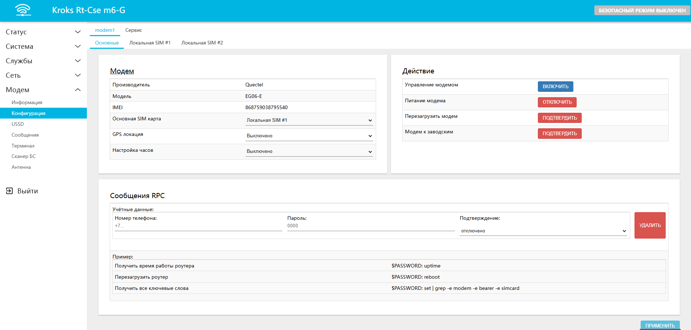

# Отключение авто перезагрузки модема

Обычно в случае исчезновения сигнала мобильного оператора модем в роутере начинает автоматически перезагружаться пока не восстановит соединение с сетью.  
Если по какой-либо причине вам нужно отключить эту функцию — например, чтобы обеспечить подключение к определённой базовой станции оператора, — вы можете сделать это через веб-интерфейс роутера.

Вам необходимо [войти](/docs/routery/chasto-zadavaemye-voprosy/vhod-v-web-interface.md) в веб-интерфейс вашего роутера и перейти на вкладку **Модем** -> **Конфигурация** -> **modem1** -> **Основные** (если в вашем роутере несколько встроеных модемов, то необходимо выбрать нужный вам вместо **modem1**).  
Здесь в разделе **Действие** вам необходимо отключить "Управление модемом".

После чего незабудьте нажать кнопку "ПРИМЕНИТЬ".

