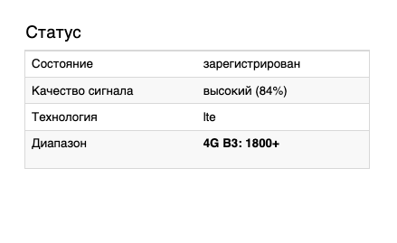
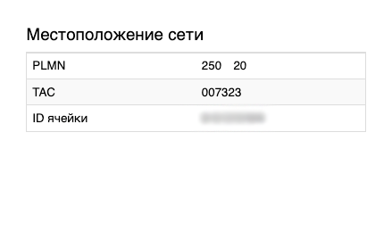

# Отключение неиспользуемых частот

В случаях нестабильной работы модема по причине постоянных переключений между БС с разными бендами в роутерах крокс предусмотрен механизм отключения отдельных частот или целых диапазонов.

::: warning
Корректная работа данной функции не гарантируется на всех модемах и всех операторах, так как не все модемы и опреаторы позволяют управлять настройками бендов. В некоторых случаях оператор принудительно подключит модем к заблокированной на модеме частоте.
:::

## ***Отключение неиспользуемых диапазонов***

В случае, если покрытие 4G сети не так стабильно, как 3G, но всё равно даёт большую скорость, а оператор принудительно переключает вас в режим 3G, можно воспользоваться функционалом отключения неиспользуемых диапазонов.

::: warning
Обратите внимание ,что через диапазоны 2G и 3G происходит регистрация в сети, приходят и отправляются СМС и голосовые звонки. При отключении этих диапазонов могут наблюдатс япроблемы с работой вышеупомянутых сервисов вплоть до полной их неработоспособности.
:::

В первую очередь в [настройках SIM-карты](/docs/routery/upravlenie-modemom/konfiguraciya-modema.md#sim-карта) необходимо включить PDN. Этот параметр используется для включения возможности регистрации в сети опреатора через 4G сеть.

После в [настройках радиомодуля](/docs/routery/upravlenie-modemom/konfiguraciya-modema.md#радио) снимите галочки со всех диапазонов кроме 4G. Нажмите кнопку Применить внизу страницы.

## ***Отключение неиспользуемых частот***

В случаях нестабильной работы модема по причине постоянных переключений между БС с разными бендами внутри, например, 4G сети, будет целесообразно определить какой бенд используется на вышке, которую мы хотим игнорировать, и отключить его. Либо наоборот, определив какой бенд используется на вышке, к которой мы хотим подключиться, и отключить другие бенды. Для этого в тех же [настройках радиомодуля](/docs/routery/upravlenie-modemom/konfiguraciya-modema.md#радио) снимите галочки с бендов, которые не нужно использовать. Нажмите кнопку Применить внизу страницы.

Увидеть какой на данный момент бенд используется можно на странице Модем - Информация.  
  
А уникальный идентификатор Базовой станции находится рядом, на карточке Местоположение сети.  

Для определения желательной/нежелательной вышки необходимо после подключения к каждой вышке снять параметры подключения, подробно описанные в статье [сканирование и фиксация БС](/docs/routery/upravlenie-modemom/skanirovanie-i-fiksaciya-bs.md) и выписать их себе напротив ID ячейки и используемого бенда. После подготовки такой таблицы можно определить оптимальный бенд для подключения к сети.
