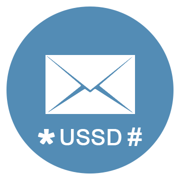
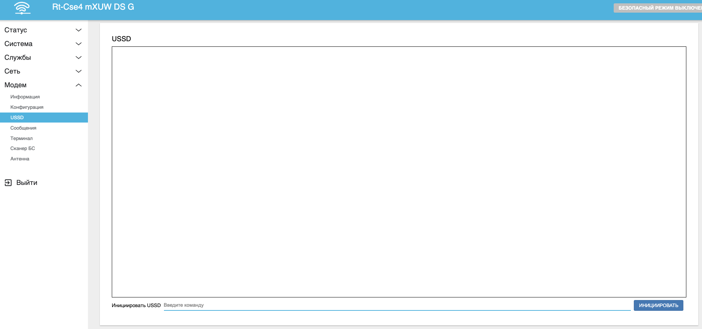
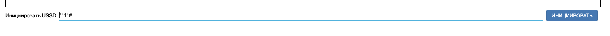
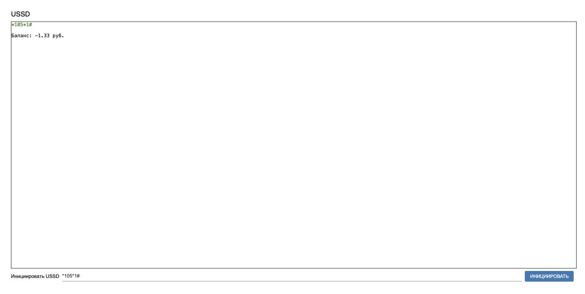
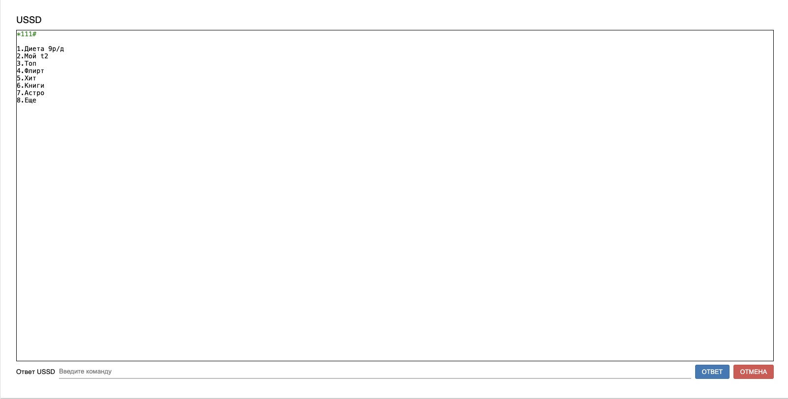
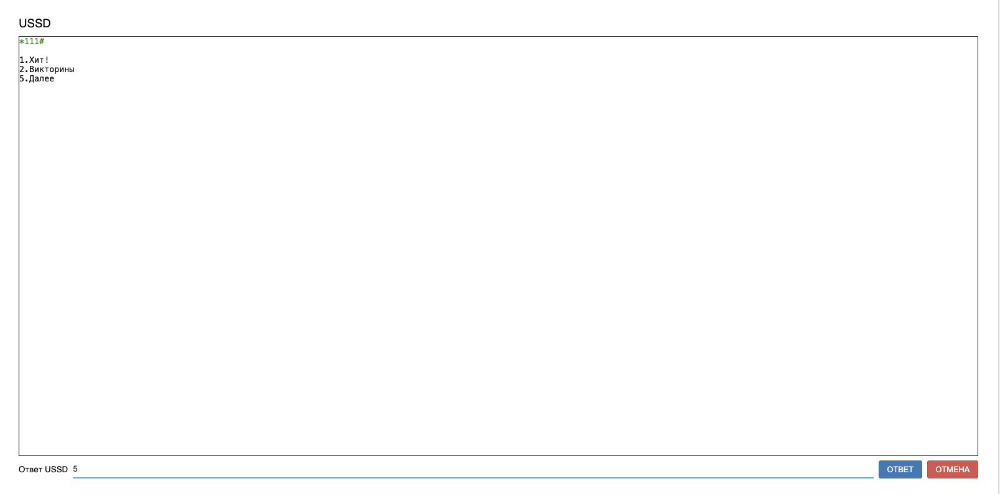

# Отправка USSD команд

Для перехода в интерфейс работы с USSD необходимо перейти на вкладку **Модем** - **USSD**. Перед вами откровется форма для отправки USSD команд.  
  
Введите необходимую команду в поле **Инициировать USSD** и нажмите **ИНИЦИИРОВАТЬ**.  
  
Через несколько секунд вы увидите результат выполнения команды.  
  
Если необходимо работать с ussd в интерактивном режиме - то после запроса ввода команды отправьте необходимый символ кнопкой Ответ. 
  

Чтобы прервать интерактивный режим - нажмите кнопку Отмена.
