# Отправка СМС с роутера

Для работы с СМС-сообщениями в роутерах Крокс перейдите на вкладку **Модем** - **Сообщения**.  
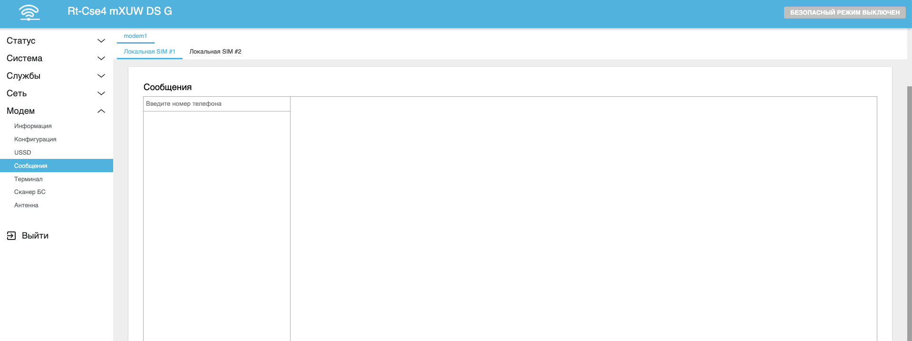

## ***Отправка сообщений***

Введите номер телефона в специальное поле и нажмите Enter.  
:::tip
Обратите внимание, номер вводится в формате **+7XXXXXXXXXX**.  
Если ввести номер в формате **8XXXXXXXXXX** - сообщение отправится, но ответ на него создаст новый чат.
:::  
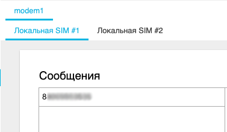  
Откроется чат с указанным номером.  
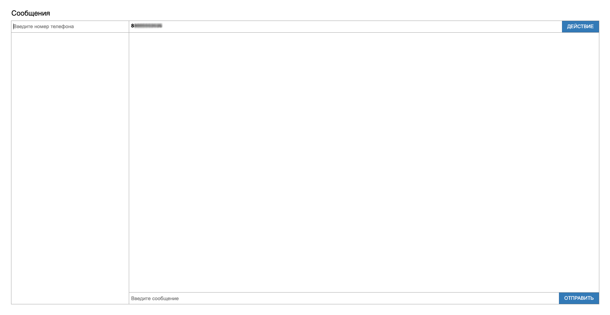  
Введите текст сообщения и нажмите **Отправить**.  
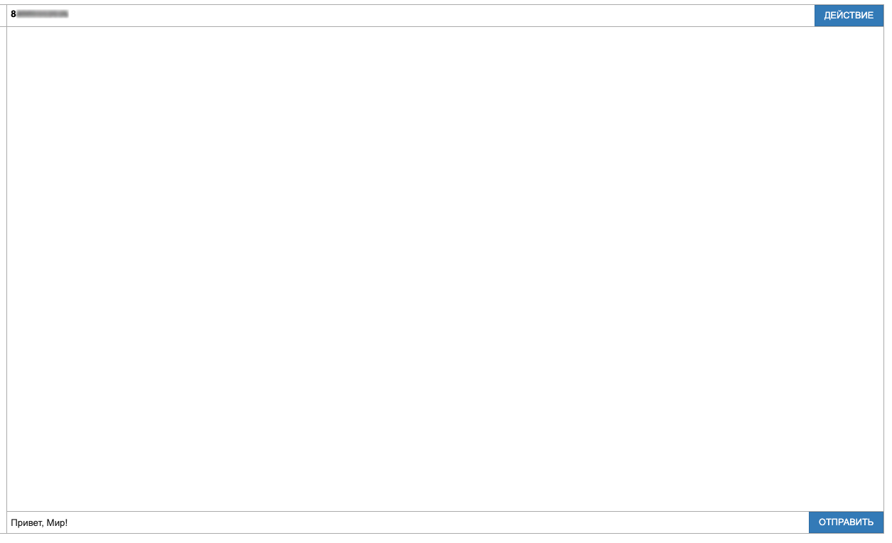  
После отправки сообщение покажется в истории чата, а так же чат закрепится в списке чатов.  
:::tip
Чаты, в которых нету ни одного сообщения, будут удалены из списка чатов после обновления страницы.
:::  
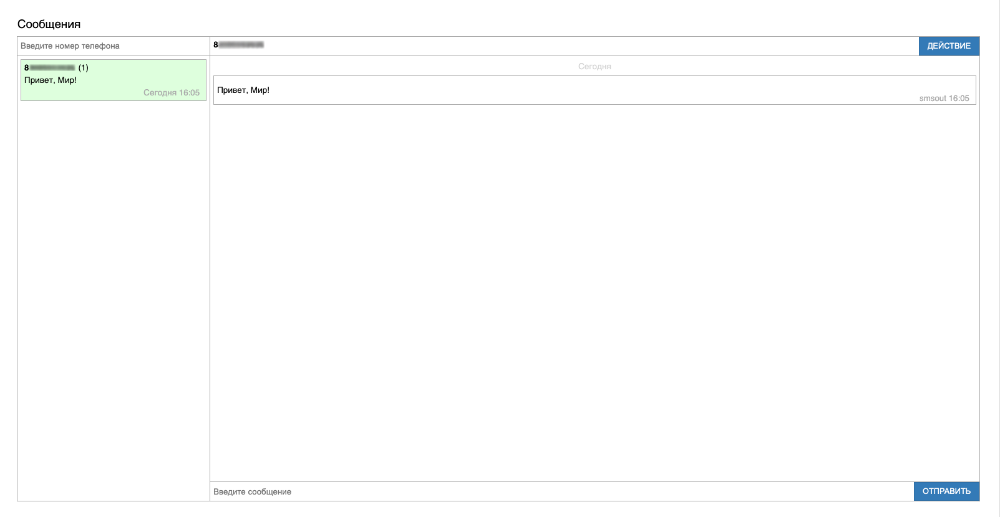

## ***Приём сообщений***

Входящие сообщения будут отображены в чате сразу же. Нет необходимости обновлять страницу в ожидании СМС.  
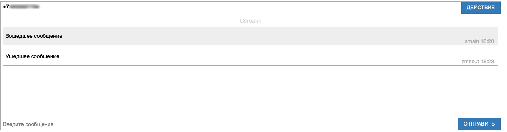

:::tip
Если сообщения не приходят или отображаются только после перезагрузки модема - попробуйте это [решение](/docs/routery/chasto-zadavaemye-voprosy/ne-prihodyat-ili-ne-otpravlyayutsya-sms.md) или обратитесь в техническую поддержку.
:::

## ***Список чатов***

Рассмотрим список чатов подробнее:

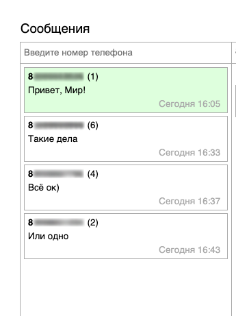

* Номер телефона - отображается в верхнем левом углу контакта
* Счётчик сообщений - отображается сразу после номера телефона в скобках
* Последнее сообщение - отображается в центре контакта
* Дата последнего сообщения - отображается в нижнем правом углу контакта
* Выбранный чат - отмечен зелёным цветом

По нажатию на контакт откроется чат с указанным номером.

## ***Действия с чатом***

В интерфейсен работы с сообщениями в роутерах Крокс можно выполнять следующие действия:

* Удалить выделенные сообщения
* Удалить чат

### ***Удаление сообщений***

Для того чтобы удалить одно или несколько сообщений:

* Выделите нужные сообщения левой кнопкой мыши. счётчик выделенных сообщений отображается в верхнем левом углу чата рядом с номером
* Нажмите на кнопку **Действие** в верхнем правом углу чата
* Выберите **Удалить выбранное**
* Подтвердите действие нажатием кнопки **ОК**

После этого сообщение исчезнут из чата и из памяти роутера.

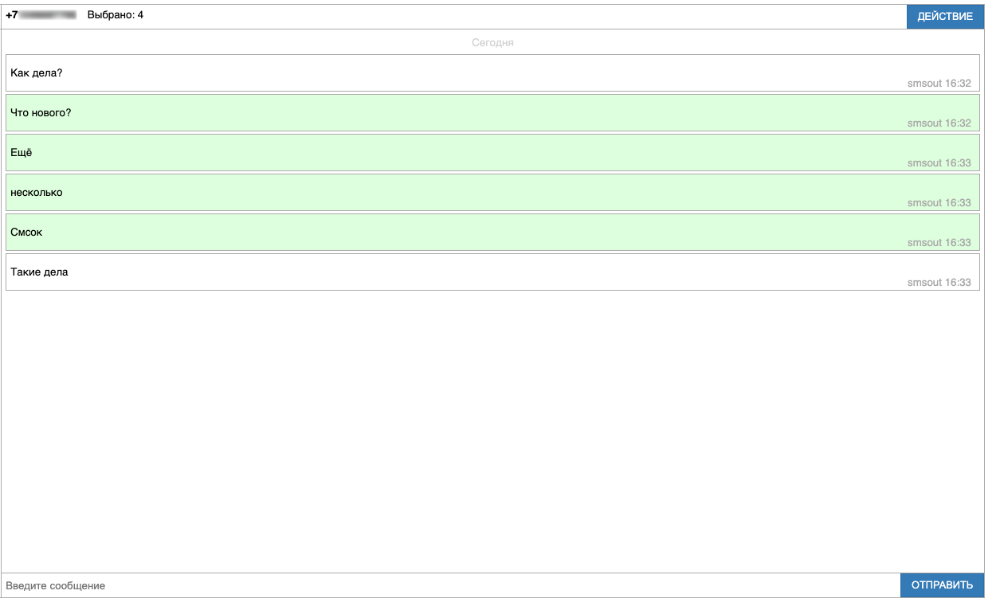  
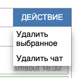  
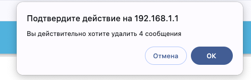  
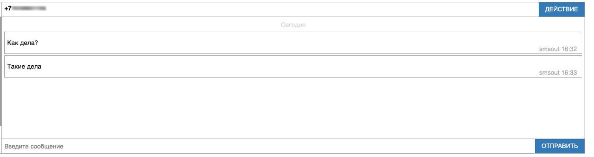

### ***Удаление чата***

Для того чтобы удалить чат:

* Выделите нужный чат левой кнопкой мыши
* Нажмите на кнопку **Действие** в верхнем правом углу чата
* Выберите **Удалить чат**

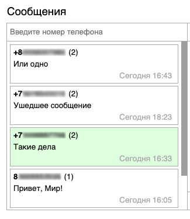  
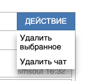  
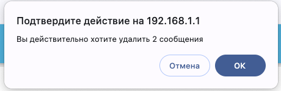

После этого чат исчезнет из списка чатов и из памяти роутера.
