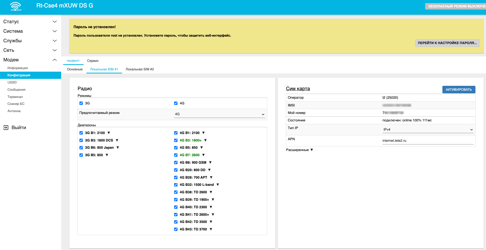

# Переключение сим карты

## ***Введение***

Если у вас есть несколько сим-карт в роутере, возможно, появится необходимость переключаться между ними. Например, вечером, при большой загрузке сети один оператор даёт большую скорость чем другой, а днём, когда сеть не так нагружена, ситуация обратная. Конечно, вы можете настроить автоматическое переключение сим-карт по этой [статье](/docs/routery/upravlenie-modemom/avtomaticheskoe-pereklyuchenie-sim-karty.md), но, например, для анализа происходящих событий, вам может понадобиться возможность переключить сим-карту вручную.

В роутерах Крокс эта функция реализована очень просто!

## ***Переключение сим карты***

Войдите в пункт Модем - Конфигурация. Выберите сим-карту, которую хотите использовать, сверху. Например, **Локальная SIM #1**. В карточке Сим-карта можно обнаружить кнопку АКТИВИРОВАТЬ. Нажмите на неё, это запустит переключение Сим-карты.

:::tip
Так же эта функция может потребоваться при ошибках в работе модема. С помощью этой функции можно перезагрузить уже использующуюся сим-карту.
:::