# Работа с терминалом

## ***Введение***

Для упрощения некоторых операций с модемом и роутером мы добавили терминал.

Терминал - это программа которая способна исполнять введённые пользователем команды. В нашем случае это не голый linux-терминал, а отдельное окружение, позволяющее вызывать специфические команды в упрощённом режиме. Также имеется возможность писать собственные команды и вызывать их из терминала. Подробнее об этом рассказано в статье [Добавление собственных Shell-шаблонов](/docs/routery/upravlenie-modemom/dobavlenie-sobstvennyh-Shell-shablonov.md)

::: warning
Перед вводом команды убедитесь, что вы понимаете, что вы вводите и что произойдёт после её исполнения. Любые действия совершайте только на свой страх и риск.
:::

::: info
Обратите внимание, что команды, которые захватывают поток вывода на продолжительное время, например

``` bash
logread -f
```

Не будут исполнены корректно и, скорее всего, заблокируют ввод новых команд на 1-2 минуты.
:::

## ***Интерфейс терминала***

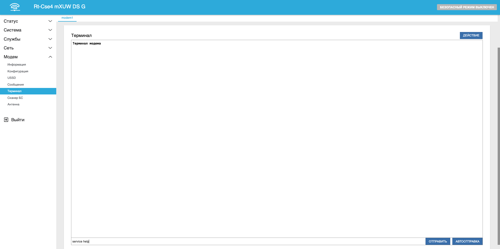

Интерфейс терминала доступен на вкладке Модем - Терминал. В центре страницы расположено поле выводе терминала - здесь будут отображаться результаты введённых вами команд.  
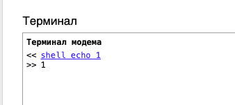  
Снизу расположена строка ввода команд, а также управляющие кнопки:

* Отправить - немедленно отправляет введённую команду на роутер
* Автоотправка - Автоматически отправляет введённую команду до нажатия кнопки Отмена либо до ошибки исполнения, после чего терминал переходит в обычный режим

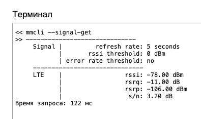

Также присутствует возможность выделять команды в окне терминала левой кнопкой мыши и они сразу же подставятся в поле ввода команд. Также доступна навигация стрелками Вверх и Вниз на клавиатуре.  
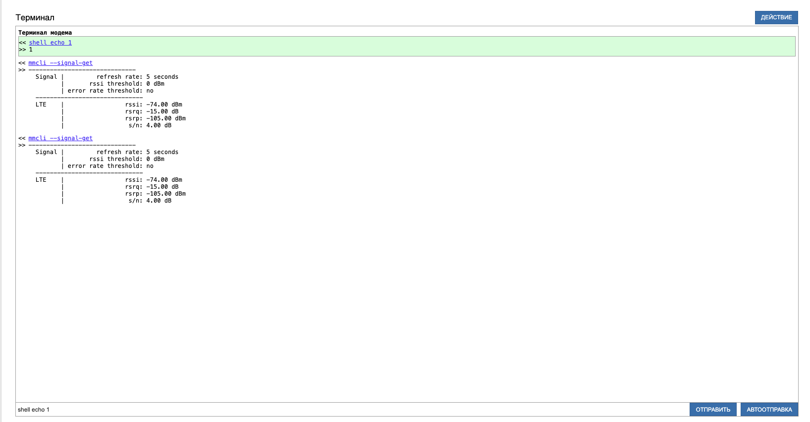

В верхнем правом углу расположена кнопка Действие:  
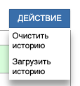

* Очистить историю - Удаляет историю отправленных команд и очищает поле вывода терминала
* Загрузить историю - Скачивает на ваш компьютер историю отправленных команд и результаты их исполнения. С помощью этой функции очень удобно делиться результатами с техподдержкой, например

## ***AT-команды***

С помощью данного терминала можно напрямую в модем отправлять АТ-команды. Например, чтобы быстро получить инофрмаци о модеме, введите:

``` bash
ATI
```

В ответ вы получите основную информацию о модеме:  
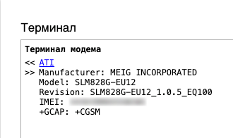

Как пример, в статье [Блокирование входящих вызовов](/docs/routery/upravlenie-modemom/blokirovanie-vhodyashchih-vyzovov.md) расположены подряд 3 АТ-команды. Вместо подключения к роутеру по ssh и ввод команд через mmcli можно ввести их сразу в терминал.

## ***Mmcli***

Mmcli - это подпрограмма linux, позваляющая управлять модемом и получать о нём информацию на низком уровне. Например, для того чтобы получить список сообщений через mmcli, необходимо ввести команду

``` bash
mmcli --messaging-list-sms
```

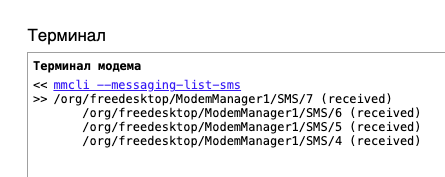

::: info
Обратите внимание, что при вводе mmcli-команд не нужно вводить ключ --modem=modem1, терминал делает это самостоятельно
:::

Прочитаем какую-нибудь смс командой

``` bash
mmcli --sms 4
```

В результате получим:  
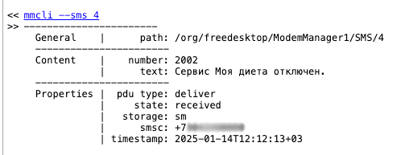

Более полный список всех возможных команд можно получить введя команду

``` bash
mmcli --help-all
```

::: info
Если ваш модем поддерживает qmi - можно использовать qmicli вместо mmcli
:::

## ***Service***

Данная команда позволяет исполнять код в окружении сервиса модема. С её помощью можно вызывать команды из списка.

``` bash
service help
```

Например:  
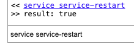

## ***Shell***

Для вызова обычных команд и отладки Shell-шаблонов можно использовать shell. Например, выведем папки из корневой директории командой

``` bash
shell ls /
```

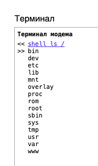

А этой командой вызовем скрипт из Shell-шаблона

``` bash
shell modem_get_signal
```

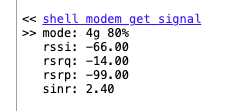
