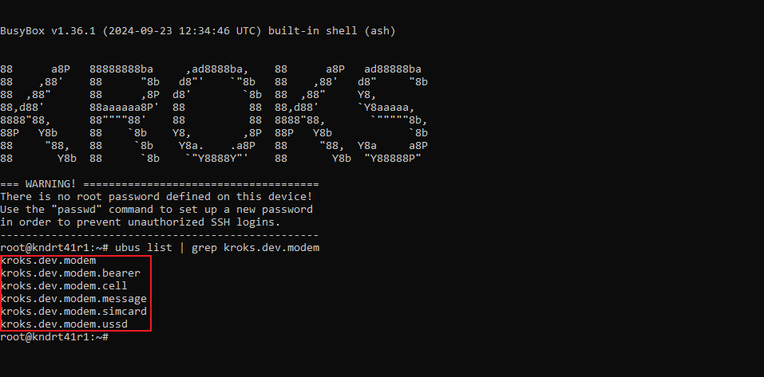
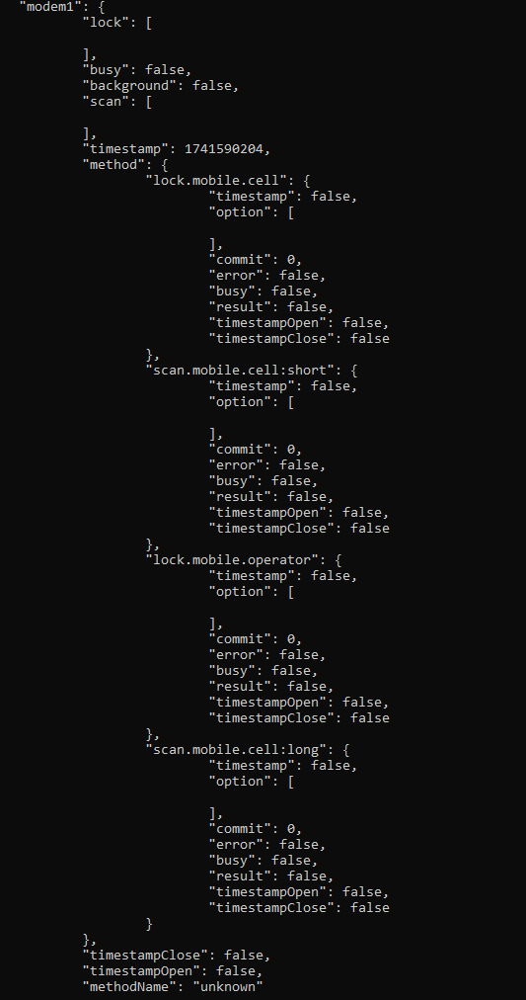
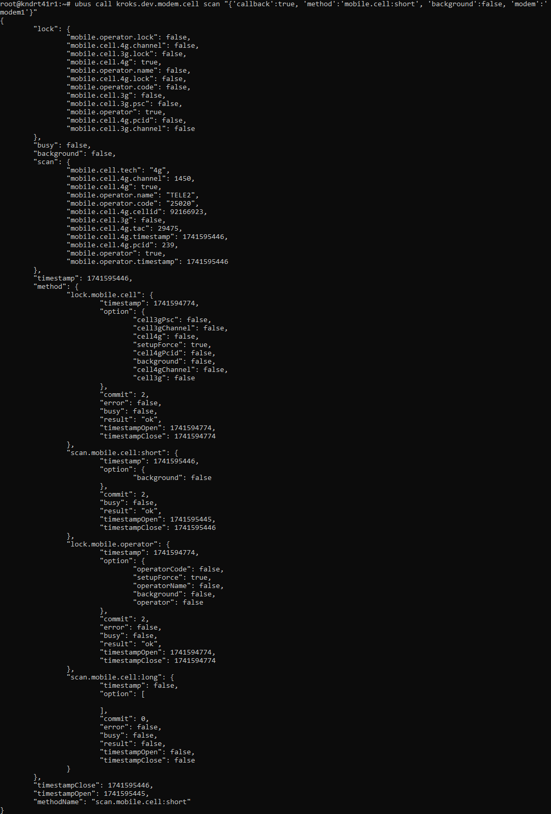
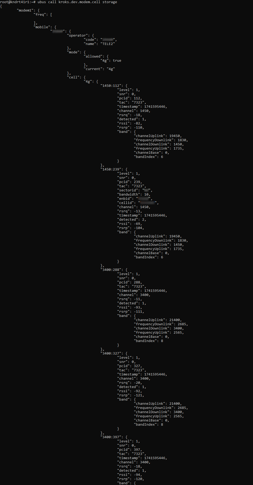

# Работа сканера БС с API

## ***Общая информация***

Всё взаимодействие с API осуществляется через UBUS шину. Для тестов вы можете вызывать её через ssh или http ubus rpc запросы.  
Для более верного взаимодействия рекомендуем **ubus socket (unix socket)** с их сопутствующей библиотекой.

В последующем далее пример мы будем использовать [ssh сессию к роутеру](/docs/routery/chasto-zadavaemye-voprosy/podklyuchenie-po-ssh.md) + запуск из под ssh приложения ubus (CLI клиент).

Для получения списка всех команд + их сигнатуры (официальные) используйте команду:

``ubus list | grep kroks.dev.modem``

В ответе будут общие методы + специализированные (bearer, cell, message, simcard, ussd).

Нам важны методы находящиеся по пути **kroks.dev.modem.cell**.  
Здесь находится вся информация связаная с сканером БС.  
Вызов метода status по пути **kroks.dev.modem.cell** происходит командой:

``ubus call kroks.dev.modem.cell status``

Теперь вы можете наблюдать информацию о состоянии системы по модемам.

На экране отображается несколько секций:  
**"lock":** — все что связанно с фиксацией БС. Если ключ поля начинается с точки *".mobile.operator.lock"* - значение в процессе вычисления;  
**"scan":** — в общем виде зеркально lock. Только все что связано с сканированием БС;  
**"timestamp":** — unix timestamp последней обработки;  
**"method":** — доступные методы сканирования и фиксации, а также их состояния (подробнее о них поговорим позже);  
**"timestampOpen":** — время начала работы движка ячейки в последний раз. Если **false** — сканирование не вызывалось;  
**"timestampClose":** — время окончания работы движка ячейки. Если **false** — сканирование не вызывалось или в процессе (зависит от значения **timestampOpen**);  
**"methodName":** — последний / активный метод движка ячейки.

## ***Методы сканирования***

Есть несколько методов сканирования, их особенности описаны ниже:  
* **mobile.cell:short** — быстрое сканирование. В этом случае производится опрос ячеек активного оператора. Поддерживается большинством модемов роутеров Kroks;  
* **mobile.cell:long** — долгое сканирование. Такой медот наоборот производит опрос ячеек всех операторов, но поддерживается не всеми модемами;  
* Фиксация - есть два варианта использования фиксации. **Mobile.cell** — фиксация на конкретной базовой станции и **mobile.operator** — фиксация на конкретном операторе связи.

Кроме метода сканирования, для составление команды вам понадобится указать также несколько других параметров:  
* **callback** — отвечает за возвращение результата сканирования. Имет два возможных значения **true** и **false**, соответсвенно **да** и **нет**;  
* **background** — если этот параметр активен, то сканирование будет происходить в фоновом режиме и результат на экране не появится. Также имет два возможных значения **true** и **false**, соответсвенно **да** и **нет**;  
* **modem** — в случае если в вашем устройстве имется несколько встроенных модемов, здесь вы можете выбрать для сканирования конкретный.

Подводя итог перечисленным выше параметрам, у нас получается следующая команда:

``ubus call kroks.dev.modem.cell scan "{'callback':true, 'method':'mobile.cell:short', 'background':false, 'modem':'modem1'}"``

В результате мы получим результаты быстрого сканирования для первого модема.

Секции в рамках метода:  
**"option":** — опции запуска метода. Важно лишь для фиксации. Для сканирования почти не нужно;  
**"commit":** — количество циклов вызова движка;  
**"result":** — флаг успеха + сообщение. Пока не используется;  
**"error":** — ошибки;  
**"busy":** — активен ли в данный момент метод или нет;  
**"timestamp", "timestampOpen", "timestampClose"** — по аналогии с описанием выше. Но только в рамках метода.

:::info
Если вы захотите использовать долгое сканирование, обратите внимание, что долгое сканирование остановит сеть на модеме до конца сканирования. Прервать это нельзя.
:::

## ***Результаты сканирования***

Для того чтобы вывести результаты сканирования есть следующая команда, но помните что эта команда отображает все результаты сканирований:

``ubus call kroks.dev.modem.cell storage``

Структура разделена на модемы.  
Внутри каждого модема структура **mobile** (то что нужно нам) и **freq** (анализатор спектра).  
Внутри **mobile** перечислены коды оператора и структура каждого оператора.

Описание структуры: 
* **operator** - код и имя оператора;  
* **mode** - поддерживаемые и активные режимы;  
* **cell** - ячейки 3g, 4g режима.
