# Сканирование и фиксация БС

## ***Введение***

Иногда бывают ситуации, когда при, казалось бы, хорошем уровне сигнала, интернет работает не так хорошо как хотелось бы. Причиной этому могут служить различные факторы, влияющие прямым или косвенным образом на качество работы мобильной сети. Неполный список таких факторов представлен ниже:

* **Релейное подключение** - тип подключения к Базовой Станции не на прямую, а через ретрансляторы сигнала сотовой сети. При этом наблюдаются высокие показатели сигнала, в том числе показатель качества сигнала, но низкая скорость интерента и высокая задержка.
* **Подключение к перегруженной Базовой Станции** - подключение происходит напрямую к Базовой станции, но качество сигнала проседает в следствии высокой нагрузки на Базовую Станцию. Преимущественно проблемы наблюдаются в вечерние часы (18:00 - 23:00). При этом можно наблюдать плохие или преимущественно плохие показатели качества сигнала, а также низкую скорость интернета и высокую задержку.
* **Переотражение сигнала** - эффект многолучевого распространения, который приводит к ослаблению сигнала, повышению уровня шума и искажению сигнала, которые приводят к ошибкам. При этом можно наблюдать низкое качество сигнала и низкую скорость интернета. Отличительной особенностью является то, что подобные проявления помех наблюдаются при подключении к близко расположенной Базовой Станции.
* **Переусиление** - эффект, вызванный слишком высоким уровнем сигнала от Базовой Станции. Сопровождается отличными параметрами силы сигнала но низким уровнем качества сигнала. Также наблюдается низкая скорость инетрента и высокие задержки.

Ниже мы привели несколько пунктов на которые стоит опираться при диагностировании проблем с подключением к мобильной сети:

* Снижение скорости инетрента в вечернее время
* "Плавающий" график скорости с явными провалами и пиками
* Большой разброс параметра SINR (более чем на 5-7 единиц)
* Низкий SINR при высоком уровне RSSI
* Небольшая скорость интернета при отличных уровнях RSSI и SINR
* Частые переподключения модема к разным БС

::: info
Подробнее про показатели сигнала можно узнать в статье [Наведение антенны](/docs/routery/upravlenie-modemom/navedenie-antenny.md)
:::

В таких случаях может помочь подключение к другой Базовой Станции. Для этого в роутерах Крокс с модемом предусмотрен механизм сканирования и фиксации БС.

## ***Сканирование БС***

Интерфейс сканирования БС доступен на вкладке Модем - Сканер БС.

::: info
Обратите внимание, что санирование БС происходит через активную симкарту в независимости от того, какая симкарта выбрана в карточке Управление фиксацией.
:::

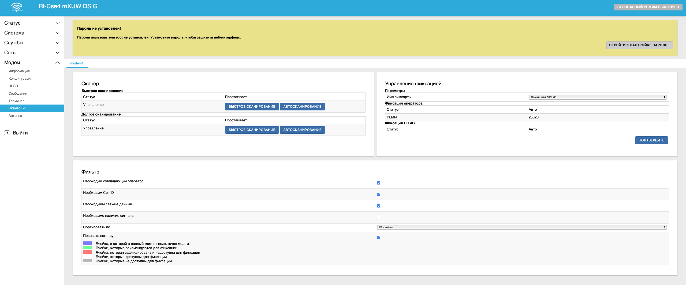

### ***Сканер***

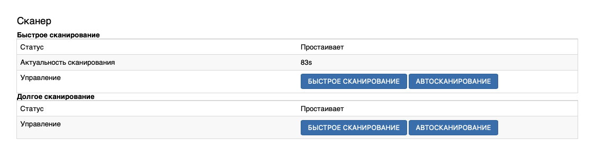

Карточка Сканер отвечает за управление процессом сканирования БС. Роутеры фирмы Крокс с модемом предлагают 2 вида сканирования - Быстрое и Долгое.

#### ***Быстрое сканирование***

Быстрое сканирование опрашивает вышку, к которой вы подключены в данный момент, о соседних БС этого же оператора. Сканирование занимает буквально пару секунд и не разрывает интернет-соединение. Данный режим доступен на всех актуальных роутерах Крокс с модемом.

Поля отображения при **Одиночном сканировании**:


* **Статус** [Простаивает/Быстрое сканирование/Автосканирование] - Статус быстрого сканирования
* **Актуальность сканирования** - время, прошедшее после последнего сканирования
* **Управление** - кнопки, запускающие однократное сканирование или Автосканирование

Поля отображения при **Автосканировании**

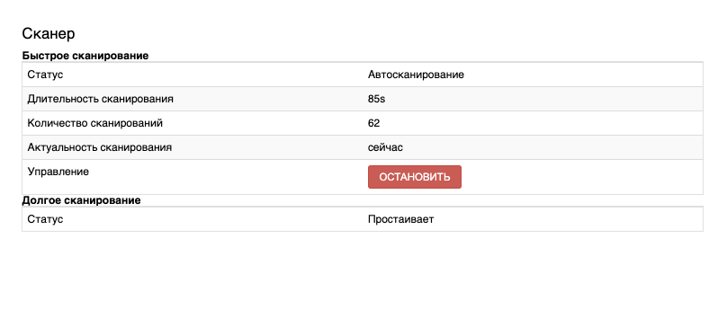

* **Статус** [Простаивает/Быстрое сканирование/Автосканирование] - Статус быстрого сканирования
* **Длительность сканирования** - время с начала автоматического сканирования
* **Количество сканирования** - количество сканирований прошедших с начала автоматического сканирования
* **Актуальность сканирования** - время прошщедшее после последнего сканирования
* **Управление** - остановка Автосканирования

#### ***Долгое сканирование***

::: warning
Особенности **Долгого сканирования**:

* Обратите внимание, процесс долгого сканирования разрывает подключение к сети.
* Обратите внимание, процесс долгого сканирования прервать нельзя.
* Обратите внимание, далеко не все модемы поддерживают данный вид сканирования. Перед покупкой лучше обратитесь к производителю за уточнением этого момента.
:::

Долгое сканирование подразумевает опрос вышек всех операторов на всех частотах. Отличается также временем, занимающим сканирование. На каждое сканирование может уходить от 10 секунд до 10 минут, в зависимости от модема.

Поля отображения аналогичны **Быстрому сканированию**.

### ***Управление фиксацией***

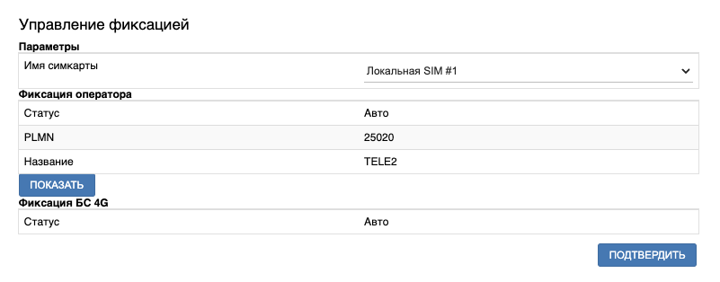

В данной карточке находятся управляющие элементы для фиксации БС.

Поля **Управления фиксацией**:

* **Имя симкарты** - симкарта для которой идёт фиксация БС. Если у вас 2 симкарты одного оператора, то через этот параметр можно зафиксировать обе симкарты без необходимости переключаться между ними для повтороного сканирования
* **Статус** - статус фиксации отображает текущее значение фиксации оператора. Подробнее этот параметр рассмотрим при фиксации оператора
* **PLMN** - код оператора к БС которого на данный момент выполнено подключение
* **Название** - Имя оператора к БС которого на данный момент выполнено подключение
* **Кнопка ПОКАЗАТЬ** - отображает БС к которой выполнено подключение в результатах сканирования
* **Статус** - отображает текущее значение фиксации БС. Подробнее этот параметр рассмотрим при фиксации БС
* **Кнопка ПОДТВЕРДИТЬ** - применение изменений

### ***Фильтр***

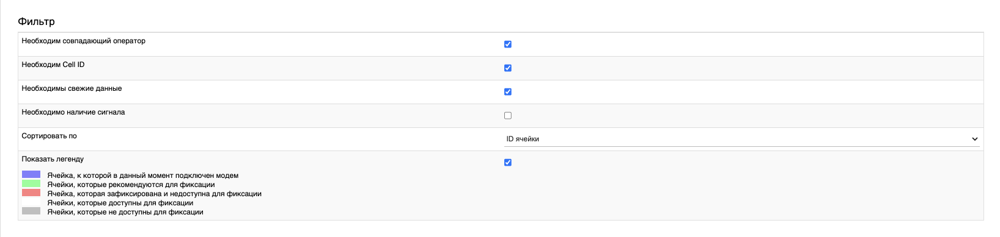

Карточка фильтр позволяет управлять отображением результатов сканирования БС для более удобного анализа. Позволяет отсечь лишние результаты и проще принять решение о фиксации необходимой БС.

* **Необходим совпадающий оператор** - выключает отображение вышек других операторов
* **Необходим Cell ID** - выключает отображение вышек, для которых не получилось определить Cell ID
* **Необходимы свежие данные** - выключает отображение БС которых нет в эфире долгое время
* **Необходимо наличие сигнала** - выключает отображение БС у которых не удалось определить параметры сигнала
* **Сортировать по [ID ячейки/ PSC/PCID / Канал / Частота DL / RSSI / Был обнаружен]** - сортировка результатов сканирования по разным параметрам
* **Показать легенду** - выключает цветовую индикацию доступности и статуса вышек

Цветовая индикация:

* **Ячейка, к которой в данный момент подключен модем** - БС, к которой вы подключаетесь по умолчанию. Также через неё идёт опрос соседних вышек при быстром сканировании. В случае использования фиксации БС этим цветом должна быть отмечана зафиксированная ячейка - это будет означать что фиксация прошла успешно. В противном случае в поле Ошибка карточки Управление фиксацией будет информация о том что именно пошло не так. Успешная фиксация практически гарантируется
* **Ячейки, которые рекомендуются для фиксации** - ячейки для которых удалось определить их Cell ID и уровень сигнала, а также долгое время присутствуют в сети
* **Ячейка, которая зафиксирована и недоступна для фиксации** - в случае провала фиксации данным цветом будет выделена ячейка, к которой по каким-то причинам не удалось выполнить фиксацию
* **Ячейки, которые доступны для фиксации** - гипотетически доступные для фиксации ячейки. Отличаются от реккомендованых к фиксации отсутствием Cell ID и, возможно, нестабильным присутствием в сети. Успешная фиксация таких ячеек не гарантируется
* **Ячейки, которые недоступны для фиксации** - не удалось вычитать Cell ID и параметры сигнала, а также не появлялись в сети более 5 минут

### ***Результаты сканирования***

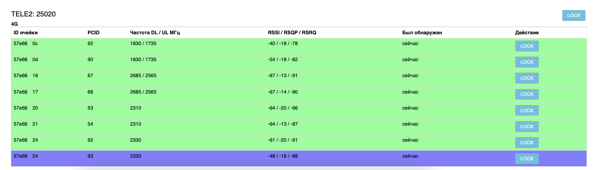

В левом верхнем углу указаны имя оператора и PLMN, чьи вышки отображаются в карточке. В правом верхнем углу расположена кнопка фиксации оператора. Под ними - технология, которую поддерживают БС в таблице ниже. Далее представлен список БС которые были обнаружены модемом во время сканирования. Справа на БС, которые можно зафиксировать, находится кнопка LOCK. Она позволяет выбрать базовую станцию для фиксации.

## ***Фиксация БС***

Для начала стоит определиться с измеряемыми величинами, от которых мы будем отталкиваться при выборе БС.

* SINR/RSRP/RSRQ/Рейтинг - физические параметры сигнала. Сообщают о том насколько уверенно модем установил связь с базовой станцией. Параметр Рейтинг является общей оценкой первых трёх и ориентироваться в первую очередь стоит именно на него
* Задержка при пинг - время, потраченное на прохождение сетевых пакетов от конечного устройства, такого как компьютер, ноутбук или телефон, до запрашиваемого сервера и обратно. Этот параметр важен при VoIP-звонках и онлайн-играх но не критичен при просмотре контента
* Скорость интернет-соединения - максимально возможная скорость скачивания и отправки информации до сервера в интернете. Не может превышать максимальную скорость модема или Ethernet-канала. В случае использования модема 6 категории и выше на роутере с 100МБит портами даже при идеальном качестве соединения скорость не сможет превысить ограничения роутера.

В общем случае алгоритм выбора и фиксации оптимальной БС таков:

### ***Шаг первый***

На этом шаге мы должны создать себе основу для последующего сравнения. Также на этом шаге можно диагностировать некоторые проблемы и решить их даже не прибегая к фиксации БС. Например, при переусилении сигнала с направленной антенной достаточно лишь отвернуть её немного в сторону от вышки, к которой подключен ваш модем.

* Сканируем БС **Быстрым сканированием**, определяем текущую БС, к котороый подключен модем, выписываем её ID ячейки а также PCID
* Можно зайти на сайт [cellmapper](https://www.cellmapper.net/) или [4cells](https://4cells.ru/) и убедится, что антенна наведена точно на БС при использовании направленных антенн (неактуально при использовании штырьевых антенн)
* После этого зайти на вкладку Модем - Антенна и выписать себе показатели сигнала [Рейтинг/SINR/RSRQ/RSRP/RSSI] для простоты дальнейшего сравнения с другими БС
* Далее заходим в браузер и открываем ваш любимый измиритель скорости и проводим 2-3 измерения. Мы реккомендуем использовать [Яндекс интернетометр](https://yandex.ru/internet) или [speedtest](https://www.speedtest.net/). Важно пользоваться во всех замерах одним и тем же сайтом и проверять одним и тем же сервером. Средние данные задержки, скорости загрузки и скорости выгрузки также выписываем отдельно
* На этом этапе можно диагностировать некоторые проблемы, что могут быть у вас. Например - у вас отличные показатели сигнала но довольно маленькая скорость интернет-соединения и большая задержка - скорее всего ваш модем подключен к БС **Релейным способом**. Или, например, у вас небольшая скорость интернет-соединения, плохие показатели SINR/RSRQ но довольно высокий показатель RSSI - скорее всего вы столкнулись с таким явлением как **Переусиление сигнала**

После первого шага у нас должно получиться примерно следующее:

```bash
57e66 24 93 4.1 3.0/-99/-10/-62 86/41/6
```

Теперь мы готовы приступить к шагу 2

### ***Шаг второй***

Вторым шагом мы должны найти базовые станции того же оператора через которого в данный момент происходит подключение. Для этого воспользуемся **Быстрым сканированием**. Мы реккомендуем включить **Автосканирование** и оставить его на 3-5 минут. После этого нужно включить отображение БС без Cell ID (он же ID ячейки). После этого мы получим список БС которые можно рассмотреть для фиксации.

### ***Шаг третий***

Можно открыть карту расположения БС и отыскать БС, к которой подключен ваш модем. Возможно, на этой БС есть сектор, который вам подойдёт больше. Например, как мы выяснили ранее, в данный момент мы подключены к БС с ID ячейки равным 57e66 24 и PCID равным 93. Для поиска необходимо перевести ID ячейки в десятеричные числа. Получится 360038 и 36. Зайдём на сайт [cellmapper](https://www.cellmapper.net/). На вкладке Provider выберете вашего опреатора и нужную технологию.  
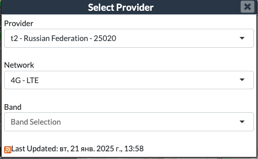  
После этого на вкладке поиск введите вычисленное выше число 360038 и нажмите Enter.  
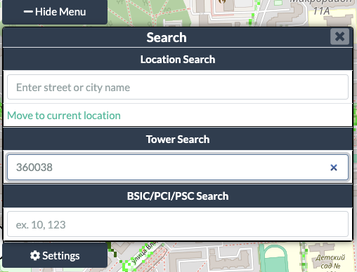  
Из предложенного списка выберите вашу БС и нажмите ОК. Скорее всего, она там будет одна.
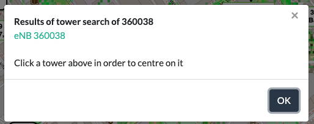  
После выберите её на карте левой кнопкой мыши, откроется расширенная информация о вышке.  
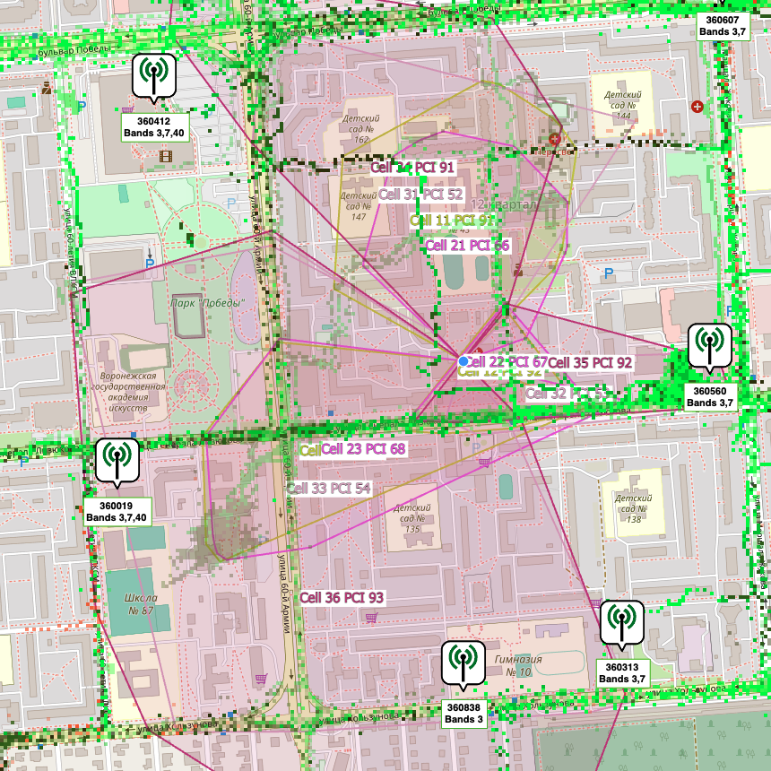  
Выше мы уже выяснили, что у нас подключение к сектору 36 и PCID у нас 93. На карте данный сектор также присутствует. Можно найти его визуально или в списке слева.  
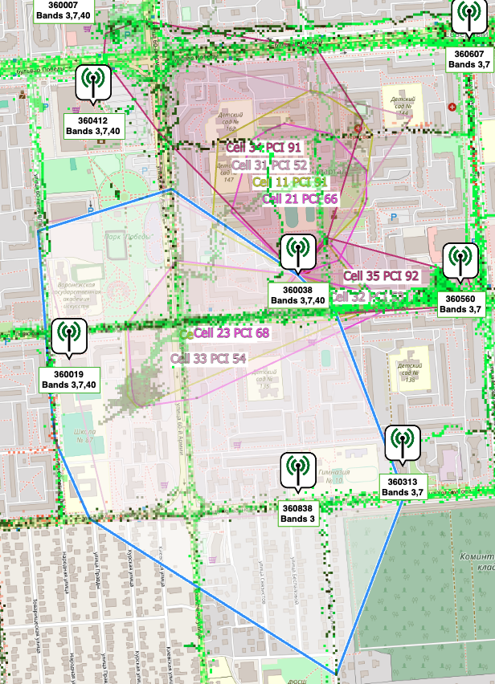  
А так как мы живём в доме, который покрывает не один сектор данной вышки, а несколько, то можно выбрать другой сектор из имеющихся на вышке. Судя по карте, наш дом также покрывается сектором 23 с PCID 68 и сектором 33 с PCID 54. Откроем эти сектора и сравним показания всех трёх ячеек.  
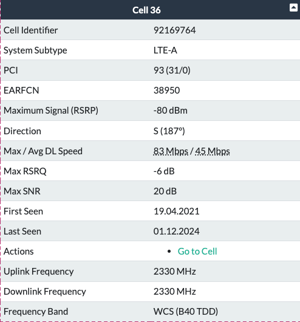  
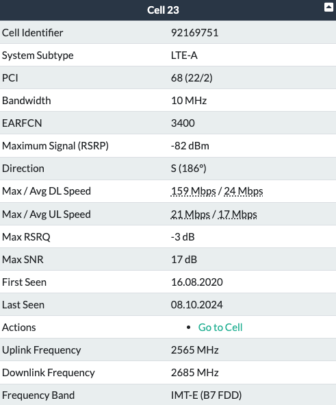  
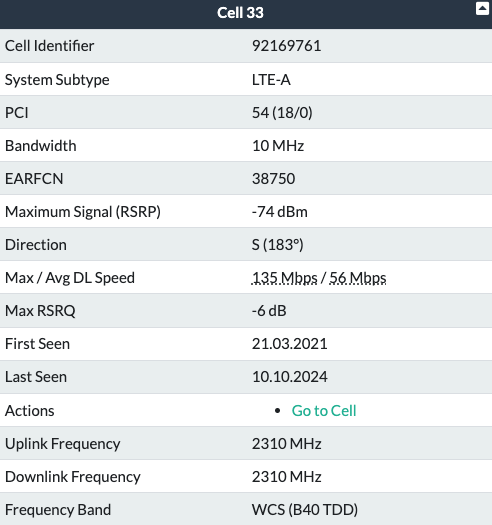  
Как видно, на нашем активном секторе зафиксирована самая высокая средняя скорость, но самая высокая пиковая скорость зафиксирована в секторе 23. Однако, попробовав зафиксировать этот сектор для проведения замеров я столкнулся со следующим явлением: фиксация прошла успешно, произошло подключение к сети, но скорость интернет-соединения около нулевая. Не открываются сайты и даже пинг не проходит до удалённых узлов не смотря на то что параметры сигнала на этом секторе более хорошие, чем на первом, а именно:

``` bash
57e66 17 68 5.5 4/-80/-5/-50 -/-/-
```

::: warning
Обратите внимание, что процесс фиксации может занимать до пяти минут. В это время сервис фиксации переводит модем в особый режим, фиксирует оператора и вышку, подключается к сети и, если не происходит подключения в течении нескольких попыток - откатывает фиксацию и подключается к вышке по умолчанию.
:::

По всей видимости, опреатор ограничивает подключение к этому сектору, что говрит о том что не все доступные для фиксации вышки и сектора будут работать так как мы ожидаем. Отсюда можно сделать вывод, что скорее всего, из доступных секторов нашей вышки мы подключены к самому оптимальному. Однако, есть ситуации, когда данный метод поможет подключиться к более оптимальному сектору.

### ***Шаг четвёртый***

На этом шаге посмотрим какие ещё БС могут обслуживать наш сектор, в котором находится наш дом. Возможно, другая БС будет меньше загружена и на ней удастся получить более быстрый доступ в интернет и более высокий рейтинг оценки качества сигнала из-за меньшего числа помех.

Для этого на той же карте вышек переберём все соседние вышки, сектора которых могут обслуживать наш дом. Пусть нам и не удалось найти такую вышку, чтобы хоть один её сектор перекрывал наш дом, но вышка с enbID 57F79, сектором 17 и PCID 144 поетнциально может смотреть в нашу сторону, так как данные на открытых картах не точны, и реальная ситуация с зоной покрытия может отличаться в большую сторону.  
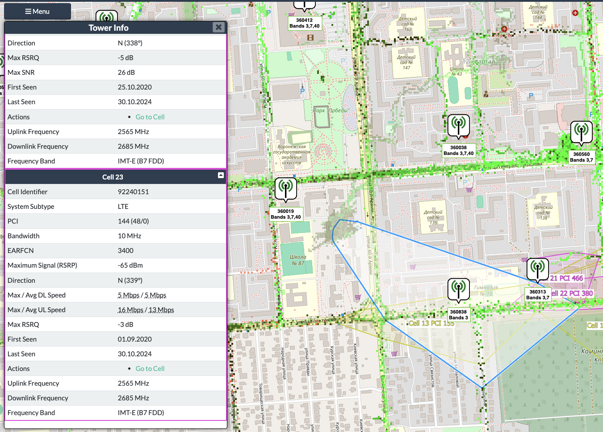  
Попробуем подключиться к ней через сканер БС роутера. Так как к этой БС мы ещё не были подключены, её ID нам неизвестен, так что придётся ориентироваться по PCID.

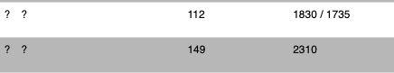

::: warning
Для владельцев направленных антенн на этом шаге важно обязательно невести антенну на новую БС. Подробнее об этом в статье [Наведение антенны](/docs/routery/upravlenie-modemom/navedenie-antenny.md)
:::

В нашем случае этой вышки нету в сканере, но мы можем подключиться к ней вручную. Для этого необходимо перейти на вкладку Модем - Конфигурация - modem1 - Локальная SIM #1 (Та симкарта, для которой необходимо зафиксировать БС). В карточке Симкарта необходимо нажать на выпадающий список Расширенные. Внизу есть поле Фиксация БС 4G, в которое нужно ввести канал и PCID выбранной БС, после чего нажать Потвердить и дождаться подключения к сети.  
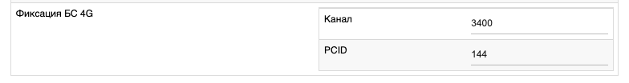  
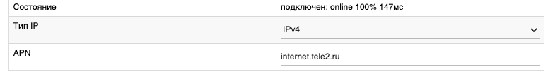
Осталось лишь проверить параметры сигнала, которые удалось получить с этой вышки.

``` bash
57F79 17 144 4.0 3.0/-100/-15/-65 75/78/2
```

Не смотря на то, что данная БС имеет чуть худшие характеристики сигнала, она выдаёт практически в два раза большую скорость загрузки. Этой скорости достаточно для просмотра фильмов и видео, а небольшой пинг позволит играть в онлайн-игры и не испытвать трудностей с VoIP-звонками (Whatsapp/Telegram).

На этом фиксация Базовой станции окончена. В случае возникновения трудностей реккомендуем обратиться к [дилеру](https://kroks.ru/about/addresses-of-shops/) в вашем регионе.
