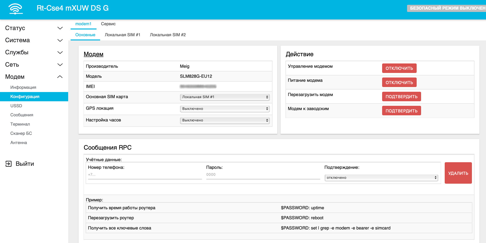
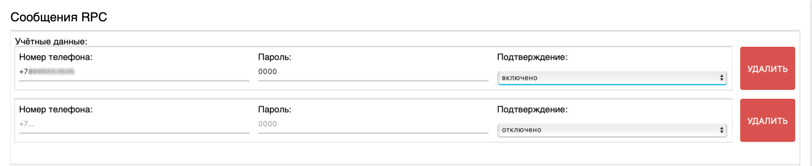

# Управление роутером через СМС

## ***Введение***

В возможности роутера заложена функция управления по SMS. С её помощью, отправляя SMS на номер сим-карты, установленной в роутере, можно передавать ему различные команды - от простейшей перезагрузки, до сложных shell-скриптов.

## ***Настройка***

Приложение управления по SMS находится во вкладке "Модем" → "Конфигурация" → **Сообщения RPC**.

Для настройки удалённого управления необходимо указать следующие параметры:

* **Номер телефона** - ваш телефонный номер, с которого на роутер будут поступать команды. **Обязательно указывать номер в формате +7ХХХХХХХХХХ**
* **Пароль** - придуманный вами пароль, который будет отправляться в теле каждой SMS. К паролю Wi-Fi, или паролю для доступа к роутеру он не имеет никакого отношения
* **Подтверждение** - если выключено, роутер не будет отправлять SMS с ответами введённых команд

Обязательно нажмите кнопку применить внизу страницы. На этом настройка удалённого управления через СМС-сообщения окончена.

## ***Проверка работы***

Для того чтобы проверить работу удалённого управления, отправим на номер сим-карты, вставленной в роутер, SMS вида: **0000: reboot**. После успешной отправки роутер начнёт процедуру перезапуска.

Если вы включили Подтверждение в настройках, можно отправить SMS вида: **0000: uptime**. В ответ должна прийти информация о времени работы роутера.

## ***Дополнительные возможности***

Данный метод позволяет по команде с телефона реализовать практически любой функционал. Для того чтобы реализовать дополнительные возможности необходимо знание языка bash и операционной системы Linux. Свои скрипты можно добавлять, следуя этой [инструкции](/docs/routery/upravlenie-modemom/dobavlenie-sobstvennyh-Shell-shablonov.md).
