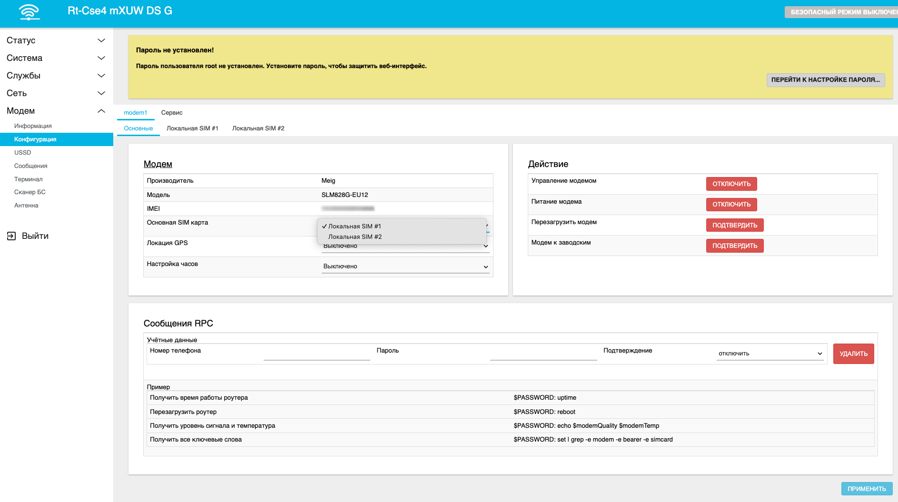

# Выбор сим карты по умолчанию

## ***Введение***

Если вам приходится после каждой перезагрузки роутера вручную переключать сим-карту на активную, то вам необходимо изменить сим-карту по умолчанию. Такое возможно, например, при наличии сим-инжектора или если у вас вдруг вышел из строя первый слот для сим-карты.

## ***Настройка***

Для смены сим-карты по умолчанию вам нужно перейти на вкладку Модем - Конфигурация на карточку Модем. В пункте Основная Сим-карта необходимо выбрать нужную сим-карту.

:::tip
Пункты Локальная SIM #1 и Локальная SIM #2 означают первый и второй сим-слот роутера соответственно.  
Пункты Удалённая SIM #1 и Удалённая SIM #2 означают первый и второй сим-слот сим-инжектора соответственно.
:::

После проведённых манипуляций не забудьте нажать кнопку Применить. На этом настройка сим-карты по умолчанию закончена. Для проверки правильности настройки можете перезагрузить роутер. После перезагрузки ротуер будет работать с выбранной сим-картой по умолчанию.
